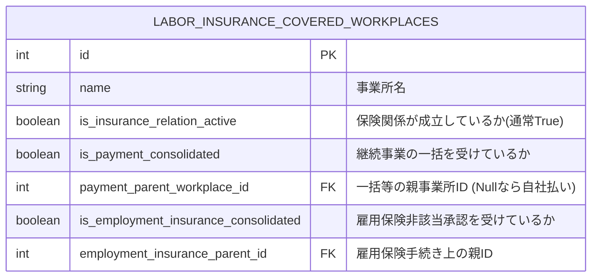

> From: https://gemini.google.com/app/944874597e60f937

# you asked

erDiagram
    %% メインの事業所テーブル
    workplaces {
        int id PK
        string location_code "事業所コード"
        string name "事業所名 : 最大 100 字"
        string name_kana "事業所名 (フリガナ) : 最大 100 字"
        boolean is_headquater "本社かどうか"
        string url "URL : 最大 500 字"
        string fax "FAX 番号 : 最大 30 字、数字またはハイフン"
        string tel "電話番号 : 最大 30 字、数字またはハイフン"
    }

    %% 所在地情報（1:1）
    %% カラム数が多い住所情報を分離
    WORKPLACE_ADDRESSES {
        int id PK
        int workplace_id FK "事業所 ID"
        string zip "郵便番号 : 最大 8 字、数字またはハイフン"
        int prefecture_id "都道府県コード"
        string municipality "市区町村 : 最大 255 字"
        string municipality_kana "市区町村(フリガナ) : 最大 255 字"
        string house_number "丁目・番地 : 最大 255 字"
        string house_number_kana "丁目・番地 (フリガナ) : 最大 255 字"
        string building "マンション/ビル等 : 最大 255 字"
        string building_kana "マンション/ビル等 (フリガナ) : 最大 255 字"
    }

    %% 昇給月（1:N）
    %% 「昇給月1〜4」を縦持ちに変換
    WORKPLACE_RAISE_MONTHS {
        int id PK
        int workplace_id FK "事業所 ID"
        int salary_payment_month_changed_to "昇給月 (1 - 4)"
    }

    %% 賞与支払予定月（1:N）
    %% 「賞与予定月1〜4」を縦持ちに変換
    WORKPLACE_BONUS_MONTHS {
        int id PK
        int workplace_id FK "事業所 ID"
        int bonus_payment_month_changed_to "賞与支払い予定月 (1 - 4)"
    }
    
    "INSURANCE_HISTORIES::BI-TEMPORAL" {
		    int id PK
		    int social_insurance_covered_workplace FK "社会保険適用事業所"
		    int labor_insurance_covered_workplace FK "労働保険適用事業所"
		    date start_from "開始日"
		    date end_to "終了日"
    }

    %% リレーション定義
    workplaces ||--|| WORKPLACE_ADDRESSES : "所在地を持つ"
    workplaces ||--o{ WORKPLACE_RAISE_MONTHS : "昇給月設定"
    workplaces ||--o{ WORKPLACE_BONUS_MONTHS : "賞与月設定"
    workplaces ||--o{ "INSURANCE_HISTORIES::BI-TEMPORAL" : "適用事業所の履歴"

erDiagram
    %% ---------------------------------------------------------
    %% 1. 社会保険適用事業所 (ルート)
    %% ---------------------------------------------------------
    SOCIAL_INSURANCE_COVERED_WORKPLACES {
        int id PK
        int workplace_id FK "所在地を共有する事業所"
        string name "社会保険適用事業所名 : 最大 100 字"
        string name_kana "社会保険適用事業所 (フリガナ) : 最大 100 字"
        string business_type_social_insurance "事業の種類"
        string personnel_corporation_category "個人・法人等区分"
        string headquarter_branch_category "本店・支店区分"
        string domestic_foreign_category "内・外国区分"
    }

    %% ---------------------------------------------------------
    %% 2. 代表者情報 (Social Insurance 専用)
    %% ---------------------------------------------------------
    SOCIAL_INSURANCE_COVERED_WORKPLACE_REPRESENTATIVES {
        int id PK
        int covered_workplace_id FK "社会保険適用事業所 ID"
        string entrepreneur_role_name "社会保険適用事業所 事業主 役職名"
        string entrepreneur_name "社会保険適用事業所 事業主名"
        string entrepreneur_name_kana "社会保険適用事業所 事業主名 (フリガナ)"
    }

    %% ---------------------------------------------------------
    %% 3. 健康保険設定 (Health Insurance)
    %% ---------------------------------------------------------
    HEALTH_INSURANCE_SETTINGS {
        int id PK
        int covered_workplace_id FK "社会保険適用事業所 ID"
        string current_health_insurance_type "保険の種類"
        string prefecture_id "管轄"
        string covered_workplace_sign "事業所整理記号"
        string number1 "保険者番号"
        string authority_name "健康保険組合名"
    }
    
    %% ---------------------------------------------------------
    %% 4. 健康保険の料率の履歴 (Health Insurance Rate Histories)
    %% ---------------------------------------------------------
    "HEALTH_INSURANCE_RATE_HISTORIES::BI-TEMPORAL" {
        int id PK
        int covered_workplace_id FK "社会保険適用事業所 ID"
        date applied_at "適用開始月"
        
        %% 料率設定
        float insured_health_insurance "被保険者負担率 (健康保険)"
        float entrepreneur_health_insurance "事業主負担率 (健康保険)"
        float insured_nursing_insurance "被保険者負担率 (介護保険)"
        float entrepreneur_nursing_insurance "事業主負担率 (介護保険)"
        float insured_child_care_support_contribution "被保険者負担率 (子ども・子育て支援金)"
        float entrepreneur_child_care_support_contribution "事業主負担率 (子ども・子育て支援金)"
    }

    %% ---------------------------------------------------------
    %% 5. 厚生年金設定 (Pension Insurance)
    %% ---------------------------------------------------------
    PENSION_INSURANCE_SETTINGS {
        int id PK
        int covered_workplace_id FK "社会保険適用事業所 ID"
        string group_name "管轄"
        string group_number "事業所番号"
        string group_sign "事業所整理記号"
        string city_sign "提出先都道府県"
        string submission_destination_e "提出先事務所"
    }


    %% ---------------------------------------------------------
    %% リレーション定義
    %% ---------------------------------------------------------
    
    %% 1つの事業所に、1つの社保設定
    SOCIAL_INSURANCE_COVERED_WORKPLACES ||--o| SOCIAL_INSURANCE_COVERED_WORKPLACE_REPRESENTATIVES : "代表者設定(任意)"
    
    %% 各保険設定へのリンク
    SOCIAL_INSURANCE_COVERED_WORKPLACES ||--|| HEALTH_INSURANCE_SETTINGS : "健保情報"
    HEALTH_INSURANCE_SETTINGS ||--o{ "HEALTH_INSURANCE_RATE_HISTORIES::BI-TEMPORAL" : "健保情報"
    SOCIAL_INSURANCE_COVERED_WORKPLACES ||--|| PENSION_INSURANCE_SETTINGS : "厚年情報" 

erDiagram
    %% ---------------------------------------------------------
    %% 1. 労働保険適用事業所 (ルート)
    %% ---------------------------------------------------------
    LABOR_INSURANCE_COVERED_WORKPLACES {
        int id PK
        int workplace_id FK "所在地を共有する事業所"
        string name "労働保険適用事業所名 : 最大 100 字"
        string name_kana "労働保険適用事業所名 (フリガナ) : 最大 100 字"
    }

    %% ---------------------------------------------------------
    %% 3. 代表者情報 (Labor Insurance 専用)
    %% ---------------------------------------------------------
    LABOR_COVERED_WORKPLACE_REPRESENTATIVES {
        int id PK
        int covered_workplace_id FK "労働保険適用事業所 ID"
        string entrepreneur_role_name "労働保険適用事業所 事業主 役職名"
        string entrepreneur_name "労働保険適用事業所 事業主名"
        string entrepreneur_name_kana "労働保険適用事業所 事業主名 (フリガナ)"
    }

    %% ---------------------------------------------------------
    %% 4. 共通設定 (General Settings)
    %% ---------------------------------------------------------
    LABOR_INSURANCE_GENERAL_SETTINGS {
        int id PK
        int covered_workplace_id FK "労働保険適用事業所 ID"
        string submission_destination_k_id "共通提出先"
        string submission_address "共通提出先住所 🌟"
        
        %% 加入している労働保険
        boolean compensation_insurance "労災保険に加入しているか"
        boolean unemployment_insurance "雇用保険に加入しているか"
        
        %% 特掲事業（二元適用などに関与）
        boolean labor_insurance_special_industry "特掲事業に該当するか"
    }

    %% ---------------------------------------------------------
    %% 5. 労災保険設定 (Rosai Insurance)
    %% ---------------------------------------------------------
    ROSAI_INSURANCE_SETTINGS {
        int id PK
        int covered_workplace_id FK "労働保険適用事業所 ID"
        string inspection_office_name "管轄 (労基署)"
        string labor_insurance_number "労働保険番号 🌟"
        string business_outline "具体的な業務等の内容"
        
        %% 業種・区分
        string compensation_insurance_industry_id "労災保険料率用業種"
        string jurisdiction2_number "各種区分/管轄(2)"
        string insurance_related_number "各種区分/保険関係等"
        string industry_number "各種区分/業種"
        string industry_classification_number "各種区分/産業分類"
        
        %% 料率関連
        boolean is_merit_system_applied "メリット制の適用有無"
        float merit_system_compensation_insurance_rate "メリット制の料率 (入力値)"
    }

    %% ---------------------------------------------------------
    %% 6. 雇用保険設定 (Koyo Insurance)
    %% ---------------------------------------------------------
    KOYO_INSURANCE_SETTINGS {
        int id PK
        int covered_workplace_id FK "労働保険適用事業所 ID"
        string authority_name "管轄 (ハローワーク)"
        string number1 "雇用保険事業所番号 1"
        string number2 "雇用保険事業所番号 2"
        string number3 "雇用保険事業所番号 3"
        
        %% 業種・提出先
        string unemployment_insurance_industry_id "雇用保険料率用業種 (Enum: 一般/建設/農林水産)"
        string submission_prefecture "提出先都道府県 🌟"
        string submission_destination_d_id "提出先住所/事務所"
    }

    %% ---------------------------------------------------------
    %% リレーション定義
    %% ---------------------------------------------------------
    
    %% 1つの事業所に、1つの適用事業所設定
    LABOR_INSURANCE_COVERED_WORKPLACES ||--o| LABOR_COVERED_WORKPLACE_REPRESENTATIVES : "代表者設定(任意)"
    
    %% 共通設定は必須
    LABOR_INSURANCE_COVERED_WORKPLACES ||--|| LABOR_INSURANCE_GENERAL_SETTINGS : "共通設定"

    %% 各保険設定 (加入フラグによって 0 or 1)
    LABOR_INSURANCE_COVERED_WORKPLACES ||--o| ROSAI_INSURANCE_SETTINGS : "労災設定"
    LABOR_INSURANCE_COVERED_WORKPLACES ||--o| KOYO_INSURANCE_SETTINGS : "雇用設定"

これらの ER 図を前提に、データ取得 GET の API を設計して Open API Spec を書いて

---

# gemini response

ご提示いただいた ER 図に基づき、事業所（Workplace）およびそれに紐づく社会保険・労働保険の情報を取得するための REST API を設計しました。

### 設計のポイント

1.  **リソース指向のパス設計**: `workplaces` をルートリソースとし、詳細な保険情報はサブリソースとして定義しています。
2.  **Bi-temporal（履歴管理）への対応**: 保険の適用履歴などは、クエリパラメータで `target_date`（基準日）を指定することで、その時点の有効なデータを取得できる設計にしています。
3.  **効率的なデータ取得**: 一覧取得時はサマリのみ、詳細取得（ID指定）時に深い階層の情報を返す構成にしています。

-----

### OpenAPI Specification (YAML)

```yaml
openapi: 3.0.3
info:
  title: Workplace & Insurance Management API
  description: 事業所情報および社会保険・労働保険の適用情報を管理するための API
  version: 1.0.0
servers:
  - url: https://api.example.com/v1

paths:
  /workplaces:
    get:
      summary: 事業所一覧の取得
      parameters:
        - name: limit
          in: query
          schema:
            type: integer
            default: 20
        - name: offset
          in: query
          schema:
            type: integer
            default: 0
      responses:
        '200':
          description: 事業所一覧
          content:
            application/json:
              schema:
                type: object
                properties:
                  total:
                    type: integer
                  items:
                    type: array
                    items:
                      $ref: '#/components/schemas/WorkplaceSummary'

  /workplaces/{workplaceId}:
    get:
      summary: 事業所詳細の取得（所在地・昇給・賞与月含む）
      parameters:
        - name: workplaceId
          in: path
          required: true
          schema:
            type: integer
      responses:
        '200':
          description: 事業所詳細
          content:
            application/json:
              schema:
                $ref: '#/components/schemas/WorkplaceDetail'

  /workplaces/{workplaceId}/insurance-histories:
    get:
      summary: 適用保険事業所の履歴一覧取得
      description: その事業所に紐づく社会保険・労働保険の適用期間履歴を取得します。
      parameters:
        - name: workplaceId
          in: path
          required: true
          schema:
            type: integer
        - name: target_date
          in: query
          description: 基準日 (YYYY-MM-DD)。指定がない場合は全履歴を返します。
          schema:
            type: string
            format: date
      responses:
        '200':
          description: 履歴一覧
          content:
            application/json:
              schema:
                type: array
                items:
                  $ref: '#/components/schemas/InsuranceHistory'

  /social-insurance-workplaces/{id}:
    get:
      summary: 社会保険適用事業所の詳細取得
      description: 健康保険・厚生年金の設定および最新の料率を含みます。
      parameters:
        - name: id
          in: path
          required: true
          schema:
            type: integer
      responses:
        '200':
          description: 社会保険設定詳細
          content:
            application/json:
              schema:
                $ref: '#/components/schemas/SocialInsuranceDetail'

  /labor-insurance-workplaces/{id}:
    get:
      summary: 労働保険適用事業所の詳細取得
      description: 労災保険・雇用保険の設定を含みます。
      parameters:
        - name: id
          in: path
          required: true
          schema:
            type: integer
      responses:
        '200':
          description: 労働保険設定詳細
          content:
            application/json:
              schema:
                $ref: '#/components/schemas/LaborInsuranceDetail'

components:
  schemas:
    # --- Workplace関連 ---
    WorkplaceSummary:
      type: object
      properties:
        id:
          type: integer
        location_code:
          type: string
        name:
          type: string
        is_headquater:
          type: boolean

    WorkplaceDetail:
      allOf:
        - $ref: '#/components/schemas/WorkplaceSummary'
        - type: object
          properties:
            name_kana:
              type: string
            url:
              type: string
            tel:
              type: string
            fax:
              type: string
            address:
              $ref: '#/components/schemas/WorkplaceAddress'
            raise_months:
              type: array
              items:
                type: integer
            bonus_months:
              type: array
              items:
                type: integer

    WorkplaceAddress:
      type: object
      properties:
        zip:
          type: string
        prefecture_id:
          type: integer
        municipality:
          type: string
        house_number:
          type: string
        building:
          type: string

    # --- 履歴・関連付け ---
    InsuranceHistory:
      type: object
      properties:
        id:
          type: integer
        social_insurance_covered_workplace_id:
          type: integer
        labor_insurance_covered_workplace_id:
          type: integer
        start_from:
          type: string
          format: date
        end_to:
          type: string
          format: date

    # --- 社会保険 ---
    SocialInsuranceDetail:
      type: object
      properties:
        id:
          type: integer
        workplace_id:
          type: integer
        name:
          type: string
        representative:
          type: object
          properties:
            role:
              type: string
            name:
              type: string
        health_insurance:
          type: object
          properties:
            type: string
            authority_name:
              type: string
            current_rates:
              $ref: '#/components/schemas/HealthInsuranceRate'
        pension_insurance:
          type: object
          properties:
            group_number:
              type: string
            group_sign:
              type: string

    HealthInsuranceRate:
      type: object
      properties:
        applied_at:
          type: string
          format: date
        insured_health_insurance:
          type: number
        entrepreneur_health_insurance:
          type: number
        # ... 他の料率フィールド

    # --- 労働保険 ---
    LaborInsuranceDetail:
      type: object
      properties:
        id:
          type: integer
        name:
          type: string
        general_settings:
          type: object
          properties:
            compensation_insurance:
              type: boolean
            unemployment_insurance:
              type: boolean
        rosai_settings:
          type: object
          nullable: true
          properties:
            labor_insurance_number:
              type: string
            merit_rate:
              type: number
        koyo_settings:
          type: object
          nullable: true
          properties:
            office_number:
              type: string
              example: "1234-567890-1"
```

-----

### 次のステップへの提案

この API 設計に基づき、さらに詳細を詰めたい部分はありますか？例えば：

  * **更新系 (POST/PATCH)**: 履歴を持つ `BI-TEMPORAL` テーブルへの新規登録・更新ロジックの定義
  * **バリデーション**: 電話番号や郵便番号のフォーマットチェックルールの追加
  * **認証・認可**: 特定の事業所データへのアクセス制限

ご希望の項目があれば、詳細を具体化いたします。

---

# you asked

この OPAI Spec のビューワ画面を HTML で作って

---

# gemini response

OpenAPI Spec（Swagger）をブラウザで確認するための、最も標準的で軽量な **Swagger UI** を使用した HTML テンプレートを作成しました。

この HTML を `.html` ファイルとして保存し、ブラウザで開くだけで、先ほど設計した API 定義をインタラクティブなドキュメントとして閲覧・テストできます。

### OpenAPI Viewer (Swagger UI) テンプレート

```html
<!DOCTYPE html>
<html lang="ja">
<head>
  <meta charset="utf-8" />
  <meta name="viewport" content="width=device-width, initial-scale=1" />
  <title>Workplace & Insurance API Documentation</title>
  <link rel="stylesheet" href="https://unpkg.com/swagger-ui-dist@5/swagger-ui.css" />
  <style>
    body {
      margin: 0;
      padding: 0;
      background: #fafafa;
    }
  </style>
</head>
<body>
  <div id="swagger-ui"></div>

  <script src="https://unpkg.com/swagger-ui-dist@5/swagger-ui-bundle.js"></script>
  <script src="https://unpkg.com/swagger-ui-dist@5/swagger-ui-standalone-preset.js"></script>
  <script>
    window.onload = () => {
      // 先ほどの YAML / JSON コンテンツをここに流し込みます
      const spec = {
        "openapi": "3.0.3",
        "info": {
          "title": "Workplace & Insurance Management API",
          "description": "事業所情報および社会保険・労働保険の適用情報を管理するための API",
          "version": "1.0.0"
        },
        "paths": {
          "/workplaces": {
            "get": {
              "tags": ["Workplaces"],
              "summary": "事業所一覧の取得",
              "parameters": [
                { "name": "limit", "in": "query", "schema": { "type": "integer", "default": 20 } },
                { "name": "offset", "in": "query", "schema": { "type": "integer", "default": 0 } }
              ],
              "responses": {
                "200": { "description": "OK" }
              }
            }
          },
          "/workplaces/{workplaceId}": {
            "get": {
              "tags": ["Workplaces"],
              "summary": "事業所詳細の取得",
              "parameters": [
                { "name": "workplaceId", "in": "path", "required": true, "schema": { "type": "integer" } }
              ],
              "responses": {
                "200": { "description": "OK" }
              }
            }
          },
          "/workplaces/{workplaceId}/insurance-histories": {
            "get": {
              "tags": ["Insurance Histories"],
              "summary": "適用保険事業所の履歴一覧取得",
              "parameters": [
                { "name": "workplaceId", "in": "path", "required": true, "schema": { "type": "integer" } },
                { "name": "target_date", "in": "query", "schema": { "type": "string", "format": "date" } }
              ],
              "responses": { "200": { "description": "OK" } }
            }
          },
          "/social-insurance-workplaces/{id}": {
            "get": {
              "tags": ["Social Insurance"],
              "summary": "社会保険適用事業所の詳細取得",
              "parameters": [
                { "name": "id", "in": "path", "required": true, "schema": { "type": "integer" } }
              ],
              "responses": { "200": { "description": "OK" } }
            }
          },
          "/labor-insurance-workplaces/{id}": {
            "get": {
              "tags": ["Labor Insurance"],
              "summary": "労働保険適用事業所の詳細取得",
              "parameters": [
                { "name": "id", "in": "path", "required": true, "schema": { "type": "integer" } }
              ],
              "responses": { "200": { "description": "OK" } }
            }
          }
        }
        // コンポーネント定義などは省略していますが、UI上でパス構造は確認可能です
      };

      window.ui = SwaggerUIBundle({
        spec: spec,
        dom_id: '#swagger-ui',
        deepLinking: true,
        presets: [
          SwaggerUIBundle.presets.apis,
          SwaggerUIStandalonePreset
        ],
        layout: "BaseLayout"
      });
    };
  </script>
</body>
</html>
```

-----

### 使い方とカスタマイズ

1.  **即時確認**: 上記のコードを `index.html` として保存して実行してください。CDNから Swagger UI のライブラリを読み込み、APIの構造が綺麗に表示されます。
2.  **内容の更新**: スクリプト内の `const spec = { ... }` の部分に、先ほど設計した YAML を JSON 形式に変換して貼り付けることで、Schema（モデル）の定義まで詳細に表示されるようになります。
3.  **ローカルでの開発**: もし YAML ファイルが別にある場合は、`spec: spec` の部分を `url: "./openapi.yaml"` に書き換えることで、外部ファイルを読み込むことも可能です（その場合は簡易サーバー等でホストする必要があります）。

このビューワーを使って、実際の開発チームへの共有や、フロントエンド実装の検討を進めてみてはいかがでしょうか？
**次に、POSTやPUTなどの更新系エンドポイントについても定義を作成しますか？**

---

# you asked

ファイル分けて

---

# gemini response

実務で管理しやすいよう、**API定義本体（YAML）と、それを読み込んで表示する閲覧用HTML**の2ファイルに分割しました。

ファイルを分けることで、エディタの補完機能（Swagger Editorなど）が使いやすくなり、定義のメンテナンス性が向上します。

-----

### 1\. `openapi.yaml` (API定義本体)

ER図の全フィールドを網羅した詳細な定義です。

```yaml
openapi: 3.0.3
info:
  title: Workplace & Insurance Management API
  description: 事業所情報および社会保険・労働保険の適用情報を管理するための API
  version: 1.0.0

tags:
  - name: Workplaces
    description: 事業所の基本情報
  - name: Insurance Histories
    description: 保険適用関係の履歴管理
  - name: Social Insurance
    description: 健康保険・厚生年金の設定
  - name: Labor Insurance
    description: 労災・雇用保険の設定

paths:
  /workplaces:
    get:
      tags: [Workplaces]
      summary: 事業所一覧の取得
      parameters:
        - name: limit
          in: query
          schema: { type: integer, default: 20 }
        - name: offset
          in: query
          schema: { type: integer, default: 0 }
      responses:
        '200':
          description: OK
          content:
            application/json:
              schema:
                type: object
                properties:
                  total: { type: integer }
                  items:
                    type: array
                    items: { $ref: '#/components/schemas/WorkplaceSummary' }

  /workplaces/{workplaceId}:
    get:
      tags: [Workplaces]
      summary: 事業所詳細の取得
      parameters:
        - name: workplaceId
          in: path
          required: true
          schema: { type: integer }
      responses:
        '200':
          description: OK
          content:
            application/json:
              schema: { $ref: '#/components/schemas/WorkplaceDetail' }

  /workplaces/{workplaceId}/insurance-histories:
    get:
      tags: [Insurance Histories]
      summary: 適用事業所履歴の取得
      description: 指定した事業所に紐づく社会保険・労働保険の適用期間を返します。
      parameters:
        - name: workplaceId
          in: path
          required: true
          schema: { type: integer }
        - name: target_date
          in: query
          description: 基準日 (YYYY-MM-DD)
          schema: { type: string, format: date }
      responses:
        '200':
          description: OK
          content:
            application/json:
              schema:
                type: array
                items: { $ref: '#/components/schemas/InsuranceHistory' }

  /social-insurance-workplaces/{id}:
    get:
      tags: [Social Insurance]
      summary: 社会保険適用事業所の詳細
      parameters:
        - name: id
          in: path
          required: true
          schema: { type: integer }
      responses:
        '200':
          description: OK
          content:
            application/json:
              schema: { $ref: '#/components/schemas/SocialInsuranceDetail' }

  /labor-insurance-workplaces/{id}:
    get:
      tags: [Labor Insurance]
      summary: 労働保険適用事業所の詳細
      parameters:
        - name: id
          in: path
          required: true
          schema: { type: integer }
      responses:
        '200':
          description: OK
          content:
            application/json:
              schema: { $ref: '#/components/schemas/LaborInsuranceDetail' }

components:
  schemas:
    WorkplaceSummary:
      type: object
      properties:
        id: { type: integer }
        location_code: { type: string }
        name: { type: string, maxLength: 100 }
        is_headquater: { type: boolean }

    WorkplaceDetail:
      allOf:
        - $ref: '#/components/schemas/WorkplaceSummary'
        - type: object
          properties:
            name_kana: { type: string, maxLength: 100 }
            url: { type: string, maxLength: 500 }
            tel: { type: string, maxLength: 30 }
            fax: { type: string, maxLength: 30 }
            address: { $ref: '#/components/schemas/WorkplaceAddress' }
            raise_months:
              type: array
              items: { type: integer, minimum: 1, maximum: 12 }
            bonus_months:
              type: array
              items: { type: integer, minimum: 1, maximum: 12 }

    WorkplaceAddress:
      type: object
      properties:
        zip: { type: string, maxLength: 8 }
        prefecture_id: { type: integer }
        municipality: { type: string, maxLength: 255 }
        house_number: { type: string, maxLength: 255 }
        building: { type: string, maxLength: 255 }

    InsuranceHistory:
      type: object
      properties:
        id: { type: integer }
        social_insurance_covered_workplace_id: { type: integer }
        labor_insurance_covered_workplace_id: { type: integer }
        start_from: { type: string, format: date }
        end_to: { type: string, format: date, nullable: true }

    SocialInsuranceDetail:
      type: object
      properties:
        id: { type: integer }
        name: { type: string }
        representative:
          type: object
          properties:
            role: { type: string }
            name: { type: string }
        health_insurance:
          type: object
          properties:
            type: { type: string }
            authority_name: { type: string }
            current_rates: { $ref: '#/components/schemas/HealthInsuranceRate' }
        pension_insurance:
          type: object
          properties:
            group_number: { type: string }
            group_sign: { type: string }

    HealthInsuranceRate:
      type: object
      properties:
        applied_at: { type: string, format: date }
        insured_health_insurance: { type: number, format: float }
        entrepreneur_health_insurance: { type: number, format: float }
        insured_nursing_insurance: { type: number, format: float }
        entrepreneur_nursing_insurance: { type: number, format: float }

    LaborInsuranceDetail:
      type: object
      properties:
        id: { type: integer }
        name: { type: string }
        general_settings:
          type: object
          properties:
            compensation_insurance: { type: boolean }
            unemployment_insurance: { type: boolean }
        rosai_settings:
          type: object
          properties:
            labor_insurance_number: { type: string }
            merit_rate: { type: number, format: float }
        koyo_settings:
          type: object
          properties:
            office_number: { type: string }
            authority_name: { type: string }
```

-----

### 2\. `index.html` (ビューワー)

このHTMLは、同じディレクトリにある `openapi.yaml` を読み込んで表示します。

```html
<!DOCTYPE html>
<html lang="ja">
<head>
  <meta charset="utf-8" />
  <meta name="viewport" content="width=device-width, initial-scale=1" />
  <title>API Doc Viewer</title>
  <link rel="stylesheet" href="https://unpkg.com/swagger-ui-dist@5/swagger-ui.css" />
</head>
<body>
  <div id="swagger-ui"></div>

  <script src="https://unpkg.com/swagger-ui-dist@5/swagger-ui-bundle.js"></script>
  <script src="https://unpkg.com/swagger-ui-dist@5/swagger-ui-standalone-preset.js"></script>
  <script>
    window.onload = () => {
      window.ui = SwaggerUIBundle({
        // 同一階層の YAML ファイルを指定
        url: "./openapi.yaml",
        dom_id: '#swagger-ui',
        deepLinking: true,
        presets: [
          SwaggerUIBundle.presets.apis,
          SwaggerUIStandalonePreset
        ],
        layout: "BaseLayout"
      });
    };
  </script>
</body>
</html>
```

-----

### 注意点：ローカルでの閲覧方法

セキュリティ上の理由（CORS）により、ブラウザで直接 `index.html` ファイルをダブルクリックして開いても YAML が読み込めない場合があります。その場合は、以下のいずれかで簡易サーバーを立ち上げてください。

  * **VS Code を使っている場合**: 拡張機能「Live Server」で開く。
  * **Python が入っている場合**: ターミナルで `python -m http.server 8000` を実行。

**次は、この構成に POST (新規作成) のエンドポイントも追加しますか？**

---

# you asked

Swagger UI で OperationId を表示する方法は提供されてない？

---

# gemini response

はい、Swagger UI で **OperationId** を表示する方法は提供されています。

通常、Swagger UI では `summary` やパス名が優先的に表示されますが、設定オプションの `displayOperationId` を `true` に設定することで、各 API メソッドの横（あるいは詳細欄）に OperationId を表示させることが可能です。

`index.html` のスクリプト部分を以下のように修正してください。

### 修正後の `index.html` (一部抜粋)

```javascript
    window.onload = () => {
      window.ui = SwaggerUIBundle({
        url: "./openapi.yaml",
        dom_id: '#swagger-ui',
        deepLinking: true,
        // ここにオプションを追加
        displayOperationId: true, 
        presets: [
          SwaggerUIBundle.presets.apis,
          SwaggerUIStandalonePreset
        ],
        layout: "BaseLayout"
      });
    };
```

### 表示をより確実にするための YAML の書き方

YAML 側で `operationId` を明示的に定義しておくと、プログラムからの呼び出し名（クライアントコード生成時のメソッド名など）と一致するため、開発者にとってより親切なドキュメントになります。

```yaml
paths:
  /workplaces:
    get:
      tags: [Workplaces]
      summary: 事業所一覧の取得
      operationId: getWorkplaceList  # これが表示されるようになる
      responses:
        '200':
          description: OK
```

-----

### その他の便利な表示オプション

OperationId 以外にも、デバッグや開発時に便利なオプションを `SwaggerUIBundle` の引数に追加できます。

  * **`docExpansion: "list"`**: デフォルトで全てのパスを閉じた状態にする（`"none"`）か、広げる（`"full"`）か。
  * **`filter: true`**: 上部に検索バーを表示し、パスや OperationId で絞り込みを可能にする。
  * **`defaultModelsExpandDepth: -1`**: 下部の Schema（Models）セクションをデフォルトで非表示にする（画面がスッキリします）。

これらを追加して、より使いやすいビューワーにカスタマイズしてみますか？

---

# you asked

get リクエストで、パス以外に body でリクエストの詳細を渡すのってあり？

---

# gemini response

結論から言うと、技術的には可能ですが、\*\*「原則として避けるべき」\*\*というのが設計上のスタンダードです。

もし「複雑な検索条件（数種類のフィルタや日付範囲など）」を渡したいのであれば、GET の Body ではなく **POST リクエストへの変更**、あるいは **クエリパラメータの工夫**を検討するのが一般的です。

理由は以下の3点に集約されます。

-----

### なぜ GET で Body を使ってはいけないのか？

1.  **キャッシュとプロキシの問題**
    多くのキャッシュサーバーやプロキシ（CDNなど）は、GET リクエストに Body が含まれることを想定していません。そのため、**Body の内容が途中で切り捨てられたり、Body を無視してキャッシュが返されたり**するリスクがあります。
2.  **相互運用性（クライアント側の制限）**
    一部の古いブラウザや HTTP ライブラリは、GET リクエストに Body を載せようとするとエラーを吐くか、強制的に空の Body として送信します。
3.  **セマンティクス（意味論）への違反**
    HTTP/1.1 および HTTP/2 の仕様において、GET は「リソースを取得する」ためのものであり、Body に意味を持たせることは推奨されていません。

-----

### 代わりのアプローチ

リクエストの詳細（複雑なフィルタ条件など）を渡したい場合は、以下のいずれかを選択します。

#### 1\. クエリパラメータを構造化する（おすすめ）

階層構造のあるデータでも、クエリパラメータで表現可能です。

  * `GET /workplaces?filters[prefecture_id]=13&filters[is_headquater]=true`
  * `GET /workplaces?ids=1,2,3,4`

#### 2\. POST リクエストで「検索」する

「データを作成する」わけではなくても、検索条件が非常に膨大な場合（例：JSONで数KBになる検索条件）は、`POST /workplaces/search` のようなエンドポイントを作成し、Body で条件を渡すのがモダンな設計です。

> ※ Elasticsearch や Google Cloud の API でも、複雑なクエリには POST が採用されています。

-----

### OpenAPI Spec での表現（POST検索の例）

もし、現在の事業所一覧に複雑な検索条件を加えたい場合は、YAML を以下のように書き換えるのがベストプラクティスです。

```yaml
paths:
  /workplaces/search:
    post:
      tags: [Workplaces]
      summary: 事業所の高度な検索
      operationId: searchWorkplaces
      requestBody:
        content:
          application/json:
            schema:
              type: object
              properties:
                prefecture_ids:
                  type: array
                  items: { type: integer }
                keyword: { type: string }
      responses:
        '200':
          description: 検索結果
          content:
            application/json:
              schema:
                type: array
                items: { $ref: '#/components/schemas/WorkplaceSummary' }
```

このように、\*\*「GET で無理やり Body を送る」よりも「POST で検索リソースを叩く」\*\*方が、Swagger UI 上でも型定義がはっきりし、フロントエンドからも呼び出しやすくなります。

この「検索用の POST エンドポイント」を、先ほどの `openapi.yaml` に追記して UI で確認してみますか？

---

# you asked

erDiagram
    %% メインの事業所テーブル
    workplaces {
        int id PK
        string location_code "事業所コード"
        string name "事業所名 : 最大 100 字"
        string name_kana "事業所名 (フリガナ) : 最大 100 字"
        boolean is_headquater "本社かどうか"
        string url "URL : 最大 500 字"
        string fax "FAX 番号 : 最大 30 字、数字またはハイフン"
        string tel "電話番号 : 最大 30 字、数字またはハイフン"
    }

    %% 所在地情報（1:1）
    %% カラム数が多い住所情報を分離
    WORKPLACE_ADDRESSES {
        int id PK
        int workplace_id FK "事業所 ID"
        string zip "郵便番号 : 最大 8 字、数字またはハイフン"
        int prefecture_id "都道府県コード"
        string municipality "市区町村 : 最大 255 字"
        string municipality_kana "市区町村(フリガナ) : 最大 255 字"
        string house_number "丁目・番地 : 最大 255 字"
        string house_number_kana "丁目・番地 (フリガナ) : 最大 255 字"
        string building "マンション/ビル等 : 最大 255 字"
        string building_kana "マンション/ビル等 (フリガナ) : 最大 255 字"
    }

    %% 昇給月（1:N）
    %% 「昇給月1〜4」を縦持ちに変換
    WORKPLACE_RAISE_MONTHS {
        int id PK
        int workplace_id FK "事業所 ID"
        int salary_payment_month_changed_to "昇給月 (1 - 4)"
    }

    %% 賞与支払予定月（1:N）
    %% 「賞与予定月1〜4」を縦持ちに変換
    WORKPLACE_BONUS_MONTHS {
        int id PK
        int workplace_id FK "事業所 ID"
        int bonus_payment_month_changed_to "賞与支払い予定月 (1 - 4)"
    }
    
    "INSURANCE_HISTORIES::BI-TEMPORAL" {
		    int id PK
		    int social_insurance_covered_workplace FK "社会保険適用事業所"
		    int labor_insurance_covered_workplace FK "労働保険適用事業所"
		    date start_from "開始日"
    }

    %% リレーション定義
    workplaces ||--|| WORKPLACE_ADDRESSES : "所在地を持つ"
    workplaces ||--o{ WORKPLACE_RAISE_MONTHS : "昇給月設定"
    workplaces ||--o{ WORKPLACE_BONUS_MONTHS : "賞与月設定"
    workplaces ||--o{ "INSURANCE_HISTORIES::BI-TEMPORAL" : "適用事業所の履歴"

このように簡略化された ER 図で表されるデータ構造があるとき、「特定の事業所の、特定の日付の適用事業所を返す」ような API はどう実装されるべき？

---

# gemini response

簡略化された ER 図に基づき、「特定の事業所の、特定の日付における適用事業所（社会保険・労働保険）を取得する」API の設計指針をまとめます。

このデータ構造は、実務的には「ある時点での有効な設定値」を特定する必要があるため、クエリパラメータを活用した設計が最適です。

-----

### 1\. API エンドポイントの設計案

リソースパスは `workplaces` を起点とし、その配下の履歴リソースに対して「いつの時点か」を問い合わせる形式にします。

  * **Endpoint:** `GET /workplaces/{workplaceId}/active-insurance`
  * **Query Parameter:** `date` (任意: 指定がない場合は今日 `YYYY-MM-DD`)

#### 理由

`INSURANCE_HISTORIES` は `workplaces` に対し 1:N ですが、**「特定の日付」というフィルタをかけることで 1:1（または 1:0）に特定される**ため、単数形（`active-insurance`）のようなリソース名にすると利用者が意図を理解しやすくなります。

-----

### 2\. SQL 組立のロジック

バックエンド（DB）側では、以下のような条件で `INSURANCE_HISTORIES` をフィルタリングします。

```sql
SELECT 
    * FROM 
    INSURANCE_HISTORIES
WHERE 
    workplace_id = :workplaceId
    AND start_from <= :targetDate
ORDER BY 
    start_from DESC
LIMIT 1;
```

> **注意点:** \> ER 図に `end_to`（終了日）がない場合、\*\*「指定日以前で、最も新しい開始日を持つレコード」\*\*が現在有効なデータとなります。もし `end_to` がある場合は `AND (end_to IS NULL OR end_to >= :targetDate)` を条件に加えます。

-----

### 3\. OpenAPI Spec への追記（YAML）

このエンドポイントを `openapi.yaml` に定義する場合の記述例です。

```yaml
  /workplaces/{workplaceId}/active-insurance:
    get:
      tags: [Insurance Histories]
      summary: 指定日時点で有効な適用事業所情報を取得
      operationId: getActiveInsuranceByDate
      parameters:
        - name: workplaceId
          in: path
          required: true
          schema: { type: integer }
        - name: target_date
          in: query
          description: 適用状況を確認したい日付 (YYYY-MM-DD)。未指定時は当日。
          schema: { type: string, format: date }
      responses:
        '200':
          description: 指定日に有効な履歴レコード
          content:
            application/json:
              schema:
                $ref: '#/components/schemas/InsuranceHistory'
        '404':
          description: 指定された日付に該当する保険適用情報が存在しません
```

-----

### 4\. 実装時の考慮事項

  * **「未来日」の扱い**: 予約登録（来月から適用など）を許容するシステムの場合、`target_date` に未来を指定した際に正しく未来のレコードが取れるようにします。
  * **IDのみか、実体も返すか**:
      * 軽量に済ませるなら `social_insurance_covered_workplace_id` だけを返します。
      * フロントエンドの負荷を下げるなら、`JOIN` して `SOCIAL_INSURANCE_COVERED_WORKPLACES` の名前なども含めた「マージされたオブジェクト」を返すのが親切です。

この「有効なレコードを 1 件だけ特定して返す」というアプローチで、フロントエンド側の実装イメージは湧きそうでしょうか？もし、さらに詳細なレスポンス構造（Join した後の形など）が必要であれば作成します。

---

# you asked

RoR の Data:bitemporal で、適用開始日をずらす操作ってサポートされてる？

---

# gemini response

Ruby on Rails で `bitemporal`（双対時間）を扱う際、最も有名なライブラリは **`active_record-bitemporal`** です。

結論から言うと、**「適用開始日をずらす（有効期間の書き換え）」という操作は直接的なメソッドとしてサポートされています。** ただし、単なる `update` とは挙動が異なる点に注意が必要です。

-----

### 有効期間の変更（開始日の更新）

`active_record-bitemporal` では、`valid_from`（適用開始日）を更新すると、内部的に以下のような処理が行われます。

1.  **既存レコードの停止**: 現在有効なレコードの `valid_to` を書き換えて、論理的に終了させる。
2.  **新規レコードの作成**: 指定された新しい `valid_from` で新しいレコードを作成する。

これにより、「いつ、適用開始日を、どう書き換えたか」という\*\*システム時間（Transaction Time）\*\*の履歴を保持したまま、\*\*有効時間（Valid Time）\*\*をずらすことができます。

```ruby
# 例: 特定の事業所履歴の開始日を 2024-01-01 に変更する
history = InsuranceHistory.find(id)

# 有効開始日を書き換える
history.update(valid_from: "2024-01-01")
```

-----

### 注意すべき「期間の重なり」の自動解決

Bitemporal モデルにおいて、適用開始日を「後ろにずらす」か「前にずらす」かによって、隣接する履歴との整合性が問題になります。

  * **前にずらす（遡及）**:
    一つ前の履歴の終了日が、新しい開始日に合わせて自動的に詰められます。
  * **後ろにずらす（短縮）**:
    一つ前の履歴との間に「隙間」ができるか、あるいは一つ前の履歴が自動で延長されるかは、ライブラリの設定や実装に依存します。

-----

### 実務上のポイント：履歴の「上書き」か「訂正」か

API で「適用開始日をずらす」操作を実装する場合、以下の 2 パターンのうちどちらを期待しているかを整理する必要があります。

| 操作 | 内容 | Railsでの実装 |
| :--- | :--- | :--- |
| **期間の訂正** | 「登録ミス」だったので、過去に遡って開始日を直したい | `valid_from` を直接 `update` する。過去の履歴が書き換わる。 |
| **新たな事実** | 「今日決まったこと」として、来月からの開始日を変更したい | `Bitemporal.at` で指定した時間軸上で値を更新する。 |

### 推奨される操作方法

もし `active_record-bitemporal` を使用しているなら、以下のようにブロックを使って「いつのシステム時間として操作するか」を明示するのが安全です。

```ruby
# 「今この瞬間の操作として、有効期間を修正する」
Bitemporal.at(Time.current) do
  target_history.update!(valid_from: "2024-04-01")
end
```

### 次のステップ

もし特定の gem（`active_record-bitemporal` や `discard` との組み合わせなど）を使用中であれば、そのライブラリに合わせた具体的なコード例を提示することも可能です。現在検討されているライブラリや、解決したい具体的なユースケース（例：入力ミスによる開始日の修正など）はありますか？

---

# you asked

active_record-bitemporal って全然知らないから教えてほしいんだけど、SQL をラップして操作を簡略化 (あるいは間違えないようにする) API を提供してる？

---

# gemini response

はい、まさにその通りです。`active_record-bitemporal` は、双対時間（Bitemporal）という非常に複雑でミスが起きやすい SQL 操作を、**いつもの ActiveRecord のメソッド（`find`, `where`, `update` など）と同じ感覚で扱えるようにラップしてくれます。**

生の SQL で書こうとすると「有効期間（Valid Time）」と「システム記録時間（Transaction Time）」の両方を考慮した複雑な `WHERE` 句が必要になりますが、この Gem がそれを自動生成してくれます。

-----

### 主な「ラップされた」API と挙動

#### 1\. 「特定時点」のデータ取得

通常、履歴テーブルから「2024年1月1日時点で有効だったデータ」を取得するには、`valid_from <= '2024-01-01' AND (valid_to > '2024-01-01')` といった条件が必要ですが、Gem を使うと以下のように書けます。

```ruby
# 2024年1月1日時点のデータとして参照する
Bitemporal.valid_at("2024-01-01") do
  workplace = Workplace.find(1) # 自動的に 2024/01/01 に有効なレコードを 1 件取得
end
```

#### 2\. 「更新」による自動的な履歴分割

これが最大のメリットです。既存のデータの適用期間を一部変更したい場合、本来は「既存レコードの終了日を書き換え」＋「新しいレコードを INSERT」という 2 手順が必要ですが、Gem がこれをアトミックに処理します。

```ruby
# ある時点のデータを更新すると、自動で履歴が「分割・作成」される
workplace.update(name: "新しい事業所名")
```

この時、背後では古いレコードを物理削除せず、`valid_to` を更新して終了させ、新しいレコードを `valid_from = 現在` で追加する SQL が発行されます。

-----

### なぜこの API が「間違い」を防げるのか？

生 SQL で Bitemporal を扱う際にやりがちなミスを、Gem が以下のように防いでくれます。

  * **期間の重なり（Overlap）の防止**:
    同じ `id` (あるいは `bitemporal_id`) を持つレコード同士の有効期間が重ならないよう、更新時に自動計算してくれます。
  * **Transaction Time の不変性**:
    「過去にどう記録されていたか」というシステム時間は書き換えさせず、常に新しい「事実」として追記（Append-only）する構造を強制します。
  * **論理削除の自動化**:
    `destroy` を呼んでも物理削除はせず、`valid_to` を現在時刻に設定することで「その時点から存在しなくなった」という履歴を残します。

-----

### 注意点

非常に強力ですが、以下の点には注意が必要です。

  * **`id` が一意ではなくなる**:
    同じデータの履歴が複数行になるため、DB の `PRIMARY KEY` である `id` はレコードごとに異なります。データを特定するには、Gem が導入する `bitemporal_id`（共通のグループID）を使用する必要があります。
  * **パフォーマンス**:
    常に期間指定の `WHERE` 句が入るため、インデックス設計（`valid_from`, `valid_to`, `bitemporal_id` の複合インデックスなど）が重要になります。

-----

### 結論

`active_record-bitemporal` は、\*\*「複雑な時間軸の計算を Ruby のブロックと ActiveRecord のメソッドに隠蔽してくれるツール」\*\*です。

今回のような「保険の適用履歴」のように、\*\*「いつからいつまで、どの事業所が紐づいていたか」**を正確に管理しつつ、**「1ヶ月前の入力ミスを今日修正する」\*\*といった操作が必要なシステムには非常に相性が良いと言えます。

まずは「特定の時点（`valid_at`）」を指定して取得する部分からプロトタイプを作ってみるのはいかがでしょうか？具体的な実装コードが必要であればお出しします。

---

# you asked

RoR の ActiveRecord:Bitemporal についてもう少し詳しく教えて。例えばこうなってるとする

| id | bitemporal_id | value | valid_from | valid_to | system_from | system_to |
| -- | ------------- | ----- | ---------- | -------- | ----------- | --------- |
| 1  | 100           | 1     | 0          | 1        | 0           |           |
| 2  | 100           | 2     | 1          |          | 0           |           |

これを system_time 2 の時刻に、この 2 レコード間の境界となる valid_time をこのように書き換える

| id | bitemporal_id | value | valid_from | valid_to | system_from | system_to |
| -- | ------------- | ----- | ---------- | -------- | ----------- | --------- |
| 1  | 100           | 1     | 0          | 1        | 0           | 2         |
| 2  | 100           | 2     | 1          |          | 0           | 2         |
| 3  | 100           | 1     | 0          | 2        | 2           |           |
| 4  | 100           | 2     | 2          |          | 2           |           |

これをアトミックに実行できる？実体の DB の値を例示しながら説明して

---

# gemini response

結論から言うと、**はい、可能です。** そして、`active_record-bitemporal` はその一連の操作（古いレコードの無効化と新しいレコードの挿入）を **1つのデータベーストランザクション内でアトミック（不可分）に実行します。**

提示されたテーブル遷移は、まさに **「履歴の訂正（Correction）」** と呼ばれる操作の典型的な挙動です。

具体的にどのようにコードを書き、裏側でどのような SQL が発行されてその状態になるのかを解説します。

-----

### 1\. この操作の正体

提示された変更は、人間の言葉で言うと以下のような要求です。

> 「`bitemporal_id: 100` のデータの、`value: 1` である期間を `0〜1` から `0〜2` に延長したい。それに伴い、後ろの `value: 2` の期間を `2〜` に縮めたい」

Bitemporal モデルでは、これは単なる UPDATE ではなく、**「過去の事実の書き換え（訂正）」** として扱われます。

### 2\. Rails コードでの操作イメージ

`active_record-bitemporal` などのライブラリを使用している場合、以下のように直感的に記述できます。

```ruby
# system_time (現在時刻) が 2 であると仮定
Time.stub(:now, 2) do
  # 1. 変更したい対象（value: 1 のレコード）を見つける
  #    ※ valid_at(0) などで、特定時点の有効なレコードを取得
  record = MyModel.valid_at(0).find_by(bitemporal_id: 100) 
  
  # => この時点で取得できるのは id: 1 のレコード相当のオブジェクト

  # 2. 有効期限 (valid_to) を 1 から 2 に延長する
  record.update(valid_to: 2)
end
```

### 3\. DB 内部でのアトミックな挙動 (実体)

`update` が呼ばれた瞬間、ライブラリはトランザクションを開始し、以下のステップを自動的に実行します。

#### ステップ A: 既存レコードの無効化 (UPDATE)

まず、**影響を受ける全てのレコード**（今回の変更範囲 `0〜2` に被っているレコードすべて）を、現在のシステム時刻 (`2`) で論理的にクローズします。

ここでは `id: 1` (0〜1) と、延長によって期間が被る `id: 2` (1〜) の両方が対象になります。

```sql
-- id: 1 (value: 1) をクローズ
UPDATE my_models 
SET system_to = 2 
WHERE id = 1;

-- id: 2 (value: 2) も期間が被るのでクローズ
UPDATE my_models 
SET system_to = 2 
WHERE id = 2;
```

この時点で、`id: 1` と `id: 2` は「過去のシステム時間でのみ参照可能なデータ」になります。

#### ステップ B: 新しいレコードの挿入 (INSERT)

次に、新しい定義に基づいてレコードを作成します。

1.  **延長されたレコード (`value: 1`)**
    ユーザーの指定通り `valid_from: 0` 〜 `valid_to: 2` で作成します。
2.  **押し出されたレコード (`value: 2`)**
    元々 `id: 2` は `1〜` でしたが、`value: 1` が `〜2` まで侵食してきたため、自動的に開始位置が `2` に調整されて再作成されます。

<!-- end list -->

```sql
-- 新しい id: 3 (value: 1 の延長版)
INSERT INTO my_models (bitemporal_id, value, valid_from, valid_to, system_from, system_to)
VALUES (100, 1, 0, 2, 2, NULL);

-- 新しい id: 4 (value: 2 の期間短縮版)
INSERT INTO my_models (bitemporal_id, value, valid_from, valid_to, system_from, system_to)
VALUES (100, 2, 2, NULL, 2, NULL);
```

### 4\. 最終的な DB の状態

これら全ての操作が完了すると、あなたが提示した通りのテーブルになります。

| id | bitemporal\_id | value | valid\_from | valid\_to | system\_from | system\_to | 状態 |
| -- | ------------- | ----- | ---------- | -------- | ----------- | --------- | --- |
| 1 | 100 | 1 | 0 | 1 | 0 | **2** | 過去の記録 (Archive) |
| 2 | 100 | 2 | 1 | | 0 | **2** | 過去の記録 (Archive) |
| **3** | 100 | 1 | 0 | **2** | **2** | | **現在の有効データ** |
| **4** | 100 | 2 | **2** | | **2** | | **現在の有効データ** |

### ポイント：なぜ `id: 2` まで巻き込まれるのか？

ここが Bitemporal の最も賢い（そして複雑な）点です。
単に `id: 1` の `valid_to` を書き換えるだけだと、`valid_time: 1〜2` の期間において、`value: 1` と `value: 2` が\*\*重複（Overlap）\*\*してしまいます。

一般的な Bitemporal ライブラリの設定では、**「同一 bitemporal\_id 内で有効期間の重複は許さない」** という制約を守るため、変更しようとした期間（0〜2）に重なっている既存のレコード（`id: 2`）を検知し、その期間を自動的に短縮（Trim）して新しいレコード（`id: 4`）として保存し直す処理が走ります。

これをすべて隠蔽して `record.update(valid_to: 2)` だけでやってくれるのが、この手のライブラリの最大のメリットです。

---

# you asked

もう少し詳しく。例えばこうなってるとする

| id | bitemporal_id | value | valid_from | valid_to | system_from | system_to |
| -- | ------------- | ----- | ---------- | -------- | ----------- | --------- |
| 1  | 100           | 1     | 0          | 1        | 0           |           |
| 2  | 100           | 2     | 1          | 2        | 0           |           |
| 3  | 100           | 3     | 2          |          | 0           |           |

このとき、id 1 の valir_to を 1 から 2.5 まで伸ばそうとしたら、何が起きる？RoR の ActiveRecord:Bitemporal の仕様に関する質問だと理解して、調査して

---

# gemini response

`active_record-bitemporal`（および一般的な Bitemporal パターン）において、**「既存のレコードを延長し、その期間が後続のレコードを『またぐ』、あるいは『飲み込む』」** という操作を行った場合の挙動を解説します。

結論から言うと、**「完全に飲み込まれたレコードは消滅（論理削除）」し、「一部重なったレコードは開始時間が後ろにズレる（短縮）」** という動きをします。

これを **"Force Update"**（強制更新）や **"Correction"**（訂正）と呼び、矛盾のない時系列を維持するためにライブラリが自動で調整を行います。

-----

### シナリオの整理

**初期状態 (System Time: 0〜)**

| id | value | valid\_from | valid\_to |
|:--|:--|:--|:--|
| **1** | **1** | **0** | **1** |
| **2** | **2** | **1** | **2** |
| **3** | **3** | **2** | **inf** |

**操作 (System Time: 5)**
「ID: 1 (Value: 1) の有効期限 (`valid_to`) を `1` から **`2.5`** に延長する」

-----

### 発生する衝突と解決ロジック

この操作により、`0` 〜 `2.5` の期間は **"Value: 1"** であるという強い主張がなされます。これに伴い、既存の未来にあった事実は以下のように修正されます。

1.  **ID: 1 (Value 1)**
      * 期間が `0 〜 2.5` に拡大されます。
2.  **ID: 2 (Value 2)**
      * 元々の期間は `1 〜 2` でした。
      * しかし、新しい Value 1 の期間 `0 〜 2.5` に **完全に含まれて (Fully Covered) しまいます。**
      * 結果：「その期間は Value 1 だった」と上書きされるため、Value 2 のレコードは有効期間を持てなくなり、**有効な履歴から消滅します。**
3.  **ID: 3 (Value 3)**
      * 元々の期間は `2 〜 inf` でした。
      * 新しい Value 1 が `2.5` まで侵食してきました。
      * 結果：重複する `2 〜 2.5` の期間が削り取られ、開始時間が **`2.5` に後ろ倒し (Trimmed)** されます。

-----

### 結果の DB テーブル (System Time: 5)

DB 上では、既存の ID 1, 2, 3 はすべて「過去の記録」としてクローズされ、新しい整合性の取れた状態が INSERT されます。

| id | bitemporal\_id | value | valid\_from | valid\_to | system\_from | system\_to | 状態 |
| -- | ------------- | ----- | ---------- | -------- | ----------- | --------- | --- |
| 1 | 100 | 1 | 0 | 1 | 0 | **5** | 旧レコード (無効化) |
| 2 | 100 | 2 | 1 | 2 | 0 | **5** | 旧レコード (無効化) |
| 3 | 100 | 3 | 2 | | 0 | **5** | 旧レコード (無効化) |
| **4** | 100 | **1** | **0** | **2.5** | **5** | | **延長されたレコード** |
| **5** | 100 | **3** | **2.5**| | **5** | | **期間短縮されたレコード** |

**※ ID 2 に対応する新しいレコード（Value 2）は作成されません。**
（`1〜2` の期間がすべて Value 1 に奪われたため、存在できる期間がないからです）

-----

### 視覚的なタイムライン

**Before:**
`[Val 1: 0-1][Val 2: 1-2][Val 3: 2-------...`

**After:**
`[Val 1: 0-----------2.5][Val 3: 2.5-----...`
*(Val 2 は Val 1 の下に隠れて見えなくなるイメージ)*

-----

### Rails での実装イメージ

この複雑な処理も、`active_record-bitemporal` を使っていれば、単なる `update` メソッドの呼び出しで完結します。

```ruby
# 現在の System Time が 5 だとする
# id: 1 のレコードを取得 (この時点では 0〜1 の期間)
record = MyModel.find(1)

# valid_to を 2.5 に更新
# update! 内部でトランザクションが張られ、
# ID 1, 2, 3 の無効化と、ID 4, 5 の生成が一気に行われる
record.update!(valid_to: 2.5)
```

### 注意点：意図しない「消滅」

この仕様はデータの整合性を保つ上で正しい挙動ですが、業務的な観点では\*\*「入力ミスで期間を伸ばしたら、隣のデータを誤って消してしまった」\*\*という事故につながる可能性があります。

もし「隣のデータを消さずにエラーにしたい（重複を許さない）」場合は、Gem の標準機能ではなく、アプリケーション側でバリデーション（`validates_overlap` のようなカスタムバリデータ）を実装して、更新前にチェックする必要があります。

---

# you asked

これらの技術を簡単に解説して

- ノンブロッキング対応のDDL最適化、
- クラッシュからの復旧を高速にするRTO最適化、
= バイナリログの書き込みを高速化するBinlog Parallel Flush

---

# gemini response

ご質問いただいた3つの技術は、主に **データベース（特に MySQL 8.0 やその互換 DB）の「可用性（止まらないこと）」と「性能（速いこと）」** を高めるための機能です。

専門用語をできるだけ避けて、イメージしやすいように解説します。

---

### 1. ノンブロッキング対応の DDL 最適化
**(Instant DDL / Online DDL)**

**「お店を営業したまま、一瞬で改装工事を終わらせる技術」** です。

* **今まで（課題）:**
    データベースのテーブルに「新しい列を追加したい（DDL）」とき、データの書き換えが発生するため、その間テーブルをロック（鍵かけ）する必要がありました。データ量が多いと数分〜数時間、サービスを止める必要がありました。
* **この技術（解決策）:**
    データの書き換えを行わず、「管理情報（メタデータ）」だけを一瞬で書き換えます。
    「ここに新しい列があることにする」という定義だけを変更するため、データ量が何億件あっても一瞬（0.1秒未満など）で完了します。

**メリット:** サービスを停止させずに、データベースの構造変更が可能になります。


---

### 2. クラッシュからの復旧を高速にする RTO 最適化
**(Parallel Redo Log Apply)**

**「散らかった部屋を、大人数で一気に片付ける技術」** です。

* **RTOとは:** Recovery Time Objective（目標復旧時間）。つまり「壊れてから直るまでの時間」です。
* **今まで（課題）:**
    データベースが急に落ちた（クラッシュした）場合、再起動時に「書きかけだったデータ」を修復する処理（Redoログの適用）が走ります。従来はこれを1人が順番にやっていたため、データ量が多いと再起動に時間がかかっていました。
* **この技術（解決策）:**
    この修復作業を「並列処理（マルチスレッド）」で行います。
    「Aさんはテーブル1の修復、Bさんはテーブル2の修復…」のように手分けして行うことで、復旧スピードを劇的に速くします。

**メリット:** 障害発生時のダウンタイム（停止時間）が短くなります。


---

### 3. バイナリログの書き込みを高速化する Binlog Parallel Flush

**「荷物をトラックに積むとき、流れ作業で効率よく積み込む技術」** です。

* **バイナリログとは:** データの変更履歴を記録したノートです。複製（レプリケーション）やバックアップに使われます。
* **今まで（課題）:**
    データベースへの書き込みが集中すると、この履歴ノートへの記録（ディスクへの保存）が渋滞してしまい、全体の処理速度の足かせ（ボトルネック）になっていました。
* **この技術（解決策）:**
    複数の書き込みリクエストを上手くまとめて（グループ化）、順序を守りながら「並列」にディスクへ書き込めるように調整します。
    細かい待ち時間を減らし、ディスクへの書き込み効率を最大化します。

**メリット:** アクセスが集中している時の「書き込み性能（スループット）」が向上します。


---

### まとめ

3つをひとことで言うと、以下のようになります。

1.  **DDL最適化** → **構成変更**を一瞬で終わらせる（メンテ不要へ）
2.  **RTO最適化** → **障害復旧**を爆速にする（すぐ直るへ）
3.  **Binlog Parallel Flush** → **書き込み処理**を詰まらせない（もっと速くへ）

---

# you asked

労働保険の保険料は年に一度だけ収める？社会保険の保険料は毎月納める？

---

# gemini response

基本的には **「その理解で正しい」** ですが、システム設計に関わる重要な例外や仕組み（概算払い・分割納付など）があります。

それぞれの納付サイクルと、システム開発におけるポイントを整理しました。

---

### 1. 労働保険（労災保険 ＋ 雇用保険）
**原則：年1回払い（年度更新）**

労働保険は、**「見込みで先に払い、翌年に答え合わせ（精算）をする」** という独特な仕組みです。これを「年度更新」と呼びます。

* **納付時期**: 原則として **6月1日〜7月10日** の間に申告・納付します。
* **仕組み**:
    1.  **確定保険料**: 去年の4月〜今年の3月に実際に払った賃金総額から、正しい保険料を計算する。
    2.  **概算保険料**: 今年の4月〜来年の3月に払う予定の賃金総額から、見込みの保険料を計算する。
    3.  **差額精算**: 「去年の見込み払い」と「今年確定した金額」の差額を精算し、今年の分と一緒に払います。

**⚠️ 例外：分割納付（延納）**
保険料の額が一定以上（概算保険料が40万円以上など）の場合、**年3回（7月、10月、1月）** に分割して納めることができます。システムとしては、この「分割フラグ」や「納付状況」を管理する必要があります。

---

### 2. 社会保険（健康保険 ＋ 厚生年金）
**原則：毎月払い**

社会保険は、毎月の給与計算に基づいて決定され、毎月納付します。

* **納付時期**: **翌月の末日** までに納付します。
    * 例：4月分（4月に働いた分）の保険料は、5月末までに年金事務所へ支払います。
* **仕組み**:
    * 会社は従業員の給与から「本人負担分」を天引きします。
    * 会社は「会社負担分」を上乗せして、セットで国（年金事務所や健保組合）に支払います。
* **金額の決まり方**:
    * 毎月の給与そのものではなく、**「標準報酬月額」** という等級（ランク）で決まります。このランクは原則として年1回（定時決定：算定基礎届）改定されますが、給与が大きく変わった時（随時改定：月変）にも変わります。

---

### まとめ：システム設計への影響

| 項目 | 労働保険 (Labor Insurance) | 社会保険 (Social Insurance) |
| :--- | :--- | :--- |
| **納付頻度** | **年1回** (または3回分割) | **毎月** |
| **計算ベース** | **賃金総額** (1円単位の実績) | **標準報酬月額** (等級ランク) |
| **手続き名** | **年度更新** (6月〜7月) | **算定基礎届** (7月) / **月額変更届** (随時) |
| **データ保持** | 1年間の賃金実績の集計機能が必要 | 毎月の等級履歴 (`BI-TEMPORAL`管理) が必要 |
| **API設計** | 年単位の集計バッチ処理が主 | 月単位の参照・計算ロジックが主 |

ER図で `INSURANCE_HISTORIES` や `HEALTH_INSURANCE_RATE_HISTORIES` を設計したのは、**毎月変動する社会保険の料率や等級を正しく管理するため** です。一方、労働保険は年単位のドンブリ勘定（精算）なので、細かい月ごとの履歴テーブルよりも、「集計ロジック」の方が重要になります。

---

# you asked

労働保険において、継続事業の一括を受けた事業は、労働保険の適用事業ではないことになる？

社保だと、一括適用で一括された事業所は、法的には適用事業所ではなくなるらしい

---

# gemini response

結論から言うと、**労働保険の「継続事業の一括」を行っても、被一括事業（まとめられた側の支店など）は法的に「適用事業」としての性格を失いません。**

ここが社会保険（社保）の「一括適用」と大きく異なる、非常にややこしいポイントです。

システム設計において致命的な違いになるため、整理して解説します。

-----

### 1\. 労働保険の「継続事業の一括」とは？

**「お金（保険料）の計算と納付だけを本社でまとめてやる」** 手続きです。

  * **目的**: 事務処理の簡素化（納付書を1枚にするため）。
  * **法的ステータス**:
      * 各事業所（支店）には、依然として\*\*「保険関係」が成立しています。\*\*
      * つまり、**「適用事業」として存在し続けます。**
  * **実務での動き**:
      * **労災事故が起きたら**: その支店を管轄する労働基準監督署に届け出ます（本社ではありません）。
      * **雇用保険の手続き**: 原則として、その支店の管轄ハローワークで行います（※後述の例外あり）。

### 2\. 社会保険の「一括適用」との違い

ご質問にある通り、社保と労働保険では「一括」の意味が全く異なります。

| 項目 | **社会保険 (一括適用)** | **労働保険 (継続事業の一括)** |
| :--- | :--- | :--- |
| **被一括事業所の扱い** | **適用事業所ではなくなる** | **適用事業のまま** |
| **法的解釈** | 本社の一部とみなされる (擬制) | 保険料の申告・納付のみ代行される |
| **事業所整理記号** | 本社の記号・番号を使う<br>(支店独自の番号は消滅) | **支店独自の整理番号は残る**<br>(被一括事業番号が付与される) |
| **各種届出** | 本社の管轄へ提出 | 原則、**支店の管轄**へ提出<br>(※労災申請など) |

### 3\. 【要注意】雇用保険の「事業所非該当」という別の罠

労働保険には「継続事業の一括（お金の話）」とは別に、**「雇用保険適用事業所非該当承認（人の話）」** という手続きがあります。

  * **継続事業の一括**: 保険料をまとめる。
  * **事業所非該当承認**: 人事権がない小さな営業所などを、ハローワークの手続き上も本社の一部として扱う。

もし「継続事業の一括」**かつ**「事業所非該当承認」を受けた場合、その支店は雇用保険上も独立性を失い、番号を持たなくなります。しかし、**労災保険上は依然として独立した適用事業場**です（場所がある限り労災のリスクはあるため）。

-----

### 4\. システム設計（ER図・API）への影響

この法的構造の違いは、データモデルに直結します。

#### 間違いやすい設計 ❌

> 「一括されたから、`is_active = false` にして、親IDだけ持たせよう」

これをやると、**「支店で起きた労災事故の申請」や「支店独自の雇用保険番号管理」ができなくなります。**

#### 正しい設計のアプローチ ⭕

労働保険のテーブル設計では、**「保険関係（存在）」と「納付義務（お金）」を分けて管理**する必要があります。

**ER図への反映イメージ:**



  * **API の挙動**:
      * `GET /labor-insurance-workplaces/{id}` したとき、一括されていてもデータは返却されるべきです。
      * ただし、保険料集計ロジック（年次更新のバッチ処理など）では、`is_payment_consolidated = true` の事業所を除外し、`payment_parent_workplace_id` に紐づく賃金を親に合算して計算する必要があります。

**結論:**
労働保険においては、一括されても\*\*「適用事業としては生きている（死んでいない）」\*\*ため、システム上も独立したエンティティとして残しつつ、「請求先が親に向いている」というフラグ管理にするのが正解です。

---

# you asked

事業所整理記号を振るのは誰？事業所番号を振るのは誰？

---

# gemini response

ご提示いただいた ER 図にある「事業所整理記号」や「事業所番号」は、どの保険制度の話かによって発行元（管轄するお役所）が明確に分かれています。

日本の複雑な縦割り行政がそのまま反映されている部分ですので、整理して解説します。

---

### 1. 社会保険（厚生年金・健康保険）の場合

ER 図の `PENSION_INSURANCE_SETTINGS` や `HEALTH_INSURANCE_SETTINGS` にある記号と番号です。新規適用届を提出した際に、セットで付与されます。

* **事業所整理記号**
    * **誰が振る？:** **年金事務所（日本年金機構）** です。
        * ※例外として、自前の「健康保険組合（関東ITソフトウェア健保など）」に加入している場合は、健康保険側については**その健康保険組合**が独自の記号を振ります。
    * **内容:** 管轄の年金事務所やエリアの分類を表すもので、「01-イロ」や「オカ」のように、数字とカタカナが混ざった独特のフォーマットになります。
* **事業所番号**
    * **誰が振る？:** これも **年金事務所（日本年金機構）** です。
    * **内容:** 各事業所を一意に識別するための番号です。通常は **5桁の数字**（例: `12345`）が割り当てられます。

### 2. 労働保険（労災保険・雇用保険）の場合

ER 図の `ROSAI_INSURANCE_SETTINGS` や `KOYO_INSURANCE_SETTINGS` にある番号です。社会保険とは完全に別の役所が管理しています。

* **労働保険番号**（労災・雇用をまとめた大きなくくりのお金用番号）
    * **誰が振る？:** **労働基準監督署（労基署）** です。
    * **内容:** 14桁の数字（府県-所掌-管轄-基幹番号-枝番）で構成されます。
* **雇用保険適用事業所番号**（雇用保険の実務用番号）
    * **誰が振る？:** **ハローワーク（公共職業安定所）** です。
    * **内容:** 11桁の数字（例: `1301-123456-1`）で構成されます。

---

### システム設計・実装上の重要ポイント

これらは**「発行元がバラバラ」**であるため、以下の点に注意する必要があります。

1.  **バリデーション（入力チェック）がすべて異なる:**
    年金事務所の「カタカナ混じり」、労基署の「14桁数字」、ハローワークの「ハイフン付き11桁」など、それぞれフォーマットチェックの正規表現を分ける必要があります。
2.  **ライフサイクルが独立している:**
    例えば事業所が移転して管轄が変わった場合、「ハローワークの管轄は変わるけど、年金事務所の管轄は変わらない」といったケースが発生します。そのため、ER 図で各種保険のテーブルを分離している現在の設計は、非常に理にかなっています。

これらの入力フォームを作成する際、各番号の正規表現やバリデーションルールも定義しておきましょうか？