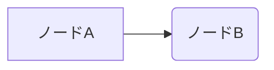
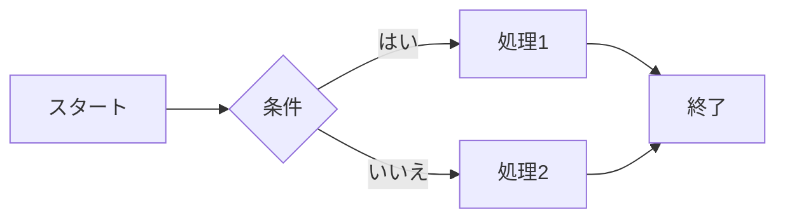
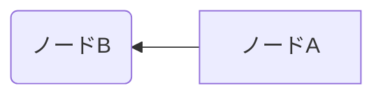

> From: https://gemini.google.com/app/41042e7551e0681f

# you asked

Mac でフォーカスのないウィンドウをクリックすると、最初はフォーカスの移動だけ行われて、クリックした操作が実行されない。これを直したい

---

# gemini response

Macでフォーカスのないウィンドウをクリックした際に、クリック操作が実行されないという問題を解決したいのですね。これはmacOSのデフォルトの挙動であり、**ダブルクリック**または**設定の変更**で解決できます。

### 解決策

#### 1\. ダブルクリックを使う方法

最もシンプルで、設定変更が不要な方法です。

1.  **1回目のクリック**: ウィンドウにフォーカスが移る
2.  **2回目のクリック**: 1回目のクリックとほぼ同じ位置をすぐにクリックすると、その操作（ボタンをクリックするなど）が実行される

#### 2\. 設定を変更する方法

この挙動を恒久的に変更したい場合は、ターミナルでコマンドを実行する必要があります。このコマンドは、**フォーカスのないウィンドウでも、最初のクリックで操作を実行する**ように設定を変更します。

1.  **「ターミナル」アプリを開く**

      * Spotlight検索（Command + Space）で「ターミナル」と入力して開く
      * または、「アプリケーション」フォルダ内の「ユーティリティ」フォルダから開く

2.  **以下のコマンドをコピー＆ペーストして実行**

    ```bash
    defaults write com.apple.universalaccess com.apple.mouse.focusFollowsMouse -bool true
    ```

3.  **Macを再起動する**

      * 設定を反映させるために、Macを再起動します。

-----

### 注意点

  * 上記の設定変更は、一部のアプリケーションで意図しない動作を引き起こす可能性があります。
  * 元のデフォルト設定に戻したい場合は、以下のコマンドを実行してください。
    ```bash
    defaults write com.apple.universalaccess com.apple.mouse.focusFollowsMouse -bool false
    ```

この設定変更は、macOSの「**universal access (ユニバーサルアクセス)**」というアクセシビリティ関連の設定を変更するものです。これにより、マウス操作の挙動がより直感的に感じられるようになります。

---

# you asked

フォルダを Finder の「よく使う項目」に追加するには？

---

# gemini response

Finderのサイドバーにある「よく使う項目」にフォルダを追加する方法はとても簡単です。主に2つの方法があります。

### 1. ドラッグ&ドロップで追加する

これが最も手軽で一般的な方法です。

1. **Finderを開く**。
2. 追加したい**フォルダ**を見つける。
3. そのフォルダを、Finderウィンドウの左側にある**サイドバー**の「よく使う項目」セクションにドラッグ&ドロップする。 
4. 目的の場所にドロップすると、フォルダがリストに追加されます。

### 2. 「ファイル」メニューから追加する

この方法でも同様にフォルダを追加できます。

1. **追加したいフォルダを選択**する。
2. メニューバーから「**ファイル**」をクリックする。
3. ドロップダウンメニューから「**サイドバーに追加**」を選択する。

---

# you asked

Chrome の PinP を毎回確認されるのが手間。確認をスキップするには？

---

# gemini response

Chromeで動画をピクチャーインピクチャー（PinP）で表示する際に、毎回確認画面が表示されて煩わしい、というお悩みですね。

これは、サイト側の設定で簡単に変更できます。特にYouTubeのような動画サイトでこの挙動がよく見られます。

### 解決策：サイトごとの設定を変更する

Chromeの設定画面から、特定のサイトのPinP設定を「許可する」に変更することで、確認画面をスキップできます。

1. **PinPを毎回確認されるサイト（例：YouTube）にアクセスする**。
2. アドレスバーの左側にある「**鍵アイコン**」または「**サイト情報アイコン**」をクリックする。
3. ポップアップメニューが表示されるので、「**サイトの設定**」をクリックする。
4. 設定画面に移動したら、「**自動的にピクチャー イン ピクチャーを開始する**」という項目を探す。
5. この項目の設定を「**確認する（Ask）**」から「**許可する（Allow）**」に変更する。

これで、次回からそのサイトでPinPを起動しようとした際に、確認画面が表示されずに自動的にPinPモードになります。

### 補足

この設定はサイトごとに管理されます。複数のサイトでこの設定を変更したい場合は、それぞれのサイトで上記の手順を繰り返す必要があります。

また、PinPに関するより詳細な設定は、Chromeの以下の設定画面からも確認できます。
`chrome://settings/content/pictureInPicture`

ここにアクセスすると、PinPが許可されているサイトの一覧を確認したり、設定を一括で管理したりすることができます。

---

# you asked

Mac の起動時にあるアプリを自動操作したい。どうする？

---

# gemini response

Macの起動時に特定のアプリを自動操作するには、**Automator**や**AppleScript**を使って自動化ワークフローを作成し、それを「ログイン項目」に登録するのが一般的です。

### 1\. アプリを自動起動させる

まず、操作したいアプリをMacの起動時に自動で立ち上がるように設定します。

1.  **アップルメニュー**  \> **システム設定** を開く。
2.  左のサイドバーで「**一般**」をクリックし、右側で「**ログイン項目**」を選択。
3.  リストの下にある「**+**」ボタンをクリック。
4.  自動で起動したいアプリを選び、「**追加**」をクリックする。

これで、Macにログインするとアプリが自動的に起動します。

-----

### 2\. アプリの自動操作を設定する

次に、起動したアプリを自動で操作するためのスクリプトやワークフローを作成します。

#### 方法① Automatorを使う（初心者向け）

**Automator**は、Macに標準で搭載されている自動化ツールです。特定の操作を記録して、一連のワークフローとして保存できます。

1.  **Automatorアプリ**を開く。
2.  「新規書類」から「**アプリケーション**」を選択。
3.  左側のライブラリから「**アプリケーションを起動**」を探し、右のワークフローエリアにドラッグ&ドロップする。
4.  ドロップダウンメニューから、自動操作したいアプリを選択する。
5.  続いて、左側のライブラリから「**ワークフローを実行**」などのアクションを探し、必要な操作（例: ウィンドウを特定の場所に移動、ボタンをクリックなど）を追加していく。
6.  完成したら、メニューバーの「**ファイル**」\>「**保存**」でアプリケーションとして保存する。

この保存したアプリケーションを、前述の「ログイン項目」に追加することで、Mac起動時に自動操作が実行されます。

#### 方法② AppleScriptを使う（上級者向け）

**AppleScript**は、より複雑で詳細な操作を自動化できるスクリプト言語です。Automatorでは難しい、より細かい制御が可能です。

1.  「**スクリプトエディタ**」アプリを開く。
2.  `tell application "アプリ名" to ...` の形式で、操作したい内容を記述する。
      * 例: Chromeを起動して特定のURLを開く
        ```applescript
        tell application "Google Chrome"
            activate
            open location "https://www.google.com"
        end tell
        ```
3.  スクリプトが完成したら、「**ファイル**」\>「**書き出す**」を選択し、ファイルフォーマットを「**アプリケーション**」にして保存する。
4.  この保存したアプリケーションを、Macの「**ログイン項目**」に追加する。

---

# you asked

crxMouseGesture で 新しいタブを開くと、既存のタブが新しいタブの画面になってしまう。そうじゃなくて、既存のタブを残したまま、新しいタブを追加で開いてほしい

---

# gemini response

crxMouseGestureでジェスチャーを使って新しいタブを開いた際、既存のタブが新しいタブに置き換わってしまうのですね。この問題は、crxMouseGestureの設定を変更することで解決できます。

### 新しいタブを「バックグラウンド」で開く設定

新しいタブを既存のタブとは別に開くようにするには、マウスジェスチャーの動作設定を「新しいタブで開く」から「**バックグラウンドの新しいタブで開く**」に変更します。

1. **Chromeの拡張機能管理画面を開く**
   * アドレスバーに `chrome://extensions` と入力してEnterキーを押す。
   * または、Chromeのメニュー（右上にある3つの点）から「その他のツール」>「拡張機能」を選択する。

2. **crxMouseGestureの設定画面を開く**
   * 拡張機能リストから「crxMouseGesture」を探し、「**詳細**」ボタンをクリックする。
   * 「拡張機能のオプション」または「設定」のリンクをクリックする。

3. **ジェスチャーの設定を編集する**
   * crxMouseGestureの設定画面で、「**タブを開く**」や「**新しいタブ**」に関連するジェスチャーを探す。
   * 通常は「**上**（↑）」方向のジェスチャーに割り当てられています。
   * そのジェスチャーの設定項目にある動作（アクション）を「新しいタブで開く」から「**バックグラウンドの新しいタブで開く**」に変更する。

---

### なぜこの問題が起きるのか

crxMouseGestureには、新しいタブを開くための似たようなジェスチャーが複数用意されています。

* **「新しいタブを開く」**: 現在のタブに上書きする形で、新しいタブを開きます。
* **「バックグラウンドの新しいタブを開く」**: 現在のタブはそのままにして、その背後で新しいタブを**追加**で開きます。

多くのユーザーが求めているのは後者の動作です。この設定を変更することで、ジェスチャーがより直感的に使えるようになります。

---

# you asked

Mac

---

# gemini response

Mac（マック）は、Appleが開発・販売しているパーソナルコンピューターのシリーズです。

---

### 特徴

* **オペレーティングシステム**: **macOS**という独自のOSを搭載しており、直感的で美しいユーザーインターフェースが特徴です。
* **デザイン**: 一体型デスクトップのiMacや、薄型軽量のMacBook Airなど、デザイン性の高さでも知られています。
* **ソフトウェア**: 写真や動画編集に強いアプリ（iMovie、GarageBandなど）が標準でプリインストールされています。
* **Apple製品との連携**: iPhoneやiPad、Apple Watchなど、他のApple製品とシームレスに連携できます（例: Handoff、AirDrop）。

---

### 主な製品ラインアップ

* **MacBook Air / Pro**: ノートパソコンのシリーズです。Airは軽量・薄型が特徴で、Proはより高い性能を求められるプロフェッショナル向けです。
* **iMac**: ディスプレイと本体が一体になったデスクトップパソコンです。 
* **Mac mini**: 超小型のデスクトップパソコンです。
* **Mac Studio / Mac Pro**: 非常に高い性能を持つ、プロフェッショナル向けのデスクトップマシンです。

---

# you asked

Mac は標準で zsh を使ってるから、brew のインストールは
/bin/bash -c "$(curl -fsSL https://raw.githubusercontent.com/Homebrew/install/HEAD/install.sh)"
じゃなくて
/bin/zsh -c "$(curl -fsSL https://raw.githubusercontent.com/Homebrew/install/HEAD/install.sh)"
こうなる？

---

# gemini response

brewのインストールスクリプトは、bashでもzshでも、どちらのシェルから実行しても問題ありません。

Homebrewの公式ウェブサイトで提供されているコマンドは、`/bin/bash` を明示的に指定しています。これは、macOSを含む多くのUNIX系OSで**bashが標準シェルとして広く利用可能である**ためです。これにより、どのシェル環境でコマンドを実行しても、確実に動作するように設計されています。

つまり、`zsh` を使っていても、インストールスクリプトは`bash`環境で実行されますが、これは意図された動作であり、問題なくインストールが完了します。

もし、あえて `zsh` で実行したい場合は、提示されたコマンドのように`/bin/zsh -c`に変更してもインストールは可能です。しかし、**Homebrewの推奨する公式な方法に従うのが最も安全で確実です**。将来的にスクリプトの仕様が変更されても、公式コマンドであれば常に最新の環境に対応しています。

したがって、**`zsh`を使用している場合でも、公式の`/bin/bash -c`から始まるコマンドをそのまま使用してください**。

---

# you asked

インストール後に再起動などいる？

---

# gemini response

ソフトウェアのインストール後に再起動が必要かどうかは、インストールするソフトウェアや、そのソフトウェアがシステムにどれだけ深く関わるかによって異なります。

### 再起動が必要なケース

* **カーネルやシステムコアに関わるアップデート**: OSのバージョンアップなど、システムの中核部分に大きな変更が加わる場合、新しいシステムを完全に読み込むために再起動が必要です。
* **デバイスドライバのインストール**: グラフィックカードやプリンタなど、ハードウェアを制御するソフトウェア（ドライバ）をインストールした後は、新しいドライバをシステムに認識させるために再起動が推奨されます。
* **システムの環境変数を変更するソフトウェア**: 新しいパスを通したり、システム全体に影響するような環境設定を変更したりするソフトウェアは、変更を有効にするために再起動が必要なことがあります。

---

### 再起動が不要なケース

* **一般的なアプリケーションのインストール**: WordやChrome、ゲームなど、ほとんどの一般的なアプリケーションは、インストール後に再起動する必要はありません。インストールが完了次第、すぐに使用できます。
* **特定のユーザー環境にのみ影響するソフトウェア**: システム全体ではなく、特定のユーザーのアカウントにのみ影響する設定の変更やソフトウェアは、再起動を必要としないことが多いです。

インストール完了後に再起動が必要な場合は、通常、インストーラーがその旨を明示的に通知します。「**再起動しますか？**」というダイアログが表示されたり、インストール完了画面にその指示が表示されたりします。特に指示がない場合は、再起動は不要と考えて問題ありません。

---

# you asked

brew の場合を聞いてる

---

# gemini response

Homebrewのインストール後にMacを再起動する必要はありません。

### 理由

Homebrewは、Macの**ユーザー環境**にインストールされるパッケージマネージャです。システムの奥深くにあるカーネルやドライバを変更するわけではなく、ユーザーが利用するコマンドやアプリケーションを管理するツールです。

インストールスクリプトの実行が完了した時点で、Homebrewのパスがユーザーの`.zshrc`や`.bash_profile`といったシェル設定ファイルに追加されます。これにより、新しいターミナルセッションを開けば、`brew`コマンドがすぐに使えるようになります。

インストール完了後に再起動を促すメッセージが表示されることもありませんので、安心してそのまま使い始めてください。

---

# you asked

which brew
brew not found

なんだけど、どうすればいい？

---

# gemini response

`which brew`コマンドで「brew not found」と表示されるのは、Homebrewがインストールされていないか、ターミナルの**PATH**にHomebrewの実行ファイルがあるディレクトリが登録されていないことが原因です。

### 解決方法

#### 1\. Homebrewを再インストールする

まず、Homebrewの公式サイトにアクセスし、インストールコマンドをコピーして再度実行してみてください。

```bash
/bin/bash -c "$(curl -fsSL https://raw.githubusercontent.com/Homebrew/install/HEAD/install.sh)"
```

インストールスクリプトが自動的にPATHの設定も行ってくれます。

#### 2\. PATHを手動で設定する

インストール済みであるにもかかわらず、`brew not found`となる場合は、PATHが正しく設定されていない可能性があります。

**zsh**を使っている場合、以下のコマンドをターミナルで実行して、設定ファイルを開きます。

```bash
open ~/.zshrc
```

ファイルに以下の行を追加して保存してください。

```bash
eval "$(/opt/homebrew/bin/brew shellenv)"
```

**bash**を使っている場合、以下のコマンドを実行します。

```bash
open ~/.bash_profile
```

ファイルに以下の行を追加して保存してください。

```bash
eval "$(/opt/homebrew/bin/brew shellenv)"
```

ファイルを保存したら、以下のコマンドを実行して設定を反映させます。

```bash
source ~/.zshrc  # zshの場合
source ~/.bash_profile # bashの場合
```

これで`brew`コマンドが使えるようになるはずです。

### 補足

`brew shellenv`コマンドは、Homebrewの実行パスを正しく設定するための環境変数を出力します。このコマンドを`.zshrc`などの設定ファイルに追加しておくことで、新しいターミナルセッションを開くたびに自動でPATHが設定されるようになります。

-----

**それでも解決しない場合**

  * **Homebrewのインストールパスを確認する**: `find / -name "brew" 2>/dev/null` を実行し、brewの実行ファイルがどこにあるかを確認してください。`opt/homebrew/bin/brew`にない場合は、手動でパスを指定する必要があります。
  * **権限の問題**: 権限の問題でインストールが中断された可能性も考えられます。その場合は、`sudo`コマンドを使ってインストールを試す必要があるかもしれません。
  * **MacのOSバージョン**: 古いバージョンのmacOSでは、インストール手順が異なる場合があります。
  * **プロキシやファイアウォール**: ネットワーク設定（プロキシ、VPN、ファイアウォールなど）が原因で、インストールスクリプトのダウンロードに失敗している可能性も考えられます。

---

# you asked

デフォルトで .zshrc って存在しない？

---

# gemini response

いいえ、デフォルトの状態では **`.zshrc` ファイルは存在しません**。

macOS Catalina以降、デフォルトのシェルは `zsh` になりましたが、ユーザーが`zsh`のカスタマイズを始めるまで、設定ファイルである`.zshrc`は自動で作成されません。そのため、Homebrewをインストールする際などに「`brew` のPATHを`.zshrc`に追記してください」と指示されても、ファイルが見つからないということがよく起こります。

### .zshrcを作成・編集する方法

`~/.zshrc`が存在しない場合は、以下の手順で新規作成できます。

1.  **ターミナルを開く**
    * `Command + Space`でSpotlight検索を開き、「ターミナル」と入力して起動します。

2.  **ファイルを作成・編集する**
    * `nano ~/.zshrc` と入力してEnterキーを押すと、`.zshrc`ファイルを新規作成して`nano`エディタが開きます。

3.  **内容を追記して保存する**
    * ファイルに設定内容（例：`eval "$(/opt/homebrew/bin/brew shellenv)"`）を貼り付けます。
    * `Control + X` を押して終了し、`Y` を押して変更を保存します。

4.  **設定を反映する**
    * `source ~/.zshrc` と入力してEnterキーを押すか、ターミナルを再起動すると、設定が有効になります。

---

# you asked

soruce ~/.zshrc
unmatched

これは何？

---

# gemini response

`.zshrc`ファイルを編集した際に、括弧の対応が取れていないことが原因で「unmatched」というエラーが発生しています。

### 原因

`zsh`の`source`コマンドは、実行するスクリプト内の構文エラーをチェックします。このエラーは、以下の文字のいずれかが対になっていない場合に表示されます。

  * `(` と `)`
  * `[` と `]`
  * `{` と `}`
  * `"` と `"`
  * `'` と `'`

最も一般的な原因は、引用符 (`"`, `'`) や括弧 (`(`, `)`) のペアが欠けていることです。例えば、以下のような記述が考えられます。

```zsh
eval "$(/opt/homebrew/bin/brew shellenv)
```

この例では、行末の引用符が抜けています。

### 解決方法

1.  **`~/.zshrc` ファイルを再度開く**

    ```bash
    open ~/.zshrc
    ```

2.  **構文エラーを探す**

      * 追加した行 **`eval "$(/opt/homebrew/bin/brew shellenv)"`** を確認します。
      * 特に、**行頭の `eval "` と行末の `)"`** が正しく記述されているかを確認してください。
      * もし、他にも独自に追加した設定があれば、その行に同じような構文エラーがないか確認します。

3.  **ファイルを修正して保存する**

      * `"` や `)` の抜けがあれば、正しく修正します。
      * 修正後、ファイルを保存して閉じます。

4.  **再度 `source` コマンドを実行する**

      * `source ~/.zshrc` を実行して、エラーが解消されたか確認します。

### 補足

`source ~/.zshrc`は、現在のターミナルセッションに設定を読み込ませるためのコマンドです。このコマンドでエラーが出た場合、`zshrc`ファイルに何らかの構文エラーがあることを示しています。ファイル内の`brew shellenv`の行を再確認し、正しくコピー&ペーストされているかを確かめてください。

---

# you asked

Mac の zsh の表示が今は
kobayashi.takeru@mf-5155-mm01 ~ % 
なんだけど、これを
[username]@[computername] ~ % 

にしたい

---

# gemini response

Zshのプロンプト表示を`[username]@[computername] ~ %`に変更するには、`.zshrc`ファイルに設定を書き込む必要があります。

### 設定の変更手順

1.  **`.zshrc`ファイルを開く**
    ターミナルで以下のコマンドを実行して、設定ファイルを開きます。

    ```bash
    nano ~/.zshrc
    ```

    もしファイルが存在しない場合は、このコマンドで新規作成されます。

2.  **プロンプト設定を追記する**
    ファイルの末尾に以下の行を追加してください。

    ```zsh
    PROMPT='[%n]@[%m] %~ %# '
    ```

    この設定行は、以下の特殊文字を使ってプロンプトをカスタマイズしています。

      - `%n`: ユーザー名 (username)
      - `%m`: ホスト名（コンピュータ名）
      - `%~`: 現在のディレクトリを短縮形式で表示（例: `/Users/kobayashi` を `~` に）
      - `%#`: 権限に応じて表示を切り替え（`%` は一般ユーザー、`#` はrootユーザー）

3.  **ファイルを保存して閉じる**

      - `Control + X` を押す。
      - `Y` を押して変更を保存する。
      - `Enter` を押してファイル名を確定する。

-----

### 設定を即時反映する

ターミナルを再起動しなくても、以下のコマンドで設定をすぐに反映させることができます。

```bash
source ~/.zshrc
```

これで、新しいプロンプトの表示形式が適用されているはずです。

---

# you asked

変わらなかった。なんでだろう？

---

# gemini response

設定が変わらない場合、以下のいずれかの理由が考えられます。

### 1\. ターミナルを再起動していない

`source ~/.zshrc` コマンドは、現在開いているターミナルウィンドウにのみ設定を適用します。新しいターミナルウィンドウを開くか、既存のターミナルを一度閉じてから再度開くと、設定が自動的に読み込まれてプロンプトが変更されます。

### 2\. `.zshrc`ファイルが読み込まれていない

もし`.zshrc`を編集しても変化がない場合、`zsh`がそのファイルを読み込んでいない可能性があります。`zsh`は、複数の設定ファイルを特定の順番で読み込みます。

  - `~/.zshrc`
  - `~/.zprofile`
  - `~/.bash_profile`
  - `~/.bashrc`

これらのファイルに設定が分散していると、意図したように動作しないことがあります。

### 3\. 他の設定で上書きされている

`.zshrc`ファイル内の、より後に記述された別の設定が、あなたの設定を上書きしている可能性があります。**ファイルを最初から確認し、`PROMPT`や`PS1`に関する別の記述がないか探してください。**

もし、他の設定行が見つかった場合、新しい設定が最後にくるように、元の設定行を削除またはコメントアウト（行頭に `#` をつける）してから、**`PROMPT='[%n]@[%m] %~ %# '`** を再度追記してください。

### 4\. 設定内容に構文エラーがある

`source` コマンドでエラーが出なかったとしても、ごく稀に構文エラーが原因でうまく機能しないことがあります。設定内容をもう一度、一字一句正確にコピー＆ペーストして試してみてください。

### 解決策のまとめ

1.  **ターミナルを再起動**する。
2.  **`.zshrc`ファイルの中身を再確認**し、**`PROMPT`** が他の設定で上書きされていないか、もしくは複数記述されていないかチェックする。
3.  最も確実な方法として、`~/.zshrc`の**一番最後に**以下の行を改めて追加する。
    ```zsh
    PROMPT='[%n]@[%m] %~ %# '
    ```

---

# you asked

GraphQL って protobuf 使うんだっけ？

---

# gemini response

いいえ、**GraphQLはprotobuf（Protocol Buffers）を標準で使うわけではありません。**

GraphQLはデータのクエリ言語であり、APIの仕様を定義するものです。これに対して、protobufはデータを効率的にシリアライズ（構造化されたデータをバイト列に変換）するためのフォーマットです。両者は異なる役割を持っています。

### 役割の違い

* **GraphQL**: **「どんなデータを取得したいか」を定義**します。クライアントがサーバーに対して、必要なデータだけを正確に要求するための仕組みを提供します。
* **Protobuf**: **「データをどのように送るか」を定義**します。JSONやXMLの代わりに、コンパクトで高速なバイナリ形式でデータをやり取りするための手段です。

### 両者の関係性

GraphQLとprotobufは、それぞれが異なるレイヤーで機能するため、**組み合わせて使うことは可能**です。

たとえば、GraphQLのサーバーとクライアント間で、データをProtobuf形式でやり取りするようにカスタマイズすることは技術的に可能です。しかし、これは一般的な使われ方ではなく、GraphQLの標準的な通信フォーマットはJSONです。

---

# you asked

GraphQL を詳しく説明して

---

# gemini response

GraphQLは、APIのためのクエリ言語であり、クライアントがサーバーから必要なデータだけを正確に取得するための仕組みです。REST APIと比べ、柔軟なデータ取得を可能にし、オーバーフェッチやアンダーフェッチといった問題を解決します。

### GraphQLの主な特徴

#### 1\. 必要なデータだけを取得できる

REST APIでは、通常、エンドポイントごとに取得できるデータが決まっています。例えば、ユーザー情報を取得する`GET /users/:id`というエンドポイントがあった場合、そのエンドポイントがユーザー名、メールアドレス、住所、投稿履歴などすべての情報を返します。これは、クライアントが必要な情報がユーザー名だけの場合でも、サーバーがすべての情報を返すことになり、\*\*オーバーフェッチ（過剰なデータ取得）\*\*という問題を引き起こします。

一方、GraphQLではクライアントが**取得したいデータの構造を自分で定義**できます。例えば、ユーザー名だけが必要な場合は、以下のようにクエリを送信します。

```graphql
query {
  user(id: "1") {
    name
  }
}
```

このリクエストに対し、サーバーはユーザー名のみを返します。これにより、通信量が削減され、特にモバイル環境でパフォーマンスが向上します。

\<br\>

#### 2\. 単一のエンドポイント

RESTでは、`GET /users`、`GET /posts`、`GET /comments`のように、リソースごとに複数のエンドポイントが存在します。
GraphQLでは、通常\*\*単一のエンドポイント（例: `/graphql`）\*\*ですべてのやり取りを行います。クライアントは、この単一のエンドポイントに対して、必要なデータを指定したクエリを送信します。

\<br\>

#### 3\. 複数のリソースを一度に取得できる

RESTでは、ユーザーとユーザーの投稿を同時に取得したい場合、2回のリクエスト（`GET /users/1`と`GET /users/1/posts`）が必要になります。これを\*\*アンダーフェッチ（データ不足）\*\*と呼びます。

GraphQLでは、一つのクエリで複数のリソースをまとめて取得できます。

```graphql
query {
  user(id: "1") {
    name
    posts {
      title
    }
  }
}
```

これにより、クライアントとサーバー間の**通信回数が削減**され、効率的なデータ取得が可能になります。

\<br\>

### GraphQLの3つの操作タイプ

GraphQLには、大きく分けて3つの操作タイプがあります。

1.  **Query（クエリ）**: データの**読み込み**に使用します。`SELECT`文に相当します。
2.  **Mutation（ミューテーション）**: データの**作成、更新、削除**に使用します。`INSERT`や`UPDATE`、`DELETE`文に相当します。
3.  **Subscription（サブスクリプション）**: リアルタイムでデータの**変更を購読**するために使用します。データの変更がサーバーで発生すると、クライアントに自動的に通知されます。チャットアプリやライブアップデートなどで使われます。

---

# you asked

Chrome で Gemini を便利に使う方法は？

---

# gemini response

ChromeでGeminiを便利に使う方法はいくつかあり、それぞれに異なる利点があります。

### 1. アドレスバーのショートカットを利用する

これが最も手軽で、追加のインストールが不要な方法です。

1.  Chromeのアドレスバーをクリックする。
2.  「**@gemini**」と入力する。
3.  `Tab` キーまたは `Space` キーを押す。
4.  アドレスバーが「Geminiとチャット」に変わるので、そのまま質問やプロンプトを入力して`Enter`を押す。
5.  自動的に`gemini.google.com`にリダイレクトされ、Geminiの回答が表示されます。

この方法は、ブラウザのどこからでも素早くGeminiにアクセスしたい場合に非常に便利です。

### 2. Geminiの拡張機能（サードパーティ製）を利用する

Chromeウェブストアには、Geminiをサイドバーやポップアップで利用できるようにするサードパーティ製の拡張機能が多数存在します。

* **サイドバーで利用**: 多くの拡張機能は、Chromeの右側にサイドバーを表示し、Webページを閲覧しながらGeminiと対話できるようにします。これにより、タブを切り替える手間が省けます。
* **ページの要約**: 一部の拡張機能は、現在開いているページのコンテンツをGeminiに分析させて、要約や関連情報を取得する機能を提供します。

**注意点**: サードパーティ製の拡張機能は、その開発者がGoogleではないため、セキュリティやプライバシーに注意が必要です。インストールする際は、レビューや開発者情報をよく確認してください。

### 3. Google WorkspaceのGemini（ビジネス向け）を利用する

もし、あなたがGoogle Workspaceユーザーであれば、GmailやGoogle ドキュメント、スプレッドシートなどのサイドパネルにGeminiを統合して利用できます。

* **メールの要約と返信の作成**: GmailのサイドパネルでGeminiを起動し、長いメールスレッドを要約したり、返信文の草稿を作成したりできます。
* **ドキュメント作成の支援**: Google ドキュメントのサイドパネルでGeminiに質問や指示を出し、文章の作成や校正をリアルタイムで行えます。

この機能は、特にビジネスや学術用途で、複数のGoogleサービスを横断して効率的に作業したい場合に非常に強力です。

これらの方法を組み合わせて、ご自身の用途に最も合った方法でGeminiを活用してみてください。

---

# you asked

Chrome の縦タブを使うには

---

# gemini response

Chromeに標準で搭載されている縦タブ機能はありませんが、**拡張機能**を利用することで、タブを縦に表示できます。最も一般的で使いやすいのは、「**Vertical Tabs**」などの拡張機能です。

### 拡張機能を使った縦タブの導入方法

1.  **Chromeウェブストアにアクセス**
    * Chromeブラウザで、右上のメニュー（3つの点）をクリックし、「**その他のツール**」>「**拡張機能**」を選択します。
    * 画面左上の「**≡**」メニューから、一番下の「**Chromeウェブストアを開く**」をクリックします。

2.  **拡張機能を検索してインストール**
    * 検索窓に「**Vertical Tabs**」と入力します。
    * 検索結果から、評価が高く、ユーザー数の多い拡張機能を選び、「**Chromeに追加**」ボタンをクリックします。

3.  **縦タブを有効化する**
    * 拡張機能をインストールすると、ツールバーにアイコンが追加されます。
    * このアイコンをクリックすることで、ブラウザの左側または右側にタブが縦に表示されるサイドバーが開きます。

### 縦タブのメリット

* **多くのタブを管理しやすい**: タブが増えても、タイトルがすべて表示されるため、目的のタブを探しやすくなります。
* **誤って閉じるリスクが減る**: タブが小さくならないため、タブを閉じようとして隣のタブを誤ってクリックしてしまうことがなくなります。

### 補足

Microsoft EdgeやBraveといった一部のブラウザでは、縦タブ機能が標準で搭載されています。もし、縦タブを頻繁に利用する場合は、これらのブラウザを検討するのも一つの方法です。

---

# you asked

GraphQL についてもう一度押して得て

---

# gemini response

はい、承知しました。GraphQLについて、より簡潔に、要点を絞って解説します。

### GraphQLとは？

GraphQLは、**APIを扱うための「クエリ言語」です。クライアント（アプリなど）がサーバーから必要なデータだけを、必要な形で取得**できるようにするためのものです。

-----

### REST APIとの決定的な違い

REST APIでは、エンドポイントごとに取得できるデータが決まっています。

  * **ユーザー情報が欲しい場合**: `/users/1`
  * **ユーザーの投稿が欲しい場合**: `/users/1/posts`
    このように、複数の情報が必要な場合は**何度もサーバーにリクエスト**を送らなければなりません。

一方、GraphQLでは、サーバーとのやり取りは**たった1つのエンドポイント**で行います。クライアントは、**「欲しいデータの形」を記述したリクエスト**を送信します。

**例：ユーザー情報と投稿を一度に取得したい場合**

REST APIだと2回リクエストが必要なところが、GraphQLなら1回で済みます。

```graphql
query {
  user(id: "1") {
    name
    email
    posts {
      title
    }
  }
}
```

このように、クライアントは`user`と`posts`を**同時に、かつ必要なフィールドだけを指定して**取得できます。これにより、**通信回数が減り、通信量も削減**できるため、特にモバイルアプリなどで大きなメリットがあります。

-----

### GraphQLの3つの機能

  * **Query（クエリ）**: データの**読み込み**。`SELECT`文に相当します。
  * **Mutation（ミューテーション）**: データの**作成、更新、削除**。`INSERT`や`UPDATE`に相当します。
  * **Subscription（サブスクリプション）**: リアルタイムなデータの**購読**。チャットのメッセージ受信など、サーバー側のデータ変更を即座に受け取るのに使います。

GraphQLは、柔軟で効率的なデータ取得を可能にする新しいAPIの標準と言えます。

---

# you asked

graph LR

---

# gemini response

GraphLRは、テキストベースで簡単なグラフ（フローチャート、シーケンス図など）を作成するためのmermaidというライブラリの記法の一つです。GraphLRの「LR」は、「**Left to Right**」（左から右へ）を表し、グラフのノードが左から右に向かって描画されることを示しています。

-----

### 基本的な使い方

GraphLRでは、ノードとノードの関係性を矢印で表現します。

#### ノードの定義

ノードはIDで定義されます。IDは任意の文字列にできます。



#### ノードの形状

ノードIDの後に続くカッコの種類によって、ノードの形を変えることができます。

  * `[ ]` : 四角いボックス
  * `( )` : 丸いボックス
  * `{ }` : ひし形（通常、条件分岐に使う）
  * `(( ))` : 円

#### 矢印の定義

`-->` のような矢印記号を使って、ノード間の関係を表現します。矢印の種類も複数あります。

  * `-->` : シンプルな矢印
  * `-- テキスト -->` : 矢印にラベルを追加
  * `---` : ラベル付きの線（矢印なし）

### 例

簡単なフローチャートを作成してみましょう。



このコードは以下のように描画されます。

---

# you asked

graph LR の Mermaid で右から左に向く矢印を書ける？

---

# gemini response

はい、Mermaidの`graph LR`では、**右から左に向かう矢印は書けません**。

`graph LR`（Left to Right）はその名の通り、グラフの描画方向が「左から右」に固定されています。

### 別の方向を指定する方法

右から左へ、または上から下など、別の方向にグラフを描画したい場合は、`graph`の後に別の方向指定子を使います。

  * **`graph RL`**: **R**ight to **L**eft（右から左へ）
  * **`graph TD`** または **`graph TB`**: **T**op to **D**own または **T**op to **B**ottom（上から下へ）
  * **`graph BT`**: **B**ottom to **T**op（下から上へ）

### 例：右から左への矢印を書く

`graph RL` を使用すると、グラフの描画方向が右から左に変わります。



このコードを実行すると、`B` から `A` へ向かう矢印が描画されます。