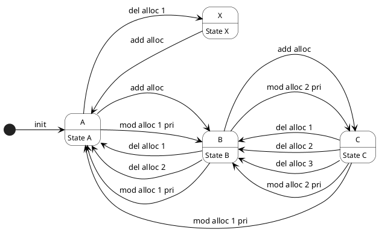

> From: https://gemini.google.com/app/ec104855585cf99d

# you asked

@startuml StateTransitionDiagram
skinparam state {
  BackgroundColor White
  BorderColor Black
  FontColor Black
  FontSize 12
  ArrowColor Black
}

' 初期状態をState Aに設定
[*] --> A : init

' 状態遷移の定義 (State X)
state X
X : State X
X --> A : add alloc

' 状態遷移の定義 (State A)
state A
A : State A
A --> B : add alloc
A --> X : del alloc 1
A --> B : mod alloc 1 pri

' 状態遷移の定義 (State B)
state B
B : State B
B --> C : add alloc
B --> A : del alloc 1
B --> A : del alloc 2
B --> A : mod alloc 1 pri
B --> C : mod alloc 2 pri

' 状態遷移の定義 (State C)
state C
C : State C
C --> B : del alloc 1
C --> B : del alloc 2
C --> B : del alloc 3
C --> A : mod alloc 1 pri
C --> B : mod alloc 2 pri

@enduml

この状態遷移図を横向きにして

---

# gemini response

状態遷移図を横向き（左から右）にレイアウトするには、`left to right direction` というコマンドを追加します。

### 修正後のコード

`skinparam` ブロックの直後に `left to right direction` を追加しました。

