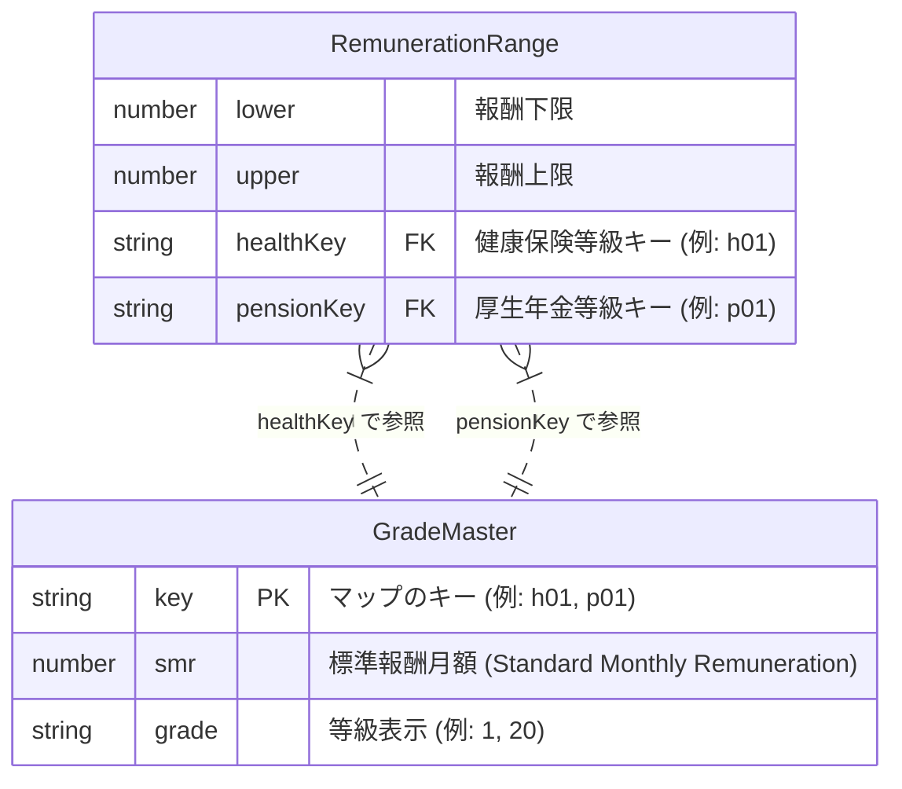
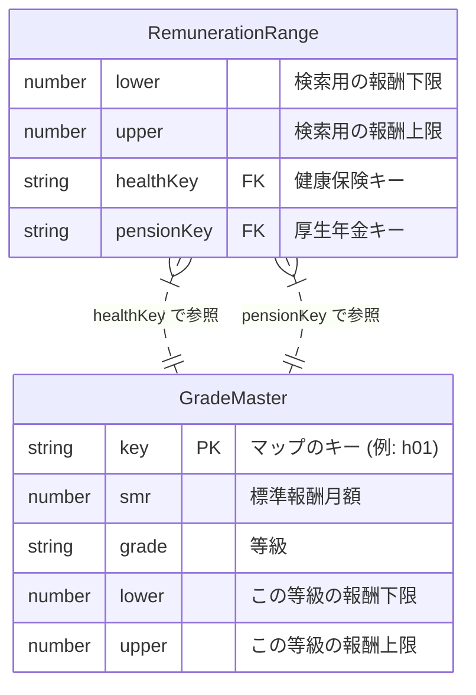
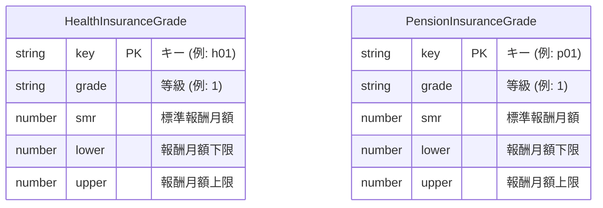
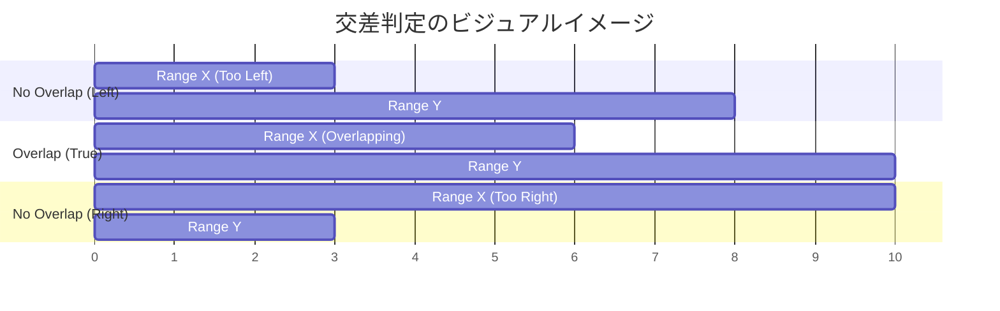
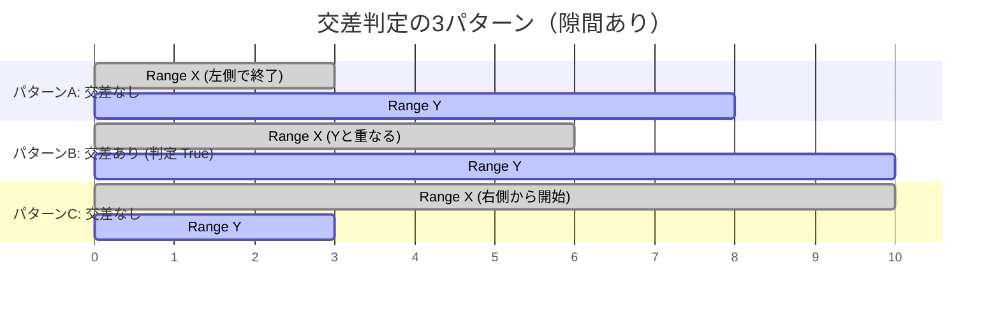

> From: https://gemini.google.com/app/fc68249c595da74d

# you asked

// 1. A single remuneration range
interface RemunerationRange {
  lower: number;
  upper: number;
  healthKey: string;
  pensionKey: string;
}

// 2. Grade definition
interface InsuranceGrade {
  smr: number;
  grade: string;
}

// 3. Grade master
// i.e.: { "h01": { smr: 58000, grade: "1" }, ... }
type GradeMap = Record<string, InsuranceGrade>;

// 4. Whole structure
type RemunerationRanges = RemunerationRange[];

ER 図を書ける？

---

# gemini response

はい、提示されたTypeScriptの型定義に基づいて、データ構造を表す\*\*ER図（Entity Relationship Diagram）\*\*を作成しました。

この構造は、一般的に**日本の社会保険（健康保険・厚生年金保険）の標準報酬月額等級**を管理するためのデータモデルに見受けられます。

### ER図 (Mermaid)

`GradeMap` のキー（`"h01"`など）を主キー（PK）とする「等級マスター」と、報酬範囲を定義する「報酬範囲テーブル」の2つのエンティティとして表現しています。



-----

### 図の解説

このデータモデルは、**リレーショナルな関係**を持っています。

#### 1\. `GradeMaster` (等級マスター)

TypeScriptの `GradeMap` (`Record<string, InsuranceGrade>`) に相当します。

  * **PK (Primary Key):** `Record` のキー部分（例: `"h01"`, `"p05"`）。
  * **属性:** `smr`（標準報酬月額）と `grade`（等級番号）。
  * ここには、健康保険用と厚生年金用の両方の等級定義が含まれると想定されます。

#### 2\. `RemunerationRange` (報酬範囲)

TypeScriptの `RemunerationRanges` 配列の各要素に相当します。

  * 給与の範囲（`lower` 〜 `upper`）を定義します。
  * その範囲が、どの「健康保険等級 (`healthKey`)」および「厚生年金等級 (`pensionKey`)」に該当するかを指し示します。

#### 3\. リレーション (関係性)

  * **多対1 (N:1):** `RemunerationRange` は、外部キー (`healthKey`, `pensionKey`) を通じて `GradeMaster` を参照しています。
      * `healthKey` -\> `GradeMaster.key`
      * `pensionKey` -\> `GradeMaster.key`

### 補足: 実際のデータイメージ

この構造をJSONデータとして具体化すると、以下のようになります。

```json
// GradeMap (GradeMaster)
{
  "h01": { "smr": 58000, "grade": "1" },
  "h02": { "smr": 68000, "grade": "2" },
  "p01": { "smr": 88000, "grade": "1" }
}

// RemunerationRanges
[
  {
    "lower": 0,
    "upper": 63000,
    "healthKey": "h01", // GradeMapの "h01" を参照
    "pensionKey": "p01" // GradeMapの "p01" を参照（※年金は下限が異なる場合があるため別キー）
  }
]
```

-----

このデータ構造に基づいて、\*\*SQLのテーブル定義（DDL）\*\*を作成したり、**データの検索ロジック**（例：給与額から等級を引く関数）を提案することも可能です。ご希望があればお知らせください。

---

# you asked

Grade Master も lower と upper を持ってるので ER 図に追加して

---

# gemini response

承知しました。**GradeMaster（等級マスター）側にもその等級における報酬範囲（lower / upper）を持たせる**形にER図を更新します。

実際の社会保険の等級表（マスター）は「等級、月額、**対象となる報酬の範囲（◯円以上〜◯円未満）**」がセットで定義されているため、この形の方が実態（公的な等級表の定義）に近くなります。

### 更新版 ER図

`GradeMaster` に属性を追加しました。



-----

### データ構造の変更点とポイント

この変更により、データモデルの意味合いが少し深くなりました。

1.  **GradeMaster（定義）**

      * TypeScript型: `Record<string, InsuranceGrade & { lower: number, upper: number }>`
      * 役割: **「法律で決まっている等級表そのもの」** を表します。
      * 例: 「健康保険の1等級（h01）は、報酬月額が63,000円未満（lower:0, upper:63000）の人」という定義を持ちます。

2.  **RemunerationRange（照合・検索用）**

      * 役割: **「給与計算ロジックのための最適化テーブル」** という位置づけになります。
      * 健康保険と厚生年金は、等級の区切り（金額のレンジ）が微妙に異なります。そのため、両方の区切りを統合して細分化した「共通のレンジ」を `RemunerationRange` として持っておくことで、給与額から一発で両方のキーを引けるようになります。

### TypeScriptの型定義（更新イメージ）

ER図に合わせてインターフェースを修正すると、以下のようになります。

```typescript
// 1. Grade definition (更新: 範囲定義を追加)
interface InsuranceGrade {
  smr: number;
  grade: string;
  lower: number; // 追加: その等級の定義上の下限
  upper: number; // 追加: その等級の定義上の上限
}

// 2. Grade master
type GradeMap = Record<string, InsuranceGrade>;

// 3. Remuneration range (検索用)
// こちらは変更なし。給与計算時に「給与額」を投げて検索するためのスライスされた範囲
interface RemunerationRange {
  lower: number;
  upper: number;
  healthKey: string;
  pensionKey: string;
}

type RemunerationRanges = RemunerationRange[];
```

このようにマスター側に範囲を持たせておくと、UIで「等級一覧表」を表示する際などに非常に扱いやすくなります。

---

# you asked

Master を健保と厚年で分けて、RR マスターを削除して

---

# gemini response

ご要望に合わせて、\*\*「GradeMasterを健保（Health）と厚年（Pension）に分割」**し、**「RemunerationRange（検索用の中間テーブル）を削除」\*\*したER図を作成します。

この構造は、正規化が進み、各保険の定義が独立するため、データの管理がスッキリします（その代わり、検索時は給与額を使ってそれぞれのテーブルを直接引くことになります）。

### ER図 (Mermaid)

2つの独立したマスターテーブルが存在する形になります。



-----

### TypeScript 型定義の変更点

データ構造の変更に伴い、型定義も以下のようにシンプルになります。`RemunerationRange` が消え、2つの独立したマップになります。

```typescript
// 共通の等級定義インターフェース
interface InsuranceGrade {
  smr: number;    // 標準報酬月額
  grade: string;  // 等級
  lower: number;  // 下限
  upper: number;  // 上限
}

// 1. 健保マスター
// 例: { "h01": { smr: 58000, grade: "1", lower: 0, upper: 63000 }, ... }
type HealthGradeMap = Record<string, InsuranceGrade>;

// 2. 厚年マスター
// 例: { "p01": { smr: 88000, grade: "1", lower: 0, upper: 93000 }, ... }
type PensionGradeMap = Record<string, InsuranceGrade>;

// ※ RemunerationRanges (RR Master) は削除されました
```

### この構造のメリット・デメリット

**メリット:**

  * **管理が楽:** 「健保の料率改定」や「厚年の等級追加」が起きた際、それぞれのテーブルだけを更新すれば良いため、運用ミスが減ります。
  * **構造が直感的:** 実際の法定義（別々の表）と同じ構造になります。

**デメリット（注意点）:**

  * **検索ロジックの変化:** 以前は `RemunerationRange` を1回引けば両方のキーが分かりましたが、この構造では、ある給与額に対して **「健保テーブルを検索」** と **「厚年テーブルを検索」** の2回の検索処理（あるいはフィルタリング）を行う必要があります。

---

# you asked

健保の h_00、h_01、h_02 などは p_00 と対応付けられる。この対応付における符号や ID を定義したいんだけど、名前は何が良い？

---

# gemini response

その「h\_xx」と「p\_xx」を結びつける（あるいは包含する）概念のIDですね。
これは\*\*「標準報酬月額（Standard Monthly Remuneration = SMR）」のランク\*\*そのものを指すIDになるため、その文脈に合わせた名前が適切です。

いくつかの切り口で提案します。

### 1\. 業務ドメインに即した命名（推奨）

社会保険の業務用語である「標準報酬月額（SMR）」や「等級（Grade）」の上位概念として扱うパターンです。

  * **`smrCode` / `smrID`**
      * 最も実態に近いです。両者を結びつけているのは「標準報酬月額（SMR）」という共通の金額基準だからです。
  * **`rankCode` / `rankID`**
      * 「等級（Grade）」という言葉がすでに個別の保険（h\_xx, p\_xx）で使われている場合、それらを統括するランクとして区別できます。
  * **`bracketID`**
      * 給与計算や税務でよく使われる「層（ブラケット）」という意味です。「給与レンジの区分けID」というニュアンスが出ます。

### 2\. 構造的な対応関係を示す命名

「マッピングするためのキー」であることを強調するパターンです。

  * **`correspondenceCode`**
      * 直訳ですが、対応関係を示す意図は明確です。
  * **`linkKey` / `linkID`**
      * シンプルですが、何と何をリンクしているかが名前からは見えないため、コメント等で補足が必要です。
  * **`commonGradeID`**
      * 「共通等級」という意味です。

### 3\. 具体的な実装例

個人的な推奨は、ドメインの意味が明確な **`smrCode`** または **`bracketId`** です。

もし、この対応表を一つの「マスター」として定義する場合、以下のような構造が考えられます。

```typescript
// 対応関係（マッピング）を定義するインターフェース
interface GradeMapping {
  // 提案名: smrCode (標準報酬月額コード)
  // 理由: h_xx と p_xx を結びつける根拠は SMR だから
  smrCode: string; 

  // 対応する各保険のキー（null許容なのは、片方にしか存在しない等級があるため）
  healthKey: string | null;  // e.g. "h01"
  pensionKey: string | null; // e.g. "p01"
  
  // 補足情報として表示名など
  label: string; // e.g. "1等級 (5万8千円)"
}

// データ例
const mappings: GradeMapping[] = [
  { smrCode: "r01", healthKey: "h01", pensionKey: "p01", label: "..." },
  { smrCode: "r02", healthKey: "h02", pensionKey: null,  label: "..." }, // 厚年は等級が少ない場合など
];
```

### どの命名を採用すべきかの基準

  * **「金額」に着目する場合:** `smrCode`, `remunerationLevel`
  * **「表の行」に着目する場合:** `rowId`, `tableRowKey`
  * **「給与の範囲」に着目する場合:** `bracketId`, `rangeCode`

**`smrCode`** (Standard Monthly Remuneration Code) が、開発チーム内で「何のID？」と聞かれた時に「標準報酬月額の区分のことだよ」と説明しやすいため、一番のおすすめです。

---

# you asked

2 つのリストが共通の値を持つかを検査するコードを JS で実装してみて。単純に済むかしら？

---

# gemini response

はい、JavaScript（ES6以降）であれば、**`Set`** と **`some`** を組み合わせることで、非常にシンプルかつ高速（効率的）に実装できます。

### 最もおすすめの方法 (`Set` を使う)

これが**計算量的にも速く、コードも短い**ベストな書き方です。片方を `Set` に変換することで検索を一瞬（$O(1)$）で行えるようにします。

```javascript
const listA = ['h01', 'h02', 'h03'];
const listB = ['p01', 'p02', 'h02']; // 'h02' が共通

// 共通の値があるかチェック (true/false)
const hasCommon = listA.some(item => new Set(listB).has(item));

console.log(hasCommon); // true
```

### さらに短い書き方（データ量が少ない場合）

データ量が少ない（数十〜数百件程度）なら、`Set` を作らずに配列のまま `includes` で探すのが一番直感的です。

```javascript
// 配列のまま検索（リストが大きいと少し遅くなる可能性があります）
const hasCommon = listA.some(item => listB.includes(item));
```

-----

### 解説

  * **`some()`**: 配列の中に、条件を満たすものが「1つでも」あれば `true` を返し、そこでループを止めます（全件チェックしないので効率的です）。
  * **`Set`**: 重複を許さないリストですが、`has()` メソッドが非常に高速という特徴があります。

**結論：**
基本的には **`Set` を使うパターン** を覚えておけば、データ量が増えてもパフォーマンスが落ちないので安心です。

---

# you asked

listA.some と書くと、listA と listB に対称性が無いように見える。入れ替えても意味の変わらない処理なので、対称的な実装にしたい

---

# gemini response

おっしゃる通りです。`listA.some` は「A を主語にして B を探す」形になるため、コード上の対称性が損なわれていますね。

**「A と B は対等である」** という意図をコードで表現するための、対称的な実装パターンを3つ紹介します。

### 1\. 結合してサイズを比較する（最も対称的）

「2つを合わせた集合のサイズ」が「個々の合計」よりも小さければ、重複（共通の値）があるということです。

```javascript
const listA = ['h01', 'h02'];
const listB = ['p01', 'h02'];

// 「合体後のユニーク数」 < 「単体の合計数」 なら共通項あり
const hasCommon = new Set([...listA, ...listB]).size < (listA.length + listB.length);

console.log(hasCommon); // true
```

  * **メリット:** 文法的に完全に A と B が対等（Commutative）に見えます。
  * **デメリット:** 配列を結合して新しい Set を作るため、データ量が膨大な場合はメモリと速度で少し不利です（数千件程度なら誤差です）。

-----

### 2\. Set の intersection（交差）を使う（最新の標準）

最新の JavaScript (ES2024 / Node.js 22+) では、Set に集合演算メソッドが追加されました。これを使うのが意味的にも最も美しいです。

```javascript
const hasCommon = new Set(listA).intersection(new Set(listB)).size > 0;
```

  * **メリット:** 「交差（積集合）があるか？」という数学的な定義そのものです。
  * **注意:** 環境によってはまだ対応していない場合があるため、古いブラウザ等をサポートする場合は Polyfill が必要です。

-----

### 3\. 関数化して隠蔽する（実用的）

内部実装がどうであれ、**呼び出し元（利用コード）での対称性**を担保するのが一般的なエンジニアリングの解決策です。

```javascript
// util.js などに定義
const haveIntersection = (a, b) => {
  // 内部では効率の良い Set.has を使う（どちらを主にするかは内部ロジックにお任せ）
  const [small, large] = a.length < b.length ? [a, b] : [b, a];
  const largeSet = new Set(large);
  return small.some(item => largeSet.has(item));
};

// メインコード
if (haveIntersection(listA, listB)) {
  // AとBは対等に見える
}
```

**おすすめ:**
ロジックの単純さと見た目の対称性を両立させるなら、**1番の「サイズ比較」** が一番パッと見て分かりやすいかと思います。

---

# you asked

x.min と x.max、y.min と y.max があって、それぞれ min<= max を満たす。
この x 範囲と y 範囲が交差部分を持つかを検証するコードを書いて
一般的なロジックで書けると思うけど、一応それぞれ非負整数のみの想定

---

# gemini response

範囲の交差判定（Overlap Check）は、\*\*「交差していない（離れている）条件の逆」\*\*を考えると最もシンプルで、かつ対称的なコードになります。

### 一般的なロジック

2つの範囲が**重ならない**のは以下のどちらかの場合です。

1.  `x` が `y` より完全に左にある（`x.max < y.min`）
2.  `x` が `y` より完全に右にある（`x.min > y.max`）

したがって、**重なる（交差する）条件**はこの逆（否定）になります。

```javascript
// x.max >= y.min  かつ  x.min <= y.max
```

これをより対称的に記述すると以下のようになります。

### 実装コード (TypeScript)

```typescript
interface Range {
  min: number;
  max: number;
}

const hasOverlap = (x: Range, y: Range): boolean => {
  // 「互いの上限が、相手の下限以上であること」を確認します
  return x.max >= y.min && y.max >= x.min;
};
```

### なぜこれが良いのか

1.  **完全に対称的です**
    式を見てわかる通り、`x` と `y` を入れ替えても全く同じ論理になります（`&&` の左右が入れ替わるだけ）。
2.  **境界値を含みます**
    `x.max` と `y.min` が同じ値（例：`[0, 5]` と `[5, 10]`）の場合も `true` になります。もし「接しているだけでは交差とみなさない」場合は、`>=` を `>` に変えるだけで対応できます。
3.  **計算が速い**
    最大値・最小値を計算する関数（`Math.min/max`）を使わず、単純な比較演算だけで済むため非常に高速です。

---

# you asked

この条件式を図示できる？

---

# gemini response

はい、数直線（タイムライン）で表現すると、このロジックの仕組みが直感的に分かります。

`x.max >= y.min && y.max >= x.min` という式は、**「相手の手前に自分が終わってしまっていないこと」** を互いに確認し合っている状態です。

### アスキーアートによる図解

#### 1\. 交差している状態 (True)

2つの条件をどちらも満たすため、重なりが発生しています。

```text
Condition 1: x.max >= y.min (Xの終わりが、Yの始まりに届いている)
Condition 2: y.max >= x.min (Yの終わりが、Xの始まりに届いている)

      x.min             x.max
        |-----------------|
                 |-----------------|
               y.min             y.max
                 <------->
                 交差エリア
```

#### 2\. 交差していない状態 (False)

どちらか片方の条件が崩れると、重なりはなくなります。

**ケースA：Xが完全に左にある**
`x.max < y.min` なので、条件1 (`x.max >= y.min`) で **False** になります。

```text
    x.min     x.max
      |---------|
                      |---------|
                    y.min     y.max

      (XがYに届いていない)
```

**ケースB：Xが完全に右にある**
`x.min > y.max`（つまり `y.max < x.min`）なので、条件2 (`y.max >= x.min`) で **False** になります。

```text
                      x.min     x.max
                        |---------|
      |---------|
    y.min     y.max

      (YがXに届いていない)
```

-----

### Mermaid での図示

視覚的なイメージとして、3つのパターンを表にしました。真ん中の「Overlap」だけが条件式をクリアします。



### まとめ

この `x.max >= y.min && y.max >= x.min` という書き方は、\*\*包含（片方が片方を包み込む）**や**接点（境界値が同じ）\*\*のケースも含めて、あらゆる「接触」を漏れなく判定できる、非常に堅牢で美しいロジックです。

---

# you asked

Mermaid いい感じなんだけど、縦に詰まって見づらいからパターンごとに隙間を挿入して

---

# gemini response

Mermaidの `gantt` チャートはデフォルトだと行間が少し狭いですよね。

視認性を高めるために、**空の `section` を「スペーサー（隙間）」として挟む**テクニックを使って、各パターンの間を広げました。また、XとYを色分けして（`done` と `active` クラスを使用）さらに見やすくしています。



### 図の工夫点

1.  **`section .` の挿入**:
      * パターンの間に、タイトルが `.`（ドット）だけのセクションを挟んでいます。これが区切り線のような役割を果たし、縦の圧迫感を減らしています。
2.  **色分け**:
      * `Range X` に `done`（グレー系）、`Range Y` に `active`（強調色）というステータスを付与し、どちらがどのバーなのかを一目で区別できるようにしました。

これで直感的に「真ん中のパターンだけが重なっている」ことが認識しやすくなったかと思います。

---

# you asked

// Health Insurance Grades
{
  "h_00": { "smr": 58000, "grade": "1", "lower": 0, "upper": 53000 },
  "h_01": { "smr": 58000, "grade": "1", "lower": 53000, "upper": 63000 },
  "h_02": { "smr": 68000, "grade": "2", "lower": 63000, "upper": 73000 },
  ...
}

// Pension Insurance Grades
{
  "p_00": { "smr": 88000, "grade": "1", "lower": 0, "upper": 83000  },
  "p_01": { "smr": 88000, "grade": "1", "lower": 83000, "upper": 93000  },
  "p_02": { "smr": 98000, "grade": "2", "lower": 93000, "upper": 101000 },
  ...
}

こんなデータ構造が 2 つある。h_xx から p_xx へのマッピングを次のように定義したい。擬似コードで書いてみて。

p_mm.lower <= h_nn.smr < p_mm.upper を満たす p_mm

---

# gemini response

提示されたロジック（`h_nn` の **SMR** が、`p_mm` の **レンジ** に収まっているか）に基づいてマッピングを行う擬似コードと、実際のTypeScript実装案です。

### 1\. 擬似コード

ロジックの本質は「健保の等級が持つ『標準報酬月額』を使って、厚年のテーブルを検索する」ことです。

```text
関数 generateMapping(healthMap, pensionMap):
    結果リスト = []

    // 1. 全ての健保等級をループ
    for each (hKey, hData) in healthMap:
        
        // 判定に使う値: 健保の標準報酬月額 (SMR)
        targetValue = hData.smr 

        // 2. 厚年等級の中から条件に合うものを探す
        // 条件: p.lower <= targetValue < p.upper
        foundPensionKey = null
        
        for each (pKey, pData) in pensionMap:
            if (pData.lower <= targetValue AND targetValue < pData.upper):
                foundPensionKey = pKey
                break // 見つかったらこのループを抜ける

        // 3. マッピングを保存
        結果リスト.add({
            healthKey: hKey,
            pensionKey: foundPensionKey, // 見つからなければ null
            smr: targetValue
        })

    return 結果リスト
```

-----

### 2\. TypeScript 実装

JavaScript/TypeScript の `Object.entries` と `find` を使うと、宣言的でスッキリ書けます。

```typescript
type GradeData = { smr: number; grade: string; lower: number; upper: number };
type GradeMap = Record<string, GradeData>;

interface GradeMapping {
  healthKey: string;
  pensionKey: string | null;
  smr: number;
}

const mapHealthToPension = (
  healthMap: GradeMap, 
  pensionMap: GradeMap
): GradeMapping[] => {
  
  // 健保マスターを配列化してループ
  return Object.entries(healthMap).map(([hKey, hData]) => {
    
    // 検索対象のSMR
    const targetSmr = hData.smr;

    // 厚年マスターから条件に合うものを探す (find)
    // 条件: p_mm.lower <= h_nn.smr < p_mm.upper
    const matchingEntry = Object.entries(pensionMap).find(([_, pData]) => {
      return pData.lower <= targetSmr && targetSmr < pData.upper;
    });

    // 見つかった場合はそのキー (p_mm)、なければ null
    const pensionKey = matchingEntry ? matchingEntry[0] : null;

    return {
      healthKey: hKey,
      pensionKey: pensionKey,
      smr: targetSmr
    };
  });
};
```

### 実行結果のイメージ

提示されたデータで実行すると、以下のようなマッピングが生成されます。

  * **h\_00** (SMR 58,000)
      * 判定: `p_00` の範囲 `[0, 83,000)` に入る？ → **Yes**
      * 結果: `pensionKey: "p_00"`
  * **h\_01** (SMR 58,000)
      * 判定: `p_00` の範囲 `[0, 83,000)` に入る？ → **Yes**
      * 結果: `pensionKey: "p_00"`
  * **h\_02** (SMR 68,000)
      * 判定: `p_00` の範囲 `[0, 83,000)` に入る？ → **Yes**
      * 結果: `pensionKey: "p_00"`

このように、**「SMR（金額）をキーにして、両方の制度を紐付ける」** 実装になります。

---

# you asked

高階関数とか使って短く書けない？

---

# gemini response

ES2020（新しいJavaScript/TypeScript）の構文を活用すれば、実質 **1行（ワンライナー）** のロジックで書けます。

`Object.entries`、`map`、`find` を組み合わせ、さらに「分割代入」と「オプショナルチェーン（`?.`）」を使うのがコツです。

### 最短実装例

```typescript
const mapGrades = (hMap: GradeMap, pMap: GradeMap) =>
  Object.entries(hMap).map(([hKey, { smr }]) => ({
    healthKey: hKey,
    // 厚年マップを走査し、条件(lower <= smr < upper)に合うキーを取得。なければ null
    pensionKey: Object.entries(pMap).find(([_, p]) => p.lower <= smr && smr < p.upper)?.[0] ?? null,
    smr
  }));
```

### 何をしているか（短縮のテクニック）

1.  **`[hKey, { smr }]`**:
      * 引数の時点でオブジェクトを分解（Destructuring）し、必要な `smr` だけを直接取り出しています。`hData` と書く手間を省いています。
2.  **`find(...)`**:
      * 内側のループも `Object.entries(pMap)` で回し、条件に一致するペア `[key, value]` を探します。
3.  **`?.[0]` (Optional Chaining)**:
      * `find` は見つからないと `undefined` を返します。
      * `undefined` の場合にエラーにならず、安全にプロパティアクセスをスキップして `undefined` を返す記法です。見つかった場合は配列の0番目（キー）を返します。
4.  **`?? null` (Nullish Coalescing)**:
      * 左側が `undefined` の場合のみ `null` を代入します。

この書き方なら、複雑なループや一時変数を一切書かずに済みます。

---

# you asked

SIMP の推定された質量は？電荷は？その他の基礎物理量は？調査して出典とともに回答して

---

# gemini response

**SIMP**（Strongly Interacting Massive Particle：強く相互作用する重い粒子）は、暗黒物質（ダークマター）の候補の一つです。

現在有力視されている「現代的なSIMPモデル（2014年以降の理論的進展）」に基づき、推定される質量や電荷などの物理量を回答します。

### 1. SIMPの基礎物理量（推定値）

| 物理量 | 推定値 / 特性 | 備考 |
| :--- | :--- | :--- |
| **質量 ($m$)** | **約 10 MeV ～ 1 GeV** | WIMP（GeV-TeV級）よりも軽く、電子よりは重い「Sub-GeV」領域が有力です。 |
| **電荷 ($q$)** | **0 （電気的に中性）** | 電磁気力とは相互作用しません（光らないため）。ただし**ダークセクター内の「暗黒電荷」**を持つと考えられています。 |
| **自己相互作用断面積 ($\sigma/m$)** | **$0.1 \sim 1 \, \text{cm}^2/\text{g}$** | グラム当たり $1\text{cm}^2$ 程度。これは原子核レベルの衝突確率に相当し、WIMPより遥かに高い値です。 |

---

### 2. 詳細解説

#### 質量（Mass）：なぜ軽いのか？
従来のWIMP（弱く相互作用する重い粒子）が数10 GeV以上の重さであるのに対し、SIMPは**MeV（メガ電子ボルト）からGeV（ギガ電子ボルト）のスケール**であると予測されています。
この質量範囲は、SIMPが初期宇宙で**「3つの粒子が出会って2つの粒子になる ($3 \to 2$)」**という特殊な熱的プロセス（SIMP Miracle）を経て現在の量が残ったと仮定すると、自然に導き出される値です。

* **出典:** 高エネルギー加速器研究機構（KEK）やHochberg et al.の研究では、**数100 MeV**（パイ中間子に近い重さ）が典型的な値として挙げられています。

#### 電荷（Charge）：電気と「暗黒」の電荷
* **電気電荷:** 我々の世界（標準模型）の電磁気力に対しては「中性」です。もし電気を帯びていれば光と反応して観測できてしまうためです。
* **暗黒電荷:** SIMPはその名の通り「強く相互作用」しますが、これは「強い力（原子核をつなぎとめる力）」そのものではなく、未知の**「ダークセクター（暗黒部門）における強い力」**を指します。したがって、SIMP同士は**「暗黒電荷（ダークカラー）」**などを介して頻繁に衝突・散乱します。

#### 自己相互作用（Self-Interaction）：SIMPの決定的な特徴
SIMPが提案された最大の理由は、WIMP理論では説明がつかない「銀河中心の密度分布問題（コア・カスプ問題）」を解決するためです。
SIMP同士がビリヤードのように衝突して弾き合うことで、銀河中心のダークマターが密集しすぎるのを防いでいると考えられています。その散乱のしやすさ（断面積 $\sigma$ を質量 $m$ で割った値）は、**$0.1 \sim 1 \, \text{cm}^2/\text{g}$** の範囲にあると観測データ（銀河団の衝突など）と矛盾しません。

---

### 主要な出典・参考文献

この分野の基礎となっている論文は以下の通りです。

1.  **提唱（元祖）:**
    * Spergel, D. N., & Steinhardt, P. J. (2000). *"Observational evidence for self-interacting cold dark matter"*.
    * 初期の提案。WIMPの欠点を補うために「自分同士で散乱するダークマター」として定義されました。

2.  **現代的SIMP理論（SIMP Miracle）:**
    * Hochberg, Y., Kuflik, E., Volansky, T., & Wacker, J. G. (2014). *"Mechanism for Thermal Relic Dark Matter of Strongly Interacting Massive Particles"*.
    * ここで「質量がMeV〜GeVスケールであること」や「$3 \to 2$ プロセス」の理論的枠組みが確立されました。

3.  **関連研究:**
    * Murayama, H. (村山斉) 氏らによる「パイ中間子（Dark Pion）」をSIMPの正体とする研究などが有名です。

---

# you asked

え、SIMP に強い力は効かない？

---

# gemini response

いい質問ですね！名前が「Strongly Interacting（強く相互作用する）」なので、非常に紛らわしい点です。

結論から言うと、**私たちが物理の授業で習う「強い力（原子核をつなぎとめる力）」は、SIMPには効きません。**

もしSIMPに「普通の強い力」が効いてしまったら、SIMPは地球の物質（原子核）とベタベタくっついてしまい、すでに見つかっているはずだからです。

このあたりの「なぜ紛らわしい名前なのか？」という仕組みを整理します。

### 1. 「強い力」違い
物理学者がSIMPについて話すとき、2つの異なる「強い力」を区別しています。

* **私たちの世界の「強い力」 (QCD)**
    * クォーク同士をくっつけて、陽子や中性子を作る力。
    * **SIMPには効きません。**（無視できるほど小さいか、ゼロです）
* **SIMPの世界の「強い力」 (Dark QCD)**
    * SIMPは、SIMP同士で非常に強くぶつかり合います。この「自分たちだけで働く力」が、強さのレベル（結合定数）として「強い力」並みに強力なのです。
    * **SIMPには、こちらが効きます。**

つまり、SIMPは**「（自分たちだけの閉じた世界で）強く相互作用する粒子」**という意味になります。

### 2. もし普通の「強い力」が効いていたら？
もしSIMPが、私たちの知っている原子核と同じ「強い力」を感じるとしたら、以下のような矛盾が起きます。

* **変な原子ができる:** SIMPが空気中や土の中の原子核に吸着して、「異常に重い酸素」や「異常に重い水素」などが大量に生まれてしまいます。
* **実験ですぐ見つかる:** 地上の検出器や加速器実験で、原子核と同じくらいの頻度で反応するはずなので、とっくの昔（数十年前）に発見されています。

これらが観測されていないため、SIMPは「普通の物質（原子核）とは、ほとんど反応しない（すり抜ける）」と考えられています。

### 3. イメージ：透明人間たちのラグビー
状況を例えるなら、こんな感じです。

* **私たち（通常の物質）:** サッカーをしています。
* **SIMP（ダークマター）:** 私たちと同じフィールドで、**ラグビー（激しい衝突）** をしています。

しかし、この2つのチームは互いに**「透明人間」**です。
* SIMP同士はタックルし合って（強い相互作用）、激しく軌道を変えます。
* しかし、私たち（通常の物質）に対しては、SIMPはすり抜けてしまいます（普通の強い力は効かない）。

### まとめ
* SIMPに効くのは **「SIMP専用の強い力（暗黒の力）」** です。
* 通常の原子核などに働く「強い力」は効きません。

「Strongly Interacting」という名前は、「（WIMPのように弱々しく反応するのではなく）**WIMPよりも桁違いに強く（自分たち同士で）反応する**」という比較の意味でつけられています。

---

# you asked

理論模型を精査することで、SIMP のうちごくわずかだけ通常の QCD と相互作用するものが生成される可能性は？例えば超弦理論などからの示唆を検討して

---

# gemini response

はい、その可能性は理論物理学の最前線で非常に真剣に検討されています。

おっしゃる通り、「SIMPが通常のQCD（強い力）と**直接的かつ全面的に**相互作用する」と観測事実と矛盾しますが、「**ごくわずかな混合**」や「**高エネルギー時のみの相互作用**」、あるいは「**超弦理論由来の特殊な状態**」を考えることで、矛盾なくモデルに組み込むことが可能です。

具体的には、以下のようなシナリオが理論的に構築されています。

### 1. メッセンジャー粒子による「間接的な」QCD相互作用
SIMP自体はカラー荷（QCDのチャージ）を持っていなくても、**「ポータル粒子（仲介役）」**を介して、ごくわずかに原子核（クォーク）と会話するモデルです。

* **アクシオン・ポータル (Axion Portal)**
    * **理論:** 「アクシオン」はQCDのCP問題を解決するために予言された粒子ですが、これがSIMP（ダークセクターのパイ中間子など）と、私たちの世界のグルーオン（QCDの力）の両方と結合するモデルです。
    * **結果:** SIMPと原子核は、アクシオンをキャッチボールすることで、極めて弱いながらも「有効的な核力」を感じ合います。これが検出実験（XENONnTなど）でのわずかなシグナルの正体かもしれないと議論されています。

### 2. 超弦理論（String Theory）からの示唆：バイファンダメンタル場
超弦理論では、私たちの世界（ブレーン）と、隠れた世界（別のブレーン）が存在する多層的な宇宙像を描くことがあります。

* **バイファンダメンタル・マター (Bifundamental Matter)**
    * 通常、私たちの世界の物質は「私たちの世界のブレーン」の弦の振動であり、ダークマターは「別のブレーン」の弦の振動です。
    * しかし、理論上、**「2つのブレーンの間にまたがって伸びる弦」**が存在し得ます。
    * この弦に対応する粒子は、**「ダークセクターの電荷（SIMPの性質）」と「通常のQCDのカラー荷」の両方を持つ**ことになります。
* **影響:** この粒子自体は非常に重くて不安定ですぐ崩壊しますが、量子力学的な効果（ループ効果）を通じて、SIMPと通常のクォークの間に「ごくわずかな混合（ミキシング）」をもたらす可能性があります。

### 3. フレーバーに依存する相互作用
「全てのクォークと反応する」のではなく、「重いクォーク（トップやボトム）とだけ反応する」というモデルです。

* **ミニマル・フレーバー・バイオレーション (MFV)**
    * 通常の物質（陽子や中性子を作るアップ・ダウンクォーク）とは相互作用しないため、地上の実験では見つかりません。
    * しかし、加速器（LHCなど）で高エネルギーの衝突が起きた瞬間だけ、一瞬生成される重いクォークを介してSIMPが顔を出す、というシナリオです。

### 4. そもそも「通常のQCDの粒子」である可能性（エキゾチック・ハドロン）
非常に特殊な例として、「SIMPの正体は、実は未知のクォークの塊である」という説もあります。

* **セクサクォーク (Sexaquark) 説 (G. Farrar et al.)**
    * 通常の陽子はクォーク3個 (uud) ですが、クォーク6個 (uuddss) が非常に強く結合した状態が安定に存在する可能性があります。
    * これは通常のクォークでできていますが、**全体として電荷もカラーも持たず、非常にコンパクト**であるため、原子核とほとんど反応せず（ファンデルワールス力程度）、ダークマターのように振る舞うとされます。
    * これならば「QCD由来なのに、暗黒物質に見える」というパラドックスが解決します。

### 結論
「ごくわずかだけQCDと相互作用する」という設定は、**「ハドロフィリック（Hadrophilic：ハドロン親和性）ダークマター」**といった文脈で研究されています。

これらが実在する場合、地球の裏側から飛んできたダークマターは地球でブロックされて届かないが、**上空から降ってくるダークマターだけは検出器で少し反応する**（日周変動とは異なるシグナルが出る）といった、非常に面白い現象が観測されると予測されています。

---

# you asked

ハドロフィリクダークマターの概要と最新研究を調査してまとめて

---

# gemini response

**ハドロフィリックダークマター（Hadrophilic Dark Matter）**は、その名の通り**「ハドロン（陽子や中性子など）と好んで相互作用する」**性質を持つダークマターの総称です。

従来のWIMP（弱く相互作用する粒子）が「幽霊のようにすり抜ける」のに対し、ハドロフィリックなモデルは**「物質とある程度ぶつかる」**ことを許容します。

ご要望の「概要」と「最新の研究トレンド」を調査し、専門的な視点からまとめました。

---

### 1. ハドロフィリックダークマターの概要

通常のダークマター探索は「相互作用が弱すぎて見つからない」ことを前提に検出器を巨大化させてきましたが、ハドロフィリックなモデルは逆の発想です。

**「相互作用が強すぎて、地下の検出器に届く前に地球の岩盤で止まってしまっているのではないか？」**

という可能性を考えます。

#### 基本的な性質
* **相互作用:** クォークやグルーオン（強い力）と有効的に結合します。ただし、パイ中間子などを媒介（メディエーター）とする間接的な結合が主流です。
* **断面積:** 通常の原子核との散乱断面積は $\sigma \approx 10^{-30} \sim 10^{-26} \, \text{cm}^2$ 程度と想定されることが多いです（WIMPより桁違いに大きい）。
* **ブラインドスポット:** 地下深くにある検出器（スーパーカミオカンデやXENONなど）には、地球の大気や地殻が「盾」となって届かないため、従来の実験では感度がありませんでした。

---

### 2. 有力な候補モデル

先ほど少し触れた「セクサクォーク」などが代表格ですが、理論的にはいくつかパターンがあります。

#### ① セクサクォーク (Sexaquark: $uuddss$)
* **概要:** ニューヨーク大学のGlennys Farrar教授らが提唱。クォーク6個からなる仮説上の粒子。
* **特徴:** 非常にコンパクトなボソンであり、質量が陽子の約2倍（約1.8 GeV）近辺だと安定になります。
* **QCDとの関係:** 正体はクォークそのものですが、電気的に中性で、かつコンパクトすぎて通常のハドロンとはほとんど反応しません（幾何学的にぶつかりにくい）。しかし、全く反応しないわけではなく、**「中性子星には捕獲されるが、原子核とはあまり反応しない」**という絶妙な性質を持ちます。

#### ② パイ中間子ポート（Pion Portal）
* **概要:** ダークマターが、原子核内の「パイ中間子」と相互作用するモデル。
* **特徴:** ダークマター自体はQCDの電荷を持ちませんが、仮想的なパイ中間子を交換することで、陽子や中性子と散乱します。これはカイラル摂動論などを用いて計算されます。

---

### 3. 最新の研究・探索トレンド (2020年代〜)

「地下実験で見つからないなら、空や宇宙で探そう」という動きが活発化しています。

#### A. 地上・浅深度・宇宙での直接探索
地下深く潜るのではなく、**「地表」**や**「宇宙空間」**で検出しようというアプローチです。
* **気球・ロケット実験:** 地球の大気で減衰する前に捕まえるため、気球実験（XQCなど）のデータ再解析が行われています。
* **小型地表検出器:** 巨大な地下タンクではなく、手のひらサイズの検出器を地表に置いて、高頻度の散乱を探す実験（CRESSTの地表ランなど）が提案されています。

#### B. 宇宙線によるブースト (CRDM: Cosmic Ray Boosted Dark Matter)
これが現在、最もホットな解析手法の一つです。
* **理論:** 宇宙空間を漂うハドロフィリックダークマターに、高エネルギーの**宇宙線（陽子など）が衝突**します。
* **現象:** ビリヤードのように弾き飛ばされたダークマターは、光速に近い速度（ブースト）を得ます。
* **検出:** この加速されたダークマターなら、地球の岩盤を貫通して、スーパーカミオカンデなどの地下検出器まで届く可能性があります。「低速なダークマターは届かないが、**高速なやつだけは届いているはずだ**」という仮定で、過去のデータの再検証が行われています。


#### C. 中性子星の加熱 (Neutron Star Heating)
ハドロフィリックダークマターは、高密度な天体（中性子星）に効率よく捕獲されます。
* **メカニズム:** 中性子星に降り注いだダークマターは、星の構成物質（中性子）と散乱してエネルギーを失い、星の中心に蓄積します。
* **観測:** ダークマター同士が対消滅を起こし、中性子星を内側から温めます。
* **最新の成果:** 「古くて冷え切っているはずの中性子星が、予想よりも温かい」という観測結果があれば、それがハドロフィリックダークマターの証拠になります。ジェームズ・ウェッブ宇宙望遠鏡などによる赤外線観測が期待されています。

### まとめ

ハドロフィリックダークマターは、**「見つからないのは、相互作用が弱すぎるからではなく、逆に強すぎて地球が盾になっているからだ」**というコペルニクス的転回に基づく研究領域です。

* **理論:** QCD（クォーク・グルーオン）との直接的・間接的なつながりを許容する。
* **最新動向:** 地下実験の限界を突破するため、「宇宙線による加速」や「中性子星の温度」を利用した間接的な探索が主流になりつつあります。

もし「通常のQCDと相互作用するSIMP」が存在するなら、この領域（特にCRDMや地表実験）で最初のシグナルが見つかる可能性が高いと考えられています。

---

# you asked

② パイ中間子ポート（Pion Portal）
このモデルについてより詳しく調査して

---

# gemini response

「パイ中間子ポータル（Pion Portal）」モデルは、ダークマターと通常の物質との相互作用を、**クォーク単位ではなく「ハドロン（特にパイ中間子）」単位で捉え直す**という、非常に現代的かつ物理学的に理にかなったアプローチです。

このモデルの詳細について、理論的な背景（カイラル摂動論）と、物理的なメカニズム（どのように力が伝わるか）に分けて解説します。

---

### 1. なぜ「パイ中間子」なのか？（理論的背景）

私たちが普段「原子核は陽子と中性子でできている」と考えますが、陽子や中性子の中では、クォークとグルーオンが激しく動き回っています。

しかし、ダークマターが地球の検出器にぶつかるような「低エネルギー」の状態では、個々のクォークは見えなくなります。その代わりに見えてくるのが、**「カイラル対称性の破れ」によって現れる最も軽い粒子＝パイ中間子（$\pi$）**です。

* **高エネルギー（加速器など）:** ダークマターはクォークと反応するとして記述します。
* **低エネルギー（地下実験など）:** ダークマターは**「パイ中間子の雲（Pion Cloud）」**や、原子核内を行き交うパイ中間子と反応するとして記述する方が正確です。

この「低エネルギー有効理論（Chiral Effective Field Theory: $\chi$EFT）」を用いた枠組みが、パイ中間子ポータル研究の核心です。

### 2. 相互作用のメカニズム（どうやってつながる？）

「ポータル」という言葉は、ダークセクターと私たちの世界をつなぐ「窓口」を意味します。パイ中間子ポータルでは、主に以下の2つのシナリオが考えられています。

#### A. スカラー結合による「パイ中間子交換」
ダークマターがクォークの「質量項（スカラー密度 $\bar{q}q$）」と結合する場合です。
* **プロセス:** ダークマターが原子核に近づくと、原子核の中に存在する「仮想的なパイ中間子」と反応します。
* **特筆すべき現象（2核子流）:**
    通常、ダークマターは1つの原子核（あるいは1つの陽子）とぶつかると考えます。しかし、パイ中間子は**「陽子と中性子の間を行き来して核力を生む糊（のり）」**です。
    このため、ダークマターは「陽子と中性子の間でキャッチボールされている最中のパイ中間子」にぶつかることができます。これは**2つの核子に同時に干渉する**ことになり、反応確率（散乱断面積）が劇的に変化する可能性があります。

#### B. $\pi^0$ ミキシング（アクシオンライク粒子）
中性のパイ中間子（$\pi^0$）と、ダークセクターの粒子（例えばダークパイソンやアクシオン）が量子力学的に「混ざり合う（Mixing）」パターンです。
* $\pi^0$ は短寿命で2つの光子（$\gamma\gamma$）に崩壊しますが、この性質を通して、ダークマターが光子と（間接的に）ごくわずかに反応する経路が開かれます。
* これにより、「光の散乱」や「天体からの冷却」といった現象に影響を与えます。

### 3. 具体的なラグランジアン（数式イメージ）

専門的な表記になりますが、この相互作用は**カイラル摂動論**を用いて以下のような有効演算子として記述されます。

$$
\mathcal{L}_{\text{eff}} \supset c_{\pi} (\bar{\chi} \chi) (\pi \cdot \pi) + \dots
$$

* $\bar{\chi}\chi$: ダークマター（フェルミオンの場合）
* $\pi \cdot \pi$: パイ中間子の場（2乗）
* $c_{\pi}$: 結合定数

この式は、**「ダークマターが、パイ中間子の『場』が存在する場所（つまり原子核内部）でポテンシャルを感じる」**ことを意味します。これが、古典的なビリヤードのような衝突ではなく、場の相互作用として記述される点です。

### 4. 最新の研究トレンドと検出の可能性

このモデルは、特に**軽いダークマター（GeV以下）**の検出において重要視されています。

#### ① "Resonance"（共鳴）の利用
ダークマターの質量が、パイ中間子や他のメソン（$\eta, \rho$など）の質量に近い場合、反応確率が跳ね上がる「共鳴」が起きる可能性があります。パイ中間子ポータルモデルでは、この共鳴効果を計算に入れることで、特定の質量領域での発見感度を高めています。

#### ② 検出実験への影響 (XENONnT, PandaX)
従来の計算では「原子核はただの球」として扱われがちでしたが、パイ中間子効果（原子核内の構造効果）を取り入れると、**「本来は見えないはずの信号が見える」**あるいは**「見えるはずの信号が打ち消し合って消える」**という干渉効果が起きることがわかってきました。
最新の解析コード（Chiral EFTに基づくもの）は、このパイ中間子ポータル効果を組み込んで、より精密な制限値を算出しています。

### まとめ

**パイ中間子ポータル**とは、単に「パイ中間子とぶつかる」というだけでなく、**「原子核を、クォークの集まりではなく『パイ中間子が飛び交う動的な場』として捉え直し、その場とダークマターの相互作用を記述する」**という、非常に解像度の高い理論モデルです。

特に、あなたが関心をお持ちの**SIMP（強く相互作用する軽い粒子）**が原子核とどう反応するかを計算する上では、クォーク直接反応よりも、このパイ中間子レベルの有効理論が**最も信頼できる計算手法**となります。