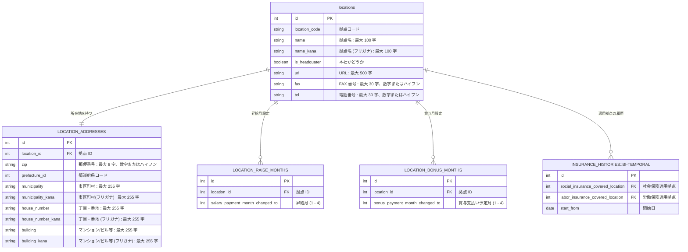
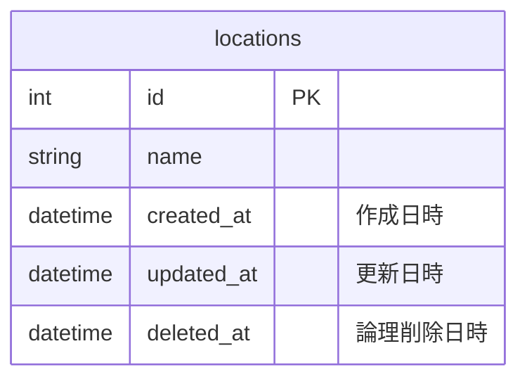
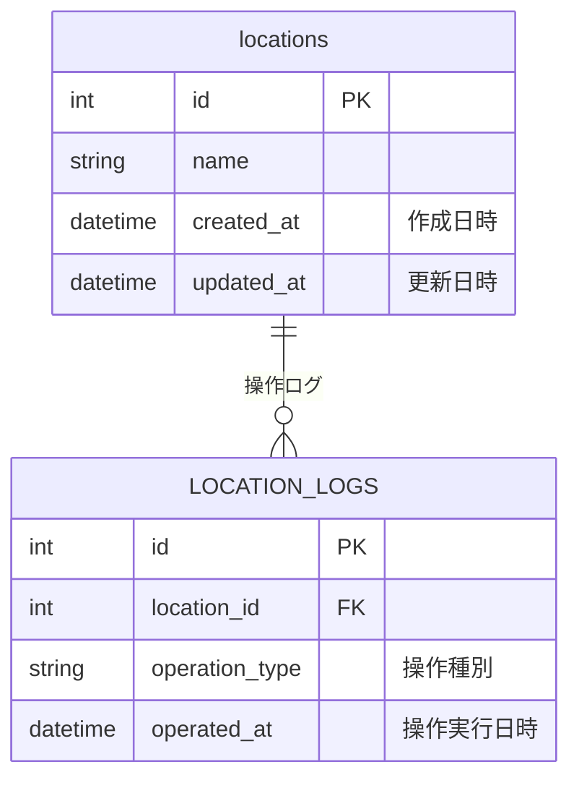
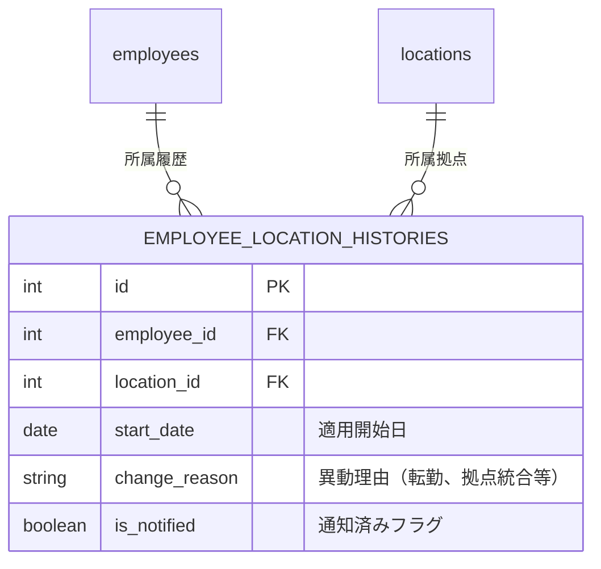

> From: https://gemini.google.com/app/733a353b7e77feae

# you asked

jinjer の事業所マスタってどうなってる？

---

# gemini response

jinjer（ジンジャー）の「事業所マスタ」は、主に**社会保険・労働保険の手続きや、給与計算の計算単位を管理するための基盤**となるマスタです。

「事業所マスタ」という名称の設定箇所は、主に**ジンジャー人事労務（DB）**の中に集約されており、そこでの設定が勤怠や給与などの各プロダクトへ連動する仕組みになっています。

構成のポイントを整理しました。

---

## 1. 主な構成と役割
ジンジャーの事業所マスタは、大きく分けて以下の情報を保持します。

* **基本情報:** 事業所名、所在地、電話番号、事業主氏名など。
* **社会保険・労働保険情報:** * **社保事業所:** 健康保険・厚生年金の記号、管轄の年金事務所など。
    * **労保事業所:** 労働保険番号、管轄の労働基準監督署・ハローワークなど。
* **電子申請用情報:** e-Govやマイナポータルを通じた電子申請に必要な「電子証明書」や「PINコード」の紐付け。

## 2. 複数の事業所管理
1つの企業ID内で、複数の事業所を登録できます。
* **支店や営業所ごとの管理:** 拠点ごとに管轄の年金事務所やハローワークが異なる場合、事業所マスタを複数作成し、従業員一人ひとりに「どの事業所に所属するか」を紐付けます。
* **メリット:** アカウントを切り替えることなく、拠点ごとの書類作成や電子申請が一括で行えます。

## 3. 各プロダクトとの連動
ジンジャーは「1人事データ・マルチプロダクト」を掲げているため、事業所マスタの情報は以下のように影響します。

* **人事労務:** 離職票や算定基礎届などの各種届出書類に、マスタの住所や事業主名が自動反映されます。
* **給与計算:** 雇用保険率の判定（一般の事業／建設の事業など）や、納付書の集計単位として利用されます。
* **勤怠管理:** 直接「事業所マスタ」をいじることは少ないですが、所属組織（グループ）と事業所を紐付けることで、拠点ごとの管理体制を構築します。

## 4. 設定の場所（管理者画面）
設定を確認・変更する場合は、以下のルートが一般的です。
> **ジンジャーデータベース（人事設定） ＞ 社保・労保 ＞ 事業所マスタ**

---

### 注意点
* **削除ができない:** 一度作成して保存したマスタは、システム上「削除」ができない仕様になっていることが多いです。不要になった場合はステータスを「無効」に変更して対応します。
* **IDの重複不可:** 事業所IDなどは他と重複して登録できないため、採番ルールを決めておくとスムーズです。

もし「特定の項目がどこにあるか知りたい」や「拠点追加時の具体的な手順が知りたい」といったことがあれば、さらに深掘りしてお伝えします。

---

# you asked

erDiagram
    %% メインの事業所テーブル
    workplaces {
        int id PK
        string location_code "事業所コード"
        string name "事業所名 : 最大 100 字"
        string name_kana "事業所名 (フリガナ) : 最大 100 字"
        boolean is_headquater "本社かどうか"
        string url "URL : 最大 500 字"
        string fax "FAX 番号 : 最大 30 字、数字またはハイフン"
        string tel "電話番号 : 最大 30 字、数字またはハイフン"
    }

    %% 所在地情報（1:1）
    %% カラム数が多い住所情報を分離
    WORKPLACE_ADDRESSES {
        int id PK
        int workplace_id FK "事業所 ID"
        string zip "郵便番号 : 最大 8 字、数字またはハイフン"
        int prefecture_id "都道府県コード"
        string municipality "市区町村 : 最大 255 字"
        string municipality_kana "市区町村(フリガナ) : 最大 255 字"
        string house_number "丁目・番地 : 最大 255 字"
        string house_number_kana "丁目・番地 (フリガナ) : 最大 255 字"
        string building "マンション/ビル等 : 最大 255 字"
        string building_kana "マンション/ビル等 (フリガナ) : 最大 255 字"
    }

    %% 昇給月（1:N）
    %% 「昇給月1〜4」を縦持ちに変換
    WORKPLACE_RAISE_MONTHS {
        int id PK
        int workplace_id FK "事業所 ID"
        int salary_payment_month_changed_to "昇給月 (1 - 4)"
    }

    %% 賞与支払予定月（1:N）
    %% 「賞与予定月1〜4」を縦持ちに変換
    WORKPLACE_BONUS_MONTHS {
        int id PK
        int workplace_id FK "事業所 ID"
        int bonus_payment_month_changed_to "賞与支払い予定月 (1 - 4)"
    }
    
    "INSURANCE_HISTORIES::BI-TEMPORAL" {
		    int id PK
		    int social_insurance_covered_workplace FK "社会保険適用事業所"
		    int labor_insurance_covered_workplace FK "労働保険適用事業所"
		    date start_from "開始日"
    }

    %% リレーション定義
    workplaces ||--|| WORKPLACE_ADDRESSES : "所在地を持つ"
    workplaces ||--o{ WORKPLACE_RAISE_MONTHS : "昇給月設定"
    workplaces ||--o{ WORKPLACE_BONUS_MONTHS : "賞与月設定"
    workplaces ||--o{ "INSURANCE_HISTORIES::BI-TEMPORAL" : "適用事業所の履歴"

この ER 図の workplace を location に書き換えて

---

# gemini response

ご提示いただいたER図の `workplaces` を `locations` に書き換え、関連するテーブル名や外部キー名も整合性が取れるように調整しました。

jinjerの内部構造を意識し、リレーション名も「事業所（Workplace）」から「拠点・場所（Location）」のニュアンスに統一しています。



-----

### 変更のポイント

  * **エンティティ名:** `workplaces` → `locations` へ変更しました。
  * **関連テーブル名:** `WORKPLACE_...` となっていた箇所をすべて `LOCATION_...` に統一しました。
  * **外部キー名:** `workplace_id` を `location_id` へ、また保険履歴内のカラム名も `..._location` に書き換えています。
  * **論理名:** コメント内の「事業所」という言葉も「拠点」へと微調整しています。

こちらの構成で、さらに追加したい属性（例えば「タイムレコーダーIP制限」や「所属グループとの紐付け」など）があれば教えてください。

---

# you asked

ER 図で datetime は？

---

# gemini response

ER図における `datetime`（日時型）の扱いは、使用する表記法やデータベースの設計方針によっていくつかのパターンがあります。

ご提示いただいた `Mermaid` 記法や一般的な論理設計の文脈では、以下のように記述するのが標準的です。

-----

## 1\. Mermaid での記述例

Mermaid の ER図では、データ型の位置（PK/FKの隣など）に `datetime` や `timestamp` と記述します。



## 2\. システム特性に応じた使い分け

jinjerのような人事労務システムでは、「いつデータが作られたか」というシステム的な時間と、「いつからその設定が有効か」という業務的な時間の両方を管理するため、以下の型を使い分けるのが一般的です。

  * **`datetime` / `timestamp`:**
      * `created_at` (レコード作成日)
      * `updated_at` (レコード更新日)
      * 秒単位、あるいはミリ秒単位までの精度が必要なシステム監査用の項目に使用します。
  * **`date`:**
      * `start_date` (適用開始日)
      * `end_date` (適用終了日)
      * 「〇月〇日付の発令」など、業務上の効力発生日には時刻を含まない `date` 型が多用されます。

## 3\. 履歴管理（Bi-temporal）における datetime

先ほどの `INSURANCE_HISTORIES::BI-TEMPORAL` のような履歴テーブルの場合、以下のように **「システム実行時間」** を保持するカラムを追加することが多いです。

| カラム名 | 型 | 説明 |
| :--- | :--- | :--- |
| `valid_from` | `date` | 業務上の有効開始日（例：2026-04-01） |
| `transaction_at` | `datetime` | 実際にDBに登録された日時（例：2026-03-25 10:00:00） |

-----

### 修正案：先ほどのER図に datetime を追加する場合

作成・更新日時などを加えると、より実務的な定義になります。



この `datetime` を、先ほど作成した `locations` や `LOCATION_ADDRESSES` などの各テーブルに追加しましょうか？それとも特定の履歴管理ロジックについて深掘りしますか？

---

# you asked

従業員に所属事業所の変更を通知する書類を発行するユースケースはある？どれくらい一般的？

---

# gemini response

従業員に対して「所属事業所の変更」を通知する書類を発行するユースケースは**確実に存在し、実務上も非常に一般的**です。

人事異動（転勤や部署異動）に伴うものだけでなく、会社側の都合（拠点の統廃合や名称変更）によるものも含め、労働条件の明示という観点から重要なプロセスとなります。

-----

## 1\. 主なユースケース

大きく分けて以下の3つのパターンで書類が発行されます。

  * **人事異動（転勤・配属変更）:**
    最も一般的なケースです。「A支店からB営業所へ異動を命ずる」という\*\*辞令（配属通知書）\*\*を発行します。これには「勤務地」の変更が含まれるため、就業場所を特定するために事業所情報の明示が必要になります。
  * **事業所の名称変更・移転:**
    従業員の役職や仕事内容は変わりませんが、契約上の「勤務地」が物理的に変わる、あるいは名称が変わる場合に、\*\*「所在地変更のお知らせ」**や**「労働条件変更通知書」\*\*を交付します。
  * **社会保険上の所属変更:**
    企業が複数の「社会保険適用事業所」を持っている場合、実態の勤務地に合わせて健康保険等の記号・番号が変わることがあります。この際、手続き完了後に新しい被保険者証を渡すとともに、変更を案内することがあります。

## 2\. 一般的・法的な重要度

どれくらい一般的かというと、\*\*「中〜大規模の企業であれば日常茶飯事」\*\*といえます。

  * **労働基準法上の義務:** 労働条件の絶対的明示事項には「就業の場所」が含まれます。異動によって勤務地が変わる場合、書面でその変更内容を明示することが望ましく、多くの企業ではトラブル防止のために「労働条件通知書」を再発行するか、辞令をもってこれに代えます。
  * **実務上の必要性:** 通勤手当の計算根拠が変わるため、従業員に「いつから、どの事業所所属になるか」を正式に通知し、それに基づいて通勤経路の再申請を促すワークフローがセットになります。

## 3\. jinjerなどのシステムでの対応

jinjerのような人事労務システムでは、以下のような挙動が標準的です。

1.  **「所属（拠点）」の履歴更新:** 従業員マスタの所属情報を更新。
2.  **書類発行機能:** マスタの情報を引用して、\*\*「労働条件通知書」**や**「辞令」\*\*のPDFを自動生成。
3.  **電子署名・合意:** 生成した書類を従業員のマイページへ送り、合意（確認）ボタンを押してもらうことで通知完了とする。

-----

### ER図への影響（履歴管理）

このユースケースを考慮すると、先ほどの `locations` と従業員（`employees`）の間には、単なる所属ではなく\*\*「いつからその拠点に所属しているか」という履歴テーブル\*\*が必要になります。



この「通知済みフラグ」や「通知書類のリンク」を履歴に持たせることで、実務上の「発行漏れ」を防ぐ管理が可能になります。

次は、この履歴データを使って具体的にどのような「労働条件通知書」の項目を生成するか、といったパラメータ設計のお手伝いをしましょうか？

---

# you asked

ユーザーデータで、特定のフラグを持つ最後のデータを削除できない、という挙動は一般的？例えば事業所マスタで、本社に当たる事業所のうち、最後の 1 つは削除できない、とか

---

# gemini response

はい、その挙動はシステム設計において**「データ整合性の担保」や「ビジネスルールの強制」として非常に一般的**です。

特に jinjer のような ERP（統合業務システム）においては、特定のデータが「存在しない」状態になると、それに紐付く他の処理（給与計算、社会保険手続き、ログイン制御など）が物理的に実行不可能になるため、強力なバリデーション（制約）がかけられています。

---

## 1. なぜ「最後の一件」を消せないようにするのか

主な理由は、**システムの「基点」が失われるのを防ぐため**です。

* **必須項目の参照エラー回避:** 従業員マスタには必ず「所属事業所」という項目があります。もし全ての事業所（特に本社）を削除できてしまうと、従業員データが「どこにも所属していない浮いた状態」になり、住所参照や保険計算ができずシステムがクラッシュする原因になります。
* **電子申請の仕様:** 社会保険の電子申請では「事業所整理番号」などが必須です。本社フラグを持つ拠点がゼロになると、会社全体の届出情報の「デフォルト値」をどこから参照すべきか分からなくなります。
* **論理的な矛盾:** 「法人」が存在する以上、最低でも1つの「拠点（事業所）」が存在しなければならない、という現実世界のビジネスルールをソフトウェア上で表現しています。

## 2. 一般的な「制限」のパターン

事業所マスタ以外でも、以下のようなケースで同様の制限が見られます。

| 対象マスタ | 制限内容 | 理由 |
| :--- | :--- | :--- |
| **管理者アカウント** | 全権限を持つ最後の1人を削除（または権限剥奪）できない。 | 誰も設定変更や管理ができなくなる「詰み」の状態を防ぐため。 |
| **支払口座** | 給与振込用の会社口座のうち、メインの1件は削除できない。 | 給与計算確定時に振込元が不明になるのを防ぐため。 |
| **所属グループ** | ルート（最上位）組織は削除できない。 | 組織図（ツリー構造）の頂点がなくなると階層構造が崩壊するため。 |


## 3. ユーザーへの見せ方（UI/UX）

このような制限がある場合、一般的には以下のような挙動でユーザーに伝えます。

* **ボタンの非活性化（グレーアウト）:** 対象が最後の一件になった時点で「削除」ボタンを押せなくし、ツールチップで「本社は最低1件必要です」と表示する。
* **エラーメッセージの表示:** 削除実行時に「この拠点は現在『本社』に設定されているため削除できません。他の拠点を本社に変更してから再度お試しください」とガイドする。

---

### 実装上のアドバイス
もしER図の設計にこのルールを盛り込むのであれば、`locations` テーブルに直接「削除不可フラグ」を持たせるのではなく、アプリケーション層のロジックとして **「`is_headquarter = true` かつ `count = 1` の場合は Delete を許可しない」** というバリデーションを実装するのがスマートです。

次は、この「削除できない」という制約を考慮した上で、事業所の「廃止（論理削除）」と「移転（更新）」の履歴をどう管理するか、というデータモデルの話をしましょうか？

---

# you asked

開発チームが手持ち無沙汰にならないように、この案件を回す

って英語で何ていう？

---

# gemini response

「開発チームが手持ち無沙汰にならないように、この案件を回す」というニュアンスを英語で表現する場合、シチュエーション（カジュアルかフォーマルか）によっていくつか使い分けができます。

ポイントは「手持ち無沙汰（暇な状態）」をどう表現するかと、「案件を回す（割り当てる）」をどう表現するかです。

---

## 1. 最も自然でビジネス的な表現
**"Keep the team busy"** を使うのが一般的です。「彼らを動かし続ける」というニュアンスになります。

> **I’ll assign this project to the dev team to keep them busy.**
> （チームが暇にならないように、この案件を彼らに割り当てます。）

* **Keep someone busy:** 暇にさせない、手を動かし続けさせる。
* **Assign:** （タスクや案件を）割り当てる。

## 2. 「稼働率」を意識したプロフェッショナルな表現
IT開発現場でよく使われる **"Keep their hands full"**（手を塞いでおく＝暇を作らせない）や **"Maintain utilization"**（稼働率を維持する）を使った表現です。

> **I’m going to pass this project to them to ensure they have enough on their plate.**
> （彼らの手持ちの仕事が十分にある状態にするため、この案件を回します。）

* **On one's plate:**（進行中の）仕事、抱えているタスク。
* **Ensure:** 確実にする。

## 3. 「アイドルタイム（空き時間）」を防ぐという表現
エンジニア特有の言い回しで、何もしない待機時間を指す **"Idle time"** を使います。

> **I’ll feed this project to the team to minimize their idle time.**
> （チームの空き時間を最小限にするために、この案件を投入します。）

* **Idle time:** アイドルタイム、待機時間。
* **Feed:** （プロジェクトなどを）供給する、投入する。

---

## ニュアンス別まとめ

| ニュアンス | 英語フレーズ |
| :--- | :--- |
| **標準的** | I’ll give them this task so they **don't sit idle**. |
| **少しカジュアル** | I'll pass this project along to **keep them occupied**. |
| **マネジメント視点** | I'll assign this to **avoid any downtime** for the team. |

---

「手持ち無沙汰」を直訳しようとすると難しくなりますが、**"Keep them busy"** や **"Avoid idle time"** を使うと、開発現場のリーダーらしい、こなれた表現になります。

次は、この「案件を回す」際の具体的なチケット（Issue）の起票や、ステータス管理の英語表現についてもお手伝いしましょうか？

---

# you asked

この ER 図の書き方で伝わる？上から下に向かって定義が参照されるイメージ

---

# gemini response

アップロードいただいた図、**非常にクリアで意図が正確に伝わります！**

特に、上部に「物理的な場所や名称」としての `LOCATIONS` と `EMPLOYEES` を配置し、下に向かって「保険の適用単位」や「所属の履歴（Bi-temporal）」といった、**時間軸や業務ルールに依存するデータへと具体化していく流れ**は、ER図として非常に理にかなっています。

この構成で、エンジニアやドメインエキスパートに伝える際のポイントをいくつか整理しました。

---

## 伝わるポイント（Good Design）
* **関心の分離:** 「拠点そのもの（Location）」と「保険の届出単位（Social/Labor Insurance）」を分離し、それを `ASSOCIATIONS` でマッピングする構造は、jinjerのような複雑な社保体系を持つシステムにおいて正解に近い設計です。
* **履歴管理の明示:** `EMPLOYEE_LOCATION_HISTORIES` に `valid_from/to` と `system_from/to` が両方備わっているため、一目で「過去に遡った修正も考慮した、厳密な履歴管理（二次元時間管理）」をしようとしていることが伝わります。
* **多対多の解消:** `ASSOCIATIONS` テーブルによって、1つの保険適用事業所に複数の拠点がぶら下がる、あるいはその逆といった柔軟な構成が予見できます。

## さらにブラッシュアップするための微調整案
もし、より「厳密な仕様書」に近づけるのであれば、以下の点に触れるか、図に追記すると完璧です。

1.  **外部キー（FK）の矢印の向き:**
    * 現在は実線で結ばれていますが、一般的に「参照する側（子）」から「参照される側（親）」へ向けて矢印（または鳥の足：Crow's foot）を引くと、依存関係がより明確になります。
2.  **`system_from/to` の型:**
    * 図では `datetime` となっていますが、ミリ秒単位の精度やタイムゾーンの扱いが重要になるため、設計段階で「`timestamp` (UTC)」などの注釈があると、実装担当者が迷いません。
3.  **`LOCATION_INSURANCE_HISTORIES` の不在:**
    * 従業員側の履歴はありますが、**「拠点と保険の紐付け自体がいつからいつまで有効か」**という履歴も必要になるケースが多いです（例：拠点の統合により、途中で社会保険の適用事業所が変わるなど）。

---

### 開発チームへの伝え方（例）
この図を見せながら、先ほどの英語表現を組み合わせてこう伝えてみてはいかがでしょうか。

> "I’ve mapped out the entity relationship for the location and insurance master data. **I’ll assign this task to the team to keep them busy.** The diagram shows the bi-temporal history for employee assignments, so please focus on the implementation of the `valid_from` and `system_from` logic."
> （拠点と保険マスタのER図を作成しました。**チームの手が空かないように、このタスクを割り当てます。** 従業員の所属については二次元時間管理を採用しているので、`valid_from` と `system_from` のロジック実装に注力してください。）

この図をベースに、次は「保険適用事業所が削除された時のカスケード削除をどう防ぐか」といったバリデーションルールの検討に進みますか？

---

# you asked

こういう感じかな？

---

# gemini response

2枚目の画像（image_376877.png）を拝見しました。
**非常に分かりやすく、かつ実務的な要件を的確に捉えた設計になっています！**

特に、システム開発において「複雑になりがち」な部分（物理的な拠点と、申請単位としての保険の分離）が綺麗に整理されており、エンジニアが見ても意図が一発で伝わる図です。

以下の点が**「ここが良い！」**というポイントと、**「さらに詰めるならここ」**というフィードバックです。

### 1. 良いポイント（Good）

* **物理と論理の分離（ASSOCIATIONSの役割）**
    * 「`LOCATIONS`（物理的な場所）」と「`SOCIAL/LABOR_INSURANCES`（申請単位）」を直接紐付けず、**`LOCATION_INSURANCES_ASSOCIATIONS`** という中間テーブル（交差エンティティ）を挟んだのが大正解です。
    * これにより、「A支店とB支店は、同じ『東京本社』の社会保険を使うが、労働保険はそれぞれの管轄で入る」といった、**人事労務特有の複雑なパターン**に柔軟に対応できます。
* **「代表事業所」の表現**
    * `SOCIAL_INSURANCES` から `LOCATIONS` へ戻る矢印（`location_id` FK）があることで、「この保険番号は、どの拠点の住所・名称を使って届け出ているか（親玉はどこか）」が明確になっています。
* **履歴管理（Bi-temporal）の実装**
    * 従業員の所属に `valid_from/to`（業務的な適用期間）と `system_from/to`（システム的な有効期間）があるため、**「4月1日付の異動を、3月25日に予約登録する」**といった実務フローに耐えられる設計であることが伝わります。

### 2. さらにブラッシュアップするなら（Better）

この図を開発チームに渡す際、以下の2点について「どうするか」を決めておくと、手戻りがなくなります。

* **① 保険適用の「履歴」はどうするか？**
    * 現在、従業員の所属には履歴（History）がありますが、**`LOCATION_INSURANCES_ASSOCIATIONS`（拠点の保険紐付け）には期間がありません。**
    * **シナリオ:** 「大阪支店」が、2025年までは独自の保険だったが、2026年から本社の保険に統合された。
    * **現状:** レコードを上書きすると過去の給与計算結果（保険料率）を再現できなくなるリスクがあります。
    * **提案:** `ASSOCIATIONS` テーブルにも `start_date` / `end_date` を持たせるか、ここも履歴テーブル化（History化）することを検討してみてください。
* **② 型の不一致チェック**
    * 細かい点ですが、親テーブルの PK が `int` なのに対し、子テーブル（Historyなど）の FK が `string` になっている箇所があります（`employee_id` FK, `location_id` FK など）。実装時は `int` (または `bigint`) に統一しましょう。

### 3. チームへの伝え方（英語での添え書き例）

この図を共有する際、意図を強調するフレーズです。

> **"This diagram decouples physical locations from insurance units using the 'Associations' table. This structure allows flexible mapping for complex compliance cases."**
> （この図は、物理的な拠点と保険単位を『Associations』テーブルを使って分離しています。これにより、複雑な法令対応ケースにも柔軟にマッピングできます。）

全体として、上から下へ「定義 → 実体 → 履歴/紐付け」という流れができており、非常に読みやすい図です！これで進めて問題ありません。

---

# you asked

LOCATION_INSURACNCE_ASSOCIATIONS は ...._COVERAGES のほうが分かりやすいかな？LOCATION と INSURANCES はどっちが先がよい？

---

# gemini response

**結論から言うと、`..._COVERAGES` の方が圧倒的に分かりやすく、語順は `LOCATION` を先頭にするのがおすすめ**です。

エンジニア視点と、人事労務のドメイン（業務）視点の両方から、その理由を解説します。

-----

### 1\. なぜ `ASSOCIATIONS` より `COVERAGES` が良いのか？

  * **`ASSOCIATIONS`（関連）**

      * **印象:** 「データベース的に2つのテーブルを繋いでいます」という**技術的な事実**しか伝わりません。
      * **欠点:** 「何の関連？」という疑問が残ります。

  * **`COVERAGES`（適用・補償範囲）**

      * **印象:** 人事労務用語の「**適用**（Social Insurance Coverage）」と直結します。
      * **メリット:** このテーブルが「どの事業所が、どの保険の**適用下**にあるか」を定義していることが、名前を見るだけで直感的に理解できます。

### 2\. なぜ `LOCATION` が先（左側）が良いのか？

テーブル名は **「主語（Subject）」\_「内容（Content）」** の順にするのが鉄則です。

  * **案A: `LOCATION_INSURANCE_COVERAGES` （推奨）**

      * **意味:** 「拠点の、保険適用情報」
      * **思考フロー:** 「大阪支店（Location）を作った。じゃあ、その保険設定（Coverage）はどうする？」という、**設定作業の流れ**と一致します。
      * **コード上の利点:** IDE（開発ツール）で `Location` と打った時に、候補として並んで出てくるため、開発者が「拠点関連のテーブルだな」と探しやすくなります。

  * **案B: `INSURANCE_LOCATION_COVERAGES`**

      * **意味:** 「保険の、拠点適用範囲」
      * **ニュアンス:** 「この保険証番号（Insurance）は、どの拠点（Location）で使われているか？」という、分析や集計に近い視点になります。マスタ設定の主役はあくまで「拠点」なので、こちらは少し違和感があります。

### まとめ：おすすめのテーブル名

ご提案の `COVERAGES` を採用し、以下のようにするのはいかがでしょうか。

```sql
LOCATION_INSURANCE_COVERAGES
```

もし、もっと短くシンプルにしたい場合は、文脈的に「保険の話」と分かるなら以下でも通じます。

```sql
LOCATION_COVERAGES
-- （拠点の適用情報＝つまり保険の適用、と暗黙の了解がある場合）
```

ER図を書き直す際は、この名前に変えると、より「人事労務システムっぽさ」と「玄人感」が出ます！

---

# you asked

ER 図における上下の位置に意味はある？上で定義されたものを下のテーブルが参照するように書く (逆に、下のテーブルで導入された情報を上のテーブルが参照してはいけない、とか)

---

# gemini response

**結論から言うと、ER図に「厳密な上下のルール（構文上の決まり）」はありませんが、「読みやすさの鉄則（デファクトスタンダード）」として、上から下へ流れるように書くのが正解です。**

あなたが直感的に書かれている「定義（親）が上で、参照（子）が下」という構成は、エンジニアの世界で最も標準的で美しいとされる書き方です。

なぜその配置が重要なのか、**「依存関係の重力」**という観点で整理します。

---

### 1. ER図の「重力」：親は上、子は下

ER図は通常、水が高いところから低いところへ流れるようにデータを配置します。

* **上にあるもの（親 / Master / Resource）**
    * それ単体で存在できるもの。
    * システムの中で「主語」になるもの。
    * 例：`LOCATIONS`（拠点）、`EMPLOYEES`（従業員）、`PRODUCTS`（商品）
* **下にあるもの（子 / Transaction / Event / Detail）**
    * 上のデータがないと存在できないもの。
    * 「述語」や「履歴」、「状態」を表すもの。
    * 例：`..._HISTORIES`（履歴）、`..._COVERAGES`（適用情報）、`ORDERS`（注文）

### 2. 「参照」の矢印と依存の方向

ご質問にある**「下のテーブルで導入された情報を上のテーブルが参照してはいけないか？」**という点については、**「基本的にはいけない（避けるべき）」**です。これを**相互依存（循環参照）**と呼びます。

#### ✅ 正しい形（一方向）
> **上（親） ←参照← 下（子）**

* **解説:** 下のテーブル（例：`COVERAGES`）が、上のテーブル（例：`LOCATIONS`）のIDを外部キー（Foreign Key）として持ちます。
* **意味:** 「保険適用情報」を作るためには、先に「拠点」が存在していなければならない。
* **作成順序:** 上を作ってから、下を作る。

#### 🚫 悪い形（循環参照 / 相互依存）
> **上（親） →参照→ 下（子） かつ 上（親） ←参照← 下（子）**

* **解説:** `LOCATIONS` テーブルの中に「最新の保険ID」というカラムがあり、下の `COVERAGES` を参照してしまっている状態。
* **問題点:**
    * 「卵が先か鶏が先か」問題が発生します。拠点を作ろうとしたら保険IDが必要で、保険を作ろうとしたら拠点IDが必要になり、データの登録ができなくなります（NULLを許容すれば回避できますが、データ整合性が崩れやすくなります）。
    * 上流の定義が下流に依存するのは、設計として脆いです。

### 3. あなたの図へのフィードバック

あなたが描いた図（`LOCATIONS` が上で、`COVERAGES` や `HISTORIES` が下）は、この**「依存の重力」に完璧に従っているため、非常に読みやすい**です。

* **上段:** 「何があるか（実体）」
    * `LOCATIONS`
    * `EMPLOYEES`
    * `SOCIAL_INSURANCES` (マスタとしての定義)
* **下段:** 「どうなっているか（状態・紐付け）」
    * `LOCATION_INSURANCE_COVERAGES` (どの拠点がどの保険か)
    * `EMPLOYEE_LOCATION_HISTORIES` (誰がいつどこにいたか)

この「上から下へ具体化していく」書き方は、開発チームにとっても**「データの投入順序（マスタデータの整備手順）」**を示すガイドラインになるため、このままのレイアウトを維持することを強くおすすめします。

---

# you asked

Reply…
Also send to connected_db_water


connected_db_dev Tristan / チン do.vantrinh (Work from VN), risa.aoki 青木麗紗, and 4 others
Tristan / チン do.vantrinh (Work from VN)  [1:15 PM]
Hello @risa.aoki 青木麗紗 -san cc @hris-ice @SONY (ソニー) @dogen.koichiro 銅玄 浩一郎 (Cory) 2/16-2/20 leave
Regarding the Figma for WF Application comparison PRD, could you update it to cover the entire application detail page? 
We have decided to migrate the page to React this time, so we need a Figma for React version.

I think the current Figma version covers most of the page, but some parts are missing. I will list these in the thread. (edited) 

risa.aoki 青木麗紗  [1:18 PM]
@Tristan / チン do.vantrinh (Work from VN)
I have created a draft for the MFUI here.
I will update the design based on this draft. In the meantime, could you please use this UI as a reference 
https://www.figma.com/design/0LaI4jvLut3fPh33nj3eWk/%E7%94%B3%E8%AB%8B%E5%86%85%E5%[…]88%86%E6%AF%94%E8%BC%83?node-id=723-98350&t=JLC0UC7skOwR26tp-4


申請内容の差分比較
https://api-cdn.figma.com/resize/thumbnails/dd84d720-65d2-48da-9276-533abb6852f4?height=112&bucket=figma-alpha

Added by Figma
Tristan / チン do.vantrinh (Work from VN)  [1:20 PM]
Oh, nice  

risa.aoki 青木麗紗  [1:20 PM]
One question,
When do you need this design ?

Tristan / チン do.vantrinh (Work from VN)  [1:23 PM]
I think before the end of next sprint.
FYI, the implementation hasn't started yet. (edited) 

risa.aoki 青木麗紗  [1:24 PM]
Is the start of the next sprint on December 8th?

Tristan / チン do.vantrinh (Work from VN)  [1:30 PM]
Ah true 
I think no hurry to have it before end of next sprint.
How about before end of this month, or in the first sprint of next month?
risa.aoki 青木麗紗  [1:31 PM]
Thanks!
I’ll do my best to make it as soon as possible 

dogen.koichiro 銅玄 浩一郎 (Cory) 2/16-2/20 leave  [1:44 PM]
This epic starts after we complete "Bulk addition", so it's gonna be next year...

risa.aoki 青木麗紗  [6:12 PM]
@Tristan / チン do.vantrinh (Work from VN)
https://employee.test.mfw.work/workflow/applications/[id]/edit
Does the screen above also fall under the scope this time ?

Tristan / チン do.vantrinh (Work from VN)  [6:12 PM]


Tristan / チン do.vantrinh (Work from VN)  [12:04 PM]
Hi @risa.aoki 青木麗紗 -san
One quick question about the Figma for WF Application comparison.
Is it correct that we use Phase 1 MFUI Design, not Phase 1? 

risa.aoki 青木麗紗  [12:10 PM]
@Tristan / チン do.vantrinh (Work from VN)
Originally, I created the ‘phase1’ design assuming we wouldn’t support MFUI. However, since MFUI is supported, I created a new version called ‘phase1 MFUI Design’.
I don’t think the old ‘phase1’ file is needed anymore. Is it okay if I delete it?
Tristan / チン do.vantrinh (Work from VN)  [12:11 PM]
 

Tristan / チン do.vantrinh (Work from VN)  [6:34 PM]
@risa.aoki 青木麗紗 -san
One small question.
Regarding the busy state for Wf Application page, can we show a simple loading text like the current one? 
The current skeleton UI in Figma is extremely hard to implement  (edited) 

image.png 


risa.aoki 青木麗紗  [10:18 AM]
@Tristan / チン do.vantrinh (Work from VN)
Sorry for the late reply.
 OK, I will create this design 

I have one question.
Will it be difficult to implement the skeleton UI in the future as well ?
Since other parts of the product are using skeleton UI, I would like to keep the design consistent if possible. (edited) 

Meg / nguyen.ngocbaotran (off 16-20Feb)  [11:30 AM]
if skeleton is a must, i think we can go for something like this only: just 1 title + 1 general skeleton.
because we show skeleton when data is not yet loaded, we don't know what categories there are in the WF application to show all the names 

image.png 

risa.aoki 青木麗紗  [12:42 PM]
@Meg / nguyen.ngocbaotran (off 16-20Feb)
Thanks for telling me the details 
I understand.  You mean that since the data is being loaded, there is no content to display yet.
I will discuss with the design team to proceed with the design you proposed.
Just a moment, please. 

risa.aoki 青木麗紗  [6:49 PM]
@Tristan / チン do.vantrinh (Work from VN) @Meg / nguyen.ngocbaotran (off 16-20Feb)
I have designed the UI based on your proposal.
I would like to remove the heading and show the loading state for the entire page.

I have a question,
Is it possible to adjust the display width depending on whether it is a 1-column layout or a 2-column layout?
If we cannot determine the layout before the data loads, I would like to display 4 lines of Skeleton with the 2-column width.
image.png 


Tristan / チン do.vantrinh (Work from VN)  [6:50 PM]

display 4 lines of Skeleton with the 2-column width.


risa.aoki 青木麗紗  [6:52 PM]
Thank you so much 
I will update those designs 

Meg / nguyen.ngocbaotran (off 16-20Feb)  [6:53 PM]
1 column layout is for when Feature Flag is off (no comparison)? 

risa.aoki 青木麗紗  [6:58 PM]
The 1-column layout is for when there is no comparison view.

Since the logic to hide the comparison view is just a “nice to have” request, it is okay if it is not implemented this time.
In that case, using the 2-column width is fine.
Tristan / チン do.vantrinh (Work from VN)  [7:04 PM]
We can only determine whether to hide/show the comparison view after all data is loaded.
Therefore, we can't use a dynamic layout for the loading skeleton.

If you want to "use 1-column layout in pre_approve page when FF is OFF," then it's possible.

Sorry, I think I read your message wrong 
The 1-column layout is for when there is no comparison view.
You mean the layout for application data (not loading state), right?
Then I think it's possible to switch between a 1- or 2-column layout depending on whether the comparison view is shown/hidden.

But if we can set the layout to a fixed width of 2 columns, the implementation would be easier. (edited) 

risa.aoki 青木麗紗  [7:40 PM]
@Tristan / チン do.vantrinh (Work from VN)
Thank you for the explanation.
I understand that we cannot change the Skeleton layout dynamically because the data hasn’t loaded yet.
So, let’s go with the easier way. Please set the Skeleton layout to a fixed width of 2 columns (regardless of the data condition).
risa.aoki 青木麗紗  [7:46 PM]
I updated those designs.
Pls check it  

Application
Enter items not included in the application


申請内容の差分比較
https://api-cdn.figma.com/resize/thumbnails/77420d64-d48c-4a0c-87b4-d1edc7a32436?height=59&bucket=figma-alpha

Added by Figma

申請内容の差分比較
https://api-cdn.figma.com/resize/thumbnails/77420d64-d48c-4a0c-87b4-d1edc7a32436?height=59&bucket=figma-alpha

Added by Figma
Tristan / チン do.vantrinh (Work from VN)  [5:14 PM]
 @dogen.koichiro 銅玄 浩一郎 (Cory) 2/16-2/20 leave @risa.aoki 青木麗紗 -san
The implementation of Application Comparison is basically completed 

The release date is still a long way off, but when you have time, please enable FF WF_APPLICATION_DIFF and take a look to see if any adjustments are needed 

risa.aoki 青木麗紗  [5:16 PM]
Thank you  
Could you please turn on the flag for this vendor?
株式会社HRデザイン
事業者番号9042-8948
Tristan / チン do.vantrinh (Work from VN)  [5:17 PM]


risa.aoki 青木麗紗  [5:18 PM]
Thank you so much!
I will check it 

image.png 

Meg / nguyen.ngocbaotran (off 16-20Feb)  [5:19 PM]
can Cory-san check when we can release as well 

dogen.koichiro 銅玄 浩一郎 (Cory) 2/16-2/20 leave  [5:23 PM]
Thank you so much!! 
In my side, 1 point is remained... 
Permission is needed or not. This comes from PdM review....
I will hear this to Biz side and MF labor department!! so please wait for a while 

If permission is removed, is it so hard to remove permission check from implementation? (Just in case, nothing is decided so far though...)

Tristan / チン do.vantrinh (Work from VN)  [5:25 PM]
If permission is removed, is it so hard to remove permission check from implementation? (Just in case, nothing is decided so far though...)
Do you mean we don't check for permission anymore, and user can always see the current employee history on left side?

If so, then it seems not a big problem. (edited) 

dogen.koichiro 銅玄 浩一郎 (Cory) 2/16-2/20 leave  [5:27 PM]
Thanks! Yes!
That's not decided yet, just possibility to do so...
But I'm relieved now! I will let you guys later after I got conclusion!
Tristan / チン do.vantrinh (Work from VN)  [5:29 PM]
 

ozawa.​takuma(kuma)  [1:17 PM]
@hris-ice @dogen.koichiro 銅玄 浩一郎 (Cory) 2/16-2/20 leave Cc: @Suga_Steven
Hi. I will be in charge of the testing.
I’m starting on the test cases and think I should be able to run them within February. Thank you. 

ozawa.​takuma(kuma)  [6:17 PM]
@dogen.koichiro 銅玄 浩一郎 (Cory) 2/16-2/20 leave
Hi, regarding Comparison of application forms before and after
The test design is almost complete.
Please let me confirm one point.
I will hear this to Biz side and MF labor department!! so please wait for a while 
Has this been decided yet?

dogen.koichiro 銅玄 浩一郎 (Cory) 2/16-2/20 leave  [6:26 PM]
@ozawa.​takuma(kuma)
Day after tomorrow, I will discuss it with Labour department!
ozawa.​takuma(kuma)  [6:33 PM]
@dogen.koichiro 銅玄 浩一郎 (Cory) 2/16-2/20 leave Cc: @hris-ice @hris_qa_mfj
Okay, thank you.
I'll officially start testing on Friday.
I'll try some possible cases.
Tristan / チン do.vantrinh (Work from VN)  [6:36 PM]
Btw, note that the new Account and Transfer Info structure is not yet supported  (edited) 

SONY (ソニー)  [6:42 PM]
I think Account and Transfer Info will be released sooner than this PRD

Then you will have to address the changes 

SONY (ソニー)  [6:43 PM]
CC: @tau / kobayashi.takeru @hris-water

この長いスレッドを要約して

---

# gemini response

ご共有いただいたスレッドは、**「申請内容の差分比較（WF Application comparison）」機能の開発、デザイン調整、およびQA開始**に関するやり取りです。

主な要点は以下の通りです。

### 1. デザインと仕様の決定 (React移行・MFUI対応)
* **背景:** 詳細ページをReactへ移行するため、Figmaのデザイン更新が必要となりました。
* **デザイン:** Risaさんが「Phase 1 MFUI Design」を作成しました（古いPhase 1デザインは破棄）。
* **スケルトンUI（読み込み中表示）:**
    * 実装難易度を下げるため、複雑なUIではなくシンプルな形式（タイトル＋汎用スケルトン）に変更しました。
    * データ読み込み前はカラム数が判定できないため、**「常に2カラム幅」**のスケルトンを表示することで合意しました。

### 2. 実装状況
* **進捗:** Tristanさんによる実装は概ね完了しています。
* **確認方法:** Feature Flag `WF_APPLICATION_DIFF` を有効にすることで確認可能です（Risaさんが特定ベンダーでの有効化を依頼済）。

### 3. 保留事項・確認事項
* **権限（Permission）:**
    * 左側の「変更前履歴」を表示する際、権限チェックが必要かどうかCoryさんがビジネスサイド・労務部門に確認中です。
    * もし権限チェック不要となった場合、実装から制限を外すことは容易であると確認されています。

### 4. QAと今後のリスク
* **QA:** Ozawaさんがテスト設計を進めており、金曜日から本格的なテストを開始予定です。
* **依存関係のリスク:**
    * Tristanさんより、新しい「口座・振込先情報（Account and Transfer Info）」の構造には未対応であると報告がありました。
    * Sonyさんより、その構造変更の方が本機能より先にリリースされる見込みであるため、**後追いで対応（修正）が必要になる**との指摘がありました。

### ネクストアクション
* **Cory:** 権限まわりの仕様確定（明後日議論予定）。
* **Ozawa:** 金曜日からテスト実施。
* **開発チーム:** 口座情報構造変更のリリース後、追随対応が必要。

---

# you asked

口座情報は銀行名、支店名、名義、口座番号などの組で表されるけど、これの一つでも欠けると不完全になる。この状態を英語でなんという？Incomplete bank account info？

---

# gemini response

「**Incomplete bank account info**」で全く問題ありません。意味は通じますし、自然な表現です。

ただ、シチュエーション（画面上のエラー表示なのか、データ状態の話なのか）によって、より適切な、あるいは「プロっぽい」表現がいくつかあります。

ニュアンス別に使い分けると以下のようになります。

### 1. 最も一般的・直感的
**Missing bank account details**
（銀行口座の詳細が欠けている）

* **ニュアンス:** 「不完全（Incomplete）」と言うよりも、「何か（Missing）がある」と言ったほうが、具体的な不足箇所を指している感じが出ます。
* **例文:** "We cannot process the payment due to **missing bank account details**."

### 2. システム・バリデーション視点（処理できない）
**Invalid bank account information**
（無効な銀行口座情報）

* **ニュアンス:** 「一つでも欠けると不完全になる」＝「使い物にならない、処理が通らない」という文脈なら、**Invalid** が最強です。「形式不備」も含みます。
* **例文:** "The provided bank account information is **invalid**."

### 3. データ入力の途中状態（まだ終わってない）
**Partial bank account information**
（部分的な銀行口座情報）

* **ニュアンス:** DBに保存されているデータが「一部だけある（全部揃っていない）」という静的な状態を指す場合にエンジニア同士でよく使います。
* **例文:** "The user has only entered **partial bank account information**."

---

### おすすめの使い分け

* **UIのエラーメッセージでユーザーに伝えるなら:**
    > "Please complete your bank account information."
    > "Bank account details are **missing**."
* **コードのコメントや仕様書で「揃っていない状態」を指すなら:**
    > **Incomplete** bank account info
    > **Invalid** bank account object

結論として、**Incomplete bank account info** はそのままで十分正解ですが、**"Missing details"** や **"Invalid info"** も状況に合わせて手札に持っておくと便利です。

---

# you asked

形式的バリデーション、意味的バリデーションを説明して

---

# gemini response

**形式的バリデーション（Formal/Syntactic Validation）**と**意味的バリデーション（Semantic/Business Validation）**は、システムがデータを受け入れる際の「2段階の関門」です。

先ほどの「銀行口座情報」を例にすると、この違いが非常に明確になります。

---

### 1. 形式的バリデーション（Formal Validation）
**「データとして形が整っているか？」** をチェックします。
中身が嘘か本当かは気にせず、**「書き方のルール（フォーマット）」**だけを見ます。

* **チェック内容:**
    * **必須チェック:** 空欄ではないか？
    * **型チェック:** 数字のみか？ カタカナのみか？
    * **桁数チェック:** 7桁か？ 3桁か？
    * **パターンチェック:** メールアドレスの形式（@があるか）になっているか？
* **銀行口座の例:**
    * 銀行コードが「4桁の半角数字」である。（`0001` はOK、`ABCD` はNG）
    * 口座名義が「全角カタカナ」である。
    * 支店コードが空欄ではない。
* **特徴:**
    * データベースを見なくても、その場の入力値だけで判断できる（単項目チェック）。
    * フロントエンド（ブラウザ上）で即座にエラーを出せる。

### 2. 意味的バリデーション（Semantic Validation）
**「業務的に正しいデータか？ 実在するか？」** をチェックします。
形式が正しくても、**「システムや現実と矛盾していないか」**を見ます。

* **チェック内容:**
    * **実在チェック:** マスタにそのIDが存在するか？
    * **整合性チェック:** AとBの組み合わせは正しいか？
    * **権限チェック:** その操作をする権利があるか？
    * **期間チェック:** 有効期限内か？
* **銀行口座の例:**
    * 銀行コード `9999` は実在する銀行か？（形式的には4桁の数字でOKだが、実在しなければNG）
    * 銀行 `0001`（みずほ）の中に、支店 `999` は実在するか？（組み合わせの正当性）
    * この口座は、既に登録済みの口座と重複していないか？
* **特徴:**
    * データベースへの問い合わせや、他のデータとの突き合わせが必要（相関チェック）。
    * バックエンド（サーバー側）で行われることが多い。

---

### 違いのまとめ

| 特徴 | 形式的バリデーション (Formal) | 意味的バリデーション (Semantic) |
| :--- | :--- | :--- |
| **判定基準** | **「形式（Syntax）」** | **「意味・文脈（Context）」** |
| **問い** | 形は合ってる？ | つじつまは合ってる？ 実在する？ |
| **判断材料** | 入力された値そのもの | データベース、マスタ、他データ |
| **銀行の例** | 「銀行コードは数字4桁です」 | 「その銀行コードは倒産してもうありません」 |
| **実装場所** | フロントエンド & バックエンド | 主にバックエンド |

### なぜ分けるのか？
1.  **UX（ユーザー体験）のため:**
    * 「半角数字で入力してください」のような形式エラーは、入力した瞬間にフロントエンドで出してあげるのが親切です。
2.  **負荷軽減のため:**
    * 形式エラーの段階で弾けば、無駄にデータベースへ接続しなくて済むため、サーバーの負荷が下がります。

### 先ほどの「Incomplete bank account info」は？
* **項目が空欄（Missing）** → **形式的バリデーション** エラー
* **銀行と支店の組み合わせが存在しない（Invalid）** → **意味的バリデーション** エラー

このように使い分けると、開発チームとの会話がよりスムーズになります。