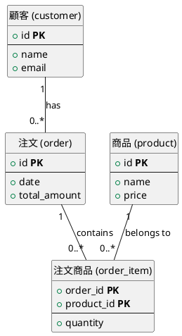
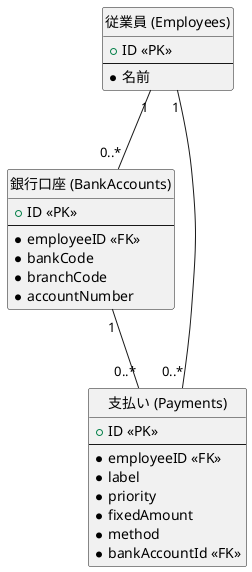
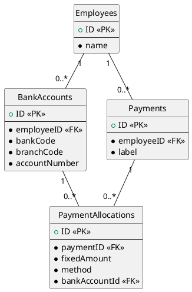
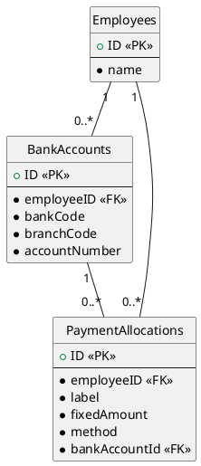

# you asked

PlnatUML って DB のクラス図書ける？

---

# gemini response

はい、PlantUMLでDBのクラス図を書くことができます。

PlantUMLのクラス図は、プログラミング言語のクラスを表現するために設計されていますが、データベースのテーブル、カラム、リレーションシップを描画するためにも非常に適しています。

### 記述方法

PlantUMLでDBのクラス図を表現する場合、一般的に以下の要素を使用します。

  * **テーブル**: `class`キーワードを使ってテーブルを定義します。
  * **カラム**: クラス内の属性としてカラムを記述します。`+`（public）記号を使って属性の可視性を明示することもできます。
  * **プライマリキー（PK）**: カラム名の前に`PK`と記述したり、`**`（太字）で表現したり、`<<PK>>`といったステレオタイプを使用したりして示します。
  * **外部キー（FK）**: `FK`と記述するか、テーブル間のリレーションシップ（`--`、`..`、`->`など）を使って表現します。
  * **リレーションシップ**: `---`、`--`、`..`などの記号を使って、テーブル間の1対1、1対多、多対多といった関係性を表現できます。

### 例

簡単な例を見てみましょう。

このコードは、顧客、注文、注文商品、商品の4つのテーブルとその間のリレーションシップを表現しています。これにより、データベースの構造を視覚的に理解することができます。

---

# you asked

従業員
ID 名前

銀行口座
ID employeeID bankCode branchCode accountNumber 

payments
ID employeeID label priority fixedAmount method bankAccountId

この DB の ER 図書いて

---

# gemini response

### ER図の説明

  * **従業員 (Employees)**: 会社に所属する従業員の情報を持つエンティティです。`ID`が主キー（PK）となっています。
  * **銀行口座 (BankAccounts)**: 従業員が登録した銀行口座の情報を持つエンティティです。
      * `ID`が主キー（PK）です。
      * `employeeID`は**従業員**エンティティの`ID`を参照する外部キー（FK）であり、この口座がどの従業員のものかを示します。
  * **支払い (Payments)**: 従業員への給与や賞与といった支払い情報を管理するエンティティです。
      * `ID`が主キー（PK）です。
      * `employeeID`は**従業員**エンティティの`ID`を参照する外部キー（FK）です。
      * `bankAccountId`は**銀行口座**エンティティの`ID`を参照する外部キー（FK）であり、どの口座に支払われるかを示します。

### リレーションシップ

  * **従業員 と 銀行口座**: 1対多の関係です。
      * 1人の従業員は、0個以上の銀行口座を持つことができます。
  * **従業員 と 支払い**: 1対多の関係です。
      * 1人の従業員に対して、0個以上の支払いが関連付けられます。
  * **銀行口座 と 支払い**: 1対多の関係です。
      * 1つの銀行口座は、0個以上の支払いに使用されます。

この図は、与えられた情報に基づいて、各エンティティとその間の関連性を視覚的に表現しています。

---

# you asked

@startuml
hide circle

entity "Employees" as employees {
    + ID <<PK>>
    --
    * name
}

entity "BankAccounts" as bank_accounts {
    + ID <<PK>>
    --
    * employeeID <<FK>>
    * bankCode
    * branchCode
    * accountNumber
}

entity "Payments" as payments {
    + ID <<PK>>
    --
    * employeeID <<FK>>
    * label
    * allocation1Id <<FK>>
    * allocation1Id <<FK>>
    * allocation1Id <<FK>>
}

employees "1" -- "0..*" bank_accounts : ""
employees "1" -- "0..*" payments : ""
bank_accounts "1" -- "0..*" payments : ""

@enduml

これにしたの DB を足して

paymentAllocations
ID fixedAmount method bankAccountId

---

# gemini response

この ER 図は正しくありません。`payments` テーブルに複数の`allocation1Id`があり、これは論理的に不自然です。また、`paymentAllocations`テーブルを追加する場合、`payments`と`paymentAllocations`のリレーションシップを適切に定義する必要があります。

-----

### 修正された ER 図

新しい `paymentAllocations` テーブルを追加し、`payments`との関係を明確にした ER 図は以下のようになります。

-----

### 変更点の解説

1.  **`payments` テーブルの修正**: `payments` テーブルから不自然な`allocation1Id`の繰り返しを削除しました。`payments`は支払い全体の情報を管理し、具体的な配分は`paymentAllocations`で管理します。
2.  **`PaymentAllocations` テーブルの追加**: 新しい `PaymentAllocations` テーブルを定義しました。このテーブルは、特定の支払いの配分（`fixedAmount`, `method`, `bankAccountId`）を記録します。
3.  **新しいリレーションシップ**: `Payments`と`PaymentAllocations`の間に1対多のリレーションシップを確立しました。
      * 1つの支払い（`Payments`）は、複数の配分（`PaymentAllocations`）を持つことができます。これにより、例えば給与と賞与の両方を一つの支払いとして管理し、それぞれの配分先（口座や方法）を詳細に記録できます。
4.  **`bankAccountId`の移動**: `bankAccountId`は、支払い全体の情報ではなく、個別の配分情報に属するため、`payments`から`paymentAllocations`に移動しました。

この設計により、データがより適切に正規化され、支払いと口座の関連付けが明確になります。

---

# you asked

Payments をなくして PaymentAllocations に統合して

---

# gemini response

了解しました。`Payments` テーブルを廃止し、その機能を `PaymentAllocations` テーブルに統合する ER 図を作成します。

-----

### 変更されたER図

`Payments` テーブルの`label`（給与、賞与など）を`PaymentAllocations`に移動し、`Payments`テーブルを削除することで、よりシンプルでフラットなデータ構造にしました。

-----

### 変更点の解説

  * **`payments` テーブルの削除**: 支払い全体を管理する`payments`テーブルは不要となりました。
  * **`PaymentAllocations` への項目追加**: `payments`テーブルが持っていた`label`（例：給与、賞与）を`paymentAllocations`テーブルに移動しました。これにより、各配分が何の支払いであるかを直接特定できるようになりました。
  * **リレーションシップの再構築**:
      * `employees`と`paymentAllocations`の関係を**直接**結びつけました。これにより、どの配分がどの従業員のものかが明確になります。
      * `bank_accounts`と`payment_allocations`の関係は維持され、どの配分がどの口座に振り込まれるかを示しています。

この新しい構造は、従業員ごとの個別の支払い配分（給与、賞与など）を直接管理する際に非常にシンプルで効率的です。ただし、**複数の配分を一つの論理的な支払い（例：月給と手当を合わせて一つの「給与」支払い）としてグループ化する機能は失われます**。この設計の選択は、ビジネス要件によって異なります。

---

# you asked

これはマルチテナントな SaaS の DB です。ユーザーのある企業が、自社の従業員の支払情報をクエリすると、パフォーマンスの観点でどうですか？

---

# gemini response

ユーザーが自社の従業員の支払い情報をクエリする場合、パフォーマンスは**テーブルの設計とインデックスの設定**に大きく依存します。

---

### パフォーマンスの懸念点

1.  **テナントIDの欠如**:
    提示されたER図には、**各レコードがどのテナント（企業）に属するかを識別する`tenant_id`がありません。**これはマルチテナントSaaSのDB設計において最も重要な項目です。
    `tenant_id`がない場合、ある企業の従業員情報を取得する際、`employeeID`や`bankAccountId`を通じて間接的にフィルタリングする必要があり、クエリが複雑で非効率になります。

2.  **インデックスの不在**:
    パフォーマンスを最適化するには、クエリで頻繁に使用される列にインデックスが必要です。
    * `employees.ID`
    * `bank_accounts.employeeID`
    * `payment_allocations.employeeID`
    * `payment_allocations.bankAccountId`
    これらの外部キー（FK）にはインデックスを設定することで、`JOIN`操作やフィルタリングが高速化されます。

### 最適化された設計とクエリ

より良いパフォーマンスを得るには、以下の点を考慮した設計が望ましいです。

1.  **`tenant_id`の追加**:
    すべてのテーブルに`tenant_id`列を追加し、複合主キーまたは複合インデックスを`tenant_id`と`ID`（または他の識別子）に設定します。これにより、クエリは特定のテナントのデータに絞り込まれ、スキャンする行数を大幅に減らすことができます。

    **修正後のテーブル構造**:
    * **Employees**: `tenant_id`, `ID`, `name`
    * **BankAccounts**: `tenant_id`, `ID`, `employeeID`, `bankCode`, `branchCode`, `accountNumber`
    * **PaymentAllocations**: `tenant_id`, `ID`, `employeeID`, `label`, `fixedAmount`, `method`, `bankAccountId`

2.  **効果的なインデックスの設定**:
    `tenant_id`と、それに続く外部キーにインデックスを設定します。

    **例**:
    * `CREATE INDEX idx_payment_allocations_tenant_employee ON payment_allocations (tenant_id, employeeID);`

これにより、特定の企業の支払い情報をクエリする際、データベースはまず`tenant_id`でデータを効率的にフィルタリングし、次に`employeeID`で絞り込むため、クエリの実行速度が劇的に向上します。

結論として、現在の設計ではパフォーマンスに課題がありますが、`tenant_id`の追加と適切なインデックス設定により、スケールするSaaS環境に適したパフォーマンスを実現できます。

---
