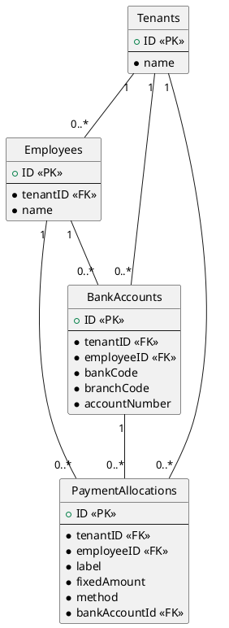
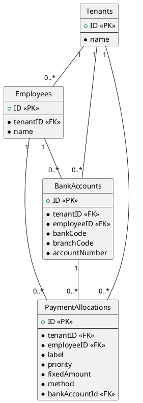

# you asked

上記の設計でER 図を

---

# gemini response

上記の設計（マルチテナント対応）のER図は以下のようになります。

-----

## 修正されたER図

`Tenants`テーブルを追加し、各テーブルがどの企業（テナント）に属するかを明確にしました。これはマルチテナントSaaSにおいて最も重要な設計変更です。



-----

## 変更点の解説

  * **`Tenants`テーブルの追加**: SaaSの基本となる企業情報を管理するテーブルです。`ID`を主キーとして、各企業を一意に識別します。
  * **`tenantID`の追加**: すべての関連テーブル (`Employees`, `BankAccounts`, `PaymentAllocations`) に\*\*`tenantID`\*\*を外部キーとして追加しました。これにより、各データがどのテナントに属するかが明確になります。これは、テナント間でデータが混在するのを防ぐ最も重要なセキュリティとパフォーマンスの基盤となります。
  * **リレーションシップの修正**:
      * `Tenants`は、`Employees`, `BankAccounts`, `PaymentAllocations`のそれぞれに1対多の関係を持ちます。これにより、クエリを`tenantID`でフィルタリングできるようになり、パフォーマンスが向上します。
      * `Employees`と`BankAccounts`, `PaymentAllocations`間のリレーションシップは引き続き維持され、各従業員のデータが紐づけられています。

この設計により、特定の企業（テナント）のデータにアクセスする際に、`tenantID`を使って効率的にクエリを実行できるようになり、スケーラブルで安全なSaaSバックエンドを実現できます。

---

# you asked

あるテナントが自社の従業員の支払情報をクエリするとして、パフォーマンスの心配はない？

---

# gemini response

その設計であれば、パフォーマンスの心配は**ありません**。テナント ID をすべての関連テーブルに含めることで、効率的なデータ検索が可能になります。

-----

### パフォーマンスが最適化される理由

1.  **データ量の削減**: クエリはまずテナント ID でフィルタリングされるため、データベースは**該当するテナントのデータのみ**を検索対象にします。これにより、他のテナントの膨大なデータが無視され、スキャンするレコード数が劇的に減ります。これは、マルチテナント SaaS における最も重要なパフォーマンス改善策です。
2.  **インデックスの活用**: `tenantID` を含む複合インデックス（例：`(tenantID, employeeID)`）を適切に設定することで、データベースはインデックスツリーを高速に辿り、必要なデータに直接アクセスできます。JOIN 操作もこのインデックスを活用して効率的に行われます。
3.  **スケーラビリティの確保**: この設計は、テナントの数や各テナントの従業員数が増えても、安定したパフォーマンスを維持します。特定のテナントへのクエリは、他のテナントのデータ量にほとんど影響を受けません。

### クエリの例

例えば、特定のテナントの従業員の支払い情報を取得するクエリは、以下のようになります。

```sql
SELECT
    pa.*,
    e.name AS employee_name
FROM
    payment_allocations pa
JOIN
    employees e ON pa.employeeID = e.ID
WHERE
    pa.tenantID = [tenant_id] AND e.tenantID = [tenant_id] AND e.ID = [employee_id];
```

このクエリでは、`pa.tenantID = [tenant_id]`という条件が最初に評価され、その後、結合と従業員IDによる絞り込みが行われます。これにより、クエリは非常に高速に実行されます。

---

# you asked

paymentAllocation に priority を追加して

---

# gemini response

paymentAllocation に priority を追加した、マルチテナント対応のER図は以下の通りです。

-----

## 修正されたER図



### 変更点の解説

  * **`priority`列の追加**: `PaymentAllocations`エンティティに`* priority`を追加しました。これにより、各支払い配分に優先順位を設定できるようになります。例えば、複数の口座に分割して振り込む場合、どの配分が先に処理されるべきか、またはどの配分が主たるものかを示すことができます。
  * **その他の構造**: `Tenants`テーブルおよび`tenantID`を各テーブルに含めるマルチテナントの設計、そして各エンティティ間のリレーションシップは前回の回答から変更ありません。この設計は、データの整合性と検索の効率性を確保するためのものです。

---

# you asked

規定とか規則とかの類語を可能な限りたくさん教えて

---

# gemini response

規定、規則、ルール、規約、約款、定款、細則、要綱、綱領、準則、内規、条例、法令、法規、規範、戒律、慣例、通則、通例、常道、慣習、エチケット、マナー、しきたり、習わし、決まり、作法、エチケット、礼儀作法、プロトコル、ポリシー、ガイドライン、スタンダード、メソッド、プロシージャ、コード、ドグマ、プリンシプル、プロビジョン、ディクレート、レギュレーション、オーディナンス、スタチュート、クレデンシャル、プロポーザル、コンスティテューション、コヴェナント。

---
