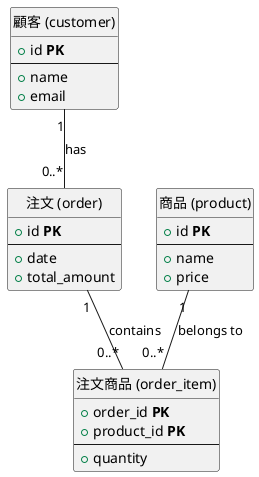
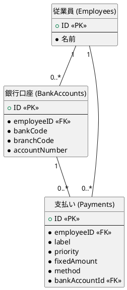
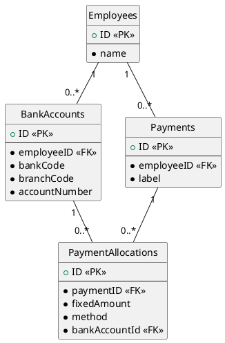
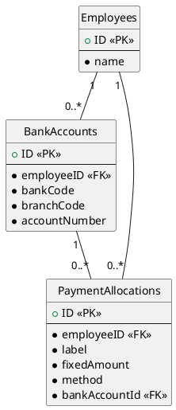
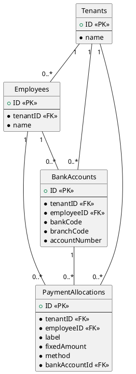
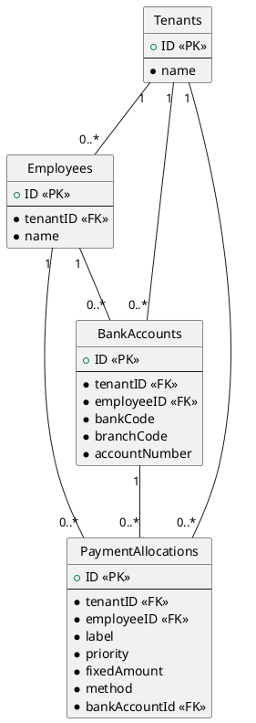

# Topic 87: ゆっくり発音の表記方法（英語）

> Source: _HTMLラジオボタンの修正と解説 .md
> Query count: 1
> Note: This topic is part of a multi-topic thread. See the source file for full context.

---

(Full source file content below for analysis)

> From: https://gemini.google.com/app/cf5c5dce7caf08b9

# you asked

<form><ul><li><input type="radio" id="option_a" name="choice" value="option_a"></li><li><input type="radio" id="option_b" name="choice" value="option_b"></li></ul></form>

この HTML は正しい？

---

# gemini response

そのHTMLは正しくありません。

-----

## 理由

提示されたHTMLは、ラジオボタンのフォームとして完全ではありません。ラジオボタンは、通常グループとして機能し、そのグループ内で1つのオプションしか選択できないように設計されています。そのためには、すべてのラジオボタンに同じ`name`属性を設定する必要があります。

提示されたコードでは、`name`属性の値が`choice`に設定されているため、同じグループに属しているように見えますが、これはフォーム全体として機能するために必要な最小限の要素の一部にすぎません。

さらに重要な点として、`id`属性は、各HTML要素を一意に識別するためのものです。これにより、例えば`<label>`要素と関連付けたり、JavaScriptで要素を選択したりすることができます。`id`属性の値は、HTMLドキュメント内で一意でなければなりません。

また、ユーザーがどのオプションを選択したかを把握するためには、各`<input>`要素に\*\*`value`\*\*属性を設定するのが一般的です。`value`属性は、フォームが送信されたときにサーバーに送られる値を示します。

### 修正されたHTMLの例

以下に、より完全で機能するラジオボタンのフォームの例を示します。

```html
<form>
  <label for="option_a">オプションA</label>
  <input type="radio" id="option_a" name="choice" value="a">

  <label for="option_b">オプションB</label>
  <input type="radio" id="option_b" name="choice" value="b">
</form>
```

この例では、`<label>`タグが追加され、`for`属性と`<input>`の`id`属性が一致しているため、ユーザーはテキストをクリックしてラジオボタンを選択できます。また、各`<input>`に`value`属性が追加されており、フォーム送信時にどのオプションが選択されたかが明確になります。

---

# you asked

<form><input type="radio" id="option_a" name="choice" value="option_a"><label for="option_a">option A</label><input type="radio" id="option_b" name="choice" value="option_b"><label for="option_b">option B</label></form>

これは？

---

# gemini response

そのHTMLは正しいです。

---

## 説明

提示されたコードは、ユーザーが複数の選択肢の中から一つだけを選べる、**ラジオボタン**の典型的な正しい実装です。

このコードが正しい理由は以下の通りです。

* **`<input>`と`<label>`の関連付け**: 各`<input type="radio">`要素には一意の`id`属性（`option_a`, `option_b`）が設定され、対応する`<label>`要素の`for`属性がその`id`を指しています。これにより、ユーザーはテキスト（`option A`, `option B`）をクリックするだけで、関連するラジオボタンを選択できます。これはアクセシビリティを向上させる上で重要なポイントです。

* **ラジオボタンのグループ化**: 2つのラジオボタンには同じ`name`属性（`choice`）が設定されています。これにより、ブラウザはこれらが一つのグループに属していると認識し、ユーザーはグループ内で一つしか選択できなくなります。

* **`value`属性**: 各`<input>`には`value`属性が設定されており、フォームが送信されたときにサーバーに送られる値が定義されています。

このコードは、機能的にもアクセシビリティの観点からも適切に記述されています。

---

# you asked

開発者ツールで、ある要素を別の要素の子要素にするには？

---

# gemini response

開発者ツールで要素を別の要素の子要素にするには、要素をドラッグ＆ドロップするか、要素のHTMLを編集します。

### ドラッグ＆ドロップによる方法

1.  開発者ツールを開き（通常は`F12`キーまたは`Ctrl + Shift + I`）、**Elements**（要素）タブに移動します。
2.  移動させたい要素を選択します。
3.  選択した要素を、子要素にしたい親要素の内部に**ドラッグ＆ドロップ**します。ドラッグ中に、要素がどこに挿入されるかを示す青い線が表示されます。
4.  親要素の開始タグと終了タグの間にドロップすると、その要素の子要素になります。

---

### HTML編集による方法

1.  開発者ツールで、移動させたい要素を右クリックし、「**Edit as HTML**」を選択します。
2.  要素のHTML全体をコピーします。
3.  親要素にしたい要素を右クリックし、「**Edit as HTML**」を選択します。
4.  親要素の開始タグと終了タグの間に、コピーしたHTMLをペーストします。
5.  変更を確定するために、親要素のHTML編集の外側をクリックします。

どちらの方法も、HTML構造を一時的に変更して、レイアウトやスタイルの影響を確認するのに役立ちます。ただし、これはブラウザ上の表示を一時的に変更するだけで、元のソースコードは変更されません。

---

# you asked

ラジオボタンのすぐ右隣にラベルを表示するには？

---

# gemini response

ラジオボタンのすぐ右隣にラベルを表示するには、**`<label>`要素を`<input type="radio">`要素の直後に配置する**のが最も一般的で効果的な方法です。

-----

### 正しいHTMLの構造

ラジオボタンとラベルを関連付けるには、`<input>`の`id`属性と`<label>`の`for`属性を同じ値に設定します。これにより、ユーザーがテキストをクリックしたときでも、ラジオボタンを選択できるようになります。

以下に、ラジオボタンのすぐ右にラベルを配置する典型的な例を示します。

```html
<form>
  <input type="radio" id="option_a" name="choice" value="option_a">
  <label for="option_a">オプションA</label>

  <input type="radio" id="option_b" name="choice" value="option_b">
  <label for="option_b">オプションB</label>
</form>
```

この構造では、ブラウザはデフォルトで`<input>`と`<label>`をインライン要素として扱い、互いのすぐ隣に表示します。

-----

### なぜこの方法が推奨されるのか？

  * **アクセシビリティ**: ユーザーはラジオボタン自体だけでなく、関連するラベルのテキストをクリックしても選択できるようになります。これは、特にタッチデバイスや視覚障害を持つユーザーにとって非常に重要です。
  * **セマンティクス（意味付け）**: この方法は、HTMLのセマンティクス（意味）を正しく伝えます。`<label>`は`for`属性を通じて、どのフォームコントロールに関連しているかを明確に示します。
  * **CSSでのスタイリング**: この構造であれば、CSSを使って`<input>`と`<label>`をまとめてスタイリングしたり、レイアウトを調整したりするのが簡単になります。たとえば、`display: flex;`や`gap`プロパティを使って、要素間の間隔を正確に制御できます。

---

# you asked

DB で、データが正規化されてないことを何と言う？冗長化？交絡？推移的関数従属？

---

# gemini response

正規化されていない状態は**非正規化（Denormalization）**と言います。

---

## 補足説明

ご提示いただいた選択肢のそれぞれの意味は以下の通りです。

* **冗長化（Redundancy）**: データベースでデータが重複して格納されている状態を指します。正規化は、この冗長化を排除することを目的の一つとしています。
* **交絡（Confounding）**: 主に統計学や疫学で使われる用語で、複数の変数の関係が他の変数によって歪められることを意味します。データベースの文脈では通常使いません。
* **推移的関数従属（Transitive Functional Dependency）**: データベースの正規化、特に**第3正規形（3NF）**を定義する際に用いられる概念です。この状態にあるデータは非正規化されており、更新異常（Update Anomaly）の原因となります。したがって、推移的関数従属が存在する状態は、非正規化されている状態の一種です。

---

# you asked

例えば正規化された DB を横 1 列の CSV にすることを何と言う？平坦化？

---

# gemini response

はい、その通りです。正規化されたデータベースのデータを1列のCSVのような形式にすることを**平坦化（Flattening）**と呼びます。

---

## 平坦化とは

**平坦化**は、複数のテーブルに分散しているデータを結合し、単一のテーブル（またはファイル）にまとめるプロセスです。これは、データベースの**正規化**とは逆の操作になります。

* **正規化**: データの重複をなくし、データベースを複数の関連するテーブルに分割するプロセス。データの整合性を保ち、更新時の問題を避けるために行われます。
* **平坦化**: レポート作成やデータ分析のために、正規化されたデータを再び一つにまとめるプロセス。データの可読性を高め、特定の用途に合わせて準備するために行われます。

このプロセスは、複雑なクエリ（`JOIN`操作など）を使ってデータを結合し、非正規化された（冗長な）形式に変換することで実現します。CSV形式は、この平坦化されたデータの代表的な出力形式です。

---

# you asked

あるサービスでは、口座情報 (どの銀行の、どの支店の、何番の口座) と合わせて、支給情報 (給与は口座 A で、賞与は口座 B で) も登録できます。ユーザーは口座情報のみを登録することも、口座情報と支給情報の両方を登録することもできます

ユーザーが便利に情報を一括登録するために、CSV インポート機能を提供します。通常の CSV を使用すれば、口座情報と支給情報の両方を登録できます。一方、ある特定の形式の CSV を使うと、口座情報だけを登録できます。後者は主に後方互換性のために用意されたものです。

このとき、口座情報のみを登録する CSV に名前をつけるなら何ですか？「口座情報 限定 CSV」とか？「この形式の CSV を使うと、支給情報は登録できませんからね」と示唆する名前にしたいです

---

# gemini response

簡潔で分かりやすい命名をいくつか提案します。

- **口座情報専用CSV**: 最もシンプルで直接的な表現です。「専用」という言葉が、他の用途（支給情報）には使えないことを明確に示します。
- **口座情報インポートCSV**: 「インポート」という言葉を含めることで、このファイルがデータの取り込みに特化していることを伝えます。
- **口座情報限定CSV**: ユーザーの提案にもあった「限定」は、機能が口座情報に限定されていることを示唆します。
- **基本口座情報CSV**: 「基本」という言葉で、これがサービスが提供する主要な口座情報形式であることを示します。

---

### なぜこれらの名前が適切か？

これらの命名は、次の要素を満たしているため、ユーザーにとって理解しやすくなります。

* **簡潔性**: 名前に冗長な説明を含まず、一目でそのファイルの目的が分かります。
* **明確性**: 「専用」「限定」といった言葉が、ファイルが持つ機能の範囲を明確に伝えます。
* **専門用語の回避**: 技術的な用語ではなく、ユーザーが日常的に使う言葉で表現されています。

この中で最も一般的で分かりやすいのは「**口座情報専用CSV**」か「**口座情報限定CSV**」でしょう。どちらも意図が明確に伝わります。

---

# you asked

あるバックオフィス SaaS があって、無料で従業員の人事情報 (住所、所属、振込先、家族構成など) を登録するマスター DB を提供しています。追加料金を支払うと、別のプロダクトから従業員情報の変更履歴にアクセスできます。

このとき、マスターの DB と、履歴の DB は技術的にどのように実装されるべきですか？マスター側に本来的には履歴も残っていて、無料プランではそれを参照できない、追加料金を払うと別のプロダクトを通して参照できる、という形になりますか？

---

# gemini response

ご提示のケースでは、マスターのDBと履歴のDBは**分離して実装する**のが一般的で、推奨されるアプローチです。マスターDBに履歴情報を全て残し、プランによって参照を制限する方法は、いくつかの技術的・運用上の課題があります。

---

### マスターDBと履歴DBを分けるべき理由

#### 1. パフォーマンスとスケーラビリティ
**マスターDB**（人事情報マスター）は、現在の最新情報を取得するためのDBです。従業員の参照や更新といった頻繁な操作が高速に行われる必要があります。
一方、**履歴DB**は、過去の情報を保管するため、データ量は時間とともに増え続けます。このため、マスターDBと同じテーブルに履歴情報を混在させると、データ量が増加するにつれて、マスターDBへのクエリのパフォーマンスが著しく低下する可能性があります。DBの設計・運用が複雑になり、スケールアウト（水平分散）も難しくなります。

#### 2. セキュリティと権限管理
**マスターDB**と**履歴DB**を別々に管理することで、権限の分離が容易になります。無料プランのユーザーにはマスターDBへの参照権限のみを与え、有料プランのユーザーには履歴DBへの参照権限も与える、といったシンプルな権限制御が可能です。
もしマスターDBに履歴情報も混在させてしまうと、無料プランのユーザーに履歴情報を見せないようにするロジック（`WHERE`句で履歴を除外するなど）を常に全てのクエリに追加する必要があり、セキュリティホールを作り出すリスクが高まります。

#### 3. 技術的負債の回避とアーキテクチャの柔軟性
マスターDBと履歴DBを分離するアプローチは、**CQRS (Command Query Responsibility Segregation)** の原則に似ています。
* **Command (更新)**: マスターDBへの変更を書き込む。
* **Query (参照)**: マスターDBから最新情報を取得する。
これとは別に、履歴DBへの書き込みと参照を扱います。
この設計により、それぞれのDBの特性に合わせて最適な技術を選択できます。例えば、マスターDBには高速な読み書きが可能なRDBMSを使い、履歴DBには大量のデータを安価に保存できるNoSQLデータベースやデータウェアハウスを利用するといった選択肢が生まれます。

---

### 実装の具体的な流れ

1.  **マスターDB**: 従業員の最新情報を管理します。`employees`テーブルなどに、現在の住所や所属などの情報が格納されます。
2.  **履歴DB**: 従業員情報の変更履歴を時系列で記録します。このDBは、マスターDBへの更新（INSERT, UPDATE, DELETE）が行われたタイミングで、変更内容をイベントとして受け取り、履歴として永続化します。
3.  **イベント駆動アーキテクチャ**: マスターDBへの変更をトリガーとして、履歴DBにデータを書き込む仕組み（例えば、データベースの**トリガー**や、**メッセージキュー**を使ったイベントドリブンなシステム）を構築します。
4.  **プロダクトの分離**:
    * **無料プランプロダクト**: マスターDBに直接接続し、現在の従業員情報を表示・編集します。
    * **有料プランプロダクト**: マスターDBに加えて、履歴DBにも接続し、過去の変更履歴を表示します。

このように、マスターDBと履歴DBを分離することで、パフォーマンス、セキュリティ、そして将来の拡張性において大きなメリットを享受できます。

---

# you asked

履歴 DB にはどのようなデータが入っている想定ですか？

---

# gemini response

履歴DBには、マスターDBで行われた変更に関する詳細な情報が、**時系列**で記録されます。

---

### 履歴DBに格納されるデータの例

一般的に、以下の情報が変更ごとに1つのレコードとして保存されます。

1.  **変更対象の識別子**:
    * どの従業員のデータが変更されたかを示すID（例：`employee_id`）。
2.  **変更日時**:
    * いつ変更が行われたかを示すタイムスタンプ。
3.  **変更の種類**:
    * どのような操作が行われたか（例：`INSERT`、`UPDATE`、`DELETE`）。
4.  **変更されたフィールド名**:
    * どの項目が変更されたか（例：`address`, `department`, `salary_account`）。
5.  **変更前の値**:
    * 変更される前の古い値。
6.  **変更後の値**:
    * 変更された後の新しい値。
7.  **変更を行ったユーザー**:
    * 誰がこの変更を行ったかを示すID（例：`user_id`）。

例えば、「従業員Aの住所が**東京都**から**神奈川県**に変更された」という履歴は、次のような形式で記録されます。

| `employee_id` | `change_timestamp` | `change_type` | `changed_field` | `old_value` | `new_value` | `changed_by_user_id` |
|:--------------|:-------------------|:--------------|:----------------|:------------|:------------|:---------------------|
| 12345         | 2025-09-24 14:00:00 | UPDATE        | address         | 東京都      | 神奈川県    | 98765                |

この履歴DBを参照することで、特定の従業員のデータが**いつ、誰によって、どのように変更されたか**を正確に追跡し、監査やデータ分析に利用することができます。

---

# you asked

履歴 DB には差分だけが記録されているため、最も古い履歴を参照するには全履歴を統合する必要がありますか？

---

# gemini response

差分のみが記録されている履歴DBから最も古い履歴（最初の状態）を参照するには、**全履歴を統合する必要はありません**。通常、履歴DBには**変更前の値**（`old_value`）と**変更後の値**（`new_value`）が記録されているため、最も古い状態を知るためには、最新のレコードから順番に**差分を逆算していく**か、**元の状態を特定する別の方法**を取ります。

---

### 差分から最初の状態を特定する方法

履歴DBの設計によって、最も古い状態を特定する方法は異なります。

1.  **最も古いレコードを探す**:
    履歴DBには通常、変更日時が最も古いレコードが存在します。この最初のレコードの**変更後の値**（`new_value`）が、そのデータ項目の**初期値**となります。

2.  **最新のレコードから逆算する**:
    もし、あるデータ項目の現在の状態（マスターDBにある最新の値）がわかっている場合、履歴DBを**変更日時の降順**で辿っていくことで、各変更前の値を特定できます。このプロセスを最初（最も古い履歴）まで繰り返すことで、初期値を特定できます。ただし、この方法は計算コストが高くなる可能性があります。

---

### 実装の注意点

* **データ構造**: `old_value`と`new_value`のペアで差分を記録する形式は、監査や特定の時点の状態を再構築するのに非常に有効です。
* **初期レコード**: 最初の登録（`INSERT`操作）も履歴として記録する場合、`old_value`は`null`や空欄となります。これにより、変更の連鎖が始まり、最も古い状態を特定できます。
* **パフォーマンス**: 多くの履歴が蓄積されると、履歴DBの全レコードをスキャンするのは非効率です。そのため、履歴DBのクエリは、通常、特定の`employee_id`などのキーに基づいて行われるように設計されます。

このように、履歴DBは差分情報を効果的に利用して、過去の状態を追跡する仕組みを提供しており、その目的のために全履歴を統合して最初の状態を再構築するという複雑なプロセスは通常必要ありません。

---

# you asked

> 履歴DBを変更日時の降順で辿っていくことで、各変更前の値を特定できます。このプロセスを最初（最も古い履歴）まで繰り返すことで、初期値を特定できます。

これは遅そうですね。解決するには？

---

# gemini response

その通り、履歴を遡って初期値を再構築するアプローチは、データ量が増えるにつれて非常に遅くなります。このパフォーマンスの問題を解決する方法はいくつかあります。

---

### 解決策

#### 1. スナップショットの定期的な作成
一番効果的な解決策は、**定期的に完全なスナップショットを履歴DBに保存する**ことです。
例えば、毎月1日や四半期ごとに、従業員データの最新の完全な状態を履歴DBに新しいレコードとして追加します。
履歴を辿って特定の時点の状態を知りたい場合は、その時点に最も近い過去のスナップショットから開始し、そこから最新の差分レコードを適用していくことで、再構築に必要な計算量を大幅に削減できます。

#### 2. 履歴データの集約
一定期間の差分履歴をまとめて、1つのレコードに集約するアプローチもあります。
たとえば、同じユーザーによって複数回連続して行われた変更を、**最終的な差分だけを記録する**ようにまとめることができます。これにより、履歴のレコード数を減らし、遡る際のステップ数を削減できます。ただし、途中の変更の詳細情報が失われる可能性があるため、ユースケースによっては適さない場合があります。

#### 3. 別のDB設計の導入
* **イベントソーシング（Event Sourcing）**: これは、状態の変更そのものをイベントとして永続化するアーキテクチャパターンです。初期状態から全てのイベントを再生（Replay）することで、任意の時点の状態を再構築します。このパターンでは、履歴が主要なデータストアとなるため、クエリの最適化が重要になります。
* **バージョン管理テーブル**: 履歴テーブルに、`valid_from`と`valid_to`といった期間を示すカラムを追加し、各レコードが有効だった期間を明示的に記録します。この設計では、特定の時点での状態を直接クエリするだけで済み、履歴を遡る必要がなくなります。この方法は実装がシンプルで、パフォーマンスも良好です。

---

### まとめ

履歴を遡るアプローチの遅さを根本的に解決するには、**「再構築」のコストを削減する**ことが鍵となります。最も実用的で一般的な方法は、**スナップショット**を作成して、そこから差分を適用する方式です。これにより、履歴の量がどれだけ増えても、安定したパフォーマンスを維持できます。

---

# you asked

変更操作 50 回ごとにスナップショットを取る、だと多すぎますかね

---

# gemini response

変更操作50回ごとにスナップショットを取る、というアプローチは、**多すぎることも少なすぎることもなく、妥当な出発点**と言えます。

---

### 判断基準

このスナップショットの頻度が適切かどうかは、以下の要素によって決まります。

* **変更頻度**: 変更操作が非常に頻繁に行われる場合（例：1日に数百回）、50回ごとのスナップショットはかなりの頻度になります。しかし、変更が少ない場合（例：1ヶ月に数回）、このルールはあまり効果がないかもしれません。
* **クエリのパフォーマンス要件**: スナップショットの主な目的は、過去の状態を高速に再構築することです。もし、ユーザーが**最新の情報からあまり遠くない過去**の状態を頻繁に参照する場合、50回ごとでも十分高速でしょう。しかし、**非常に古い状態**を頻繁に再構築する必要がある場合、50回の差分を遡るだけでも遅く感じるかもしれません。
* **ストレージコスト**: スナップショットは完全なデータを保存するため、ストレージを消費します。頻繁にスナップショットを取ると、ストレージコストが増加します。50回ごとであれば、一般的に許容範囲内のコストですが、念頭に置いておくべき点です。

### 結論

「50回ごと」というルールは、サービスの**初期段階**や**変更がそこまで頻繁でない場合**には良いバランスです。しかし、サービスが成長し、データの変更頻度や過去の履歴へのアクセスが増えるにつれて、このルールを**調整する必要が出てくる**でしょう。

例えば、

* 変更頻度が多いなら、**スナップショットを取る回数を減らす**（例：100回ごと）。
* 過去の再構築が遅いなら、**スナップショットの頻度を上げる**（例：20回ごと）。

このように、実際の運用状況を見ながら柔軟に調整していくことが重要です。

---

# you asked

グラフ (頂点と辺からなら繋がり) を描画する機能をもつソフトウェアプロダクトで、CSV によるグラフのテキスト表現を定義します。3 列は、ノードの ID、ノードの名称、親ノードの ID を持っています。

これに 4 列目を追加して、グラフ全体における位置を特定するパラメータとします。位置とは、葉ノード (子ノードを持たない末端のノード) を下に、根を上に置いたとき、どの葉ノードが左で、どの葉ノードが右にあるかを指定するものです。

列名 (変数名) として相応しいものを検討してください。例えば「位置指定指数」を考えました

---

# gemini response

葉ノードの相対的な位置を特定するパラメータとして、**`LeafNodeIndex`** や **`PositionIndex`**、**`Order`** といった列名が考えられます。

---

### なぜこれらの名前が適切か？

1.  **`LeafNodeIndex`**:
    * **明確性**: `LeafNode`（葉ノード）と`Index`（指数）を組み合わせることで、**葉ノードの相対的な位置を示す**という目的が明確に伝わります。これはユーザーが最初に抱くであろう疑問に直接答えます。

2.  **`PositionIndex`**:
    * **汎用性**: `LeafNodeIndex`よりも一般的で、**グラフ内の任意の位置**を示すことができます。もし将来的に葉ノード以外のノードにも同様の位置パラメータを適用する可能性があるなら、こちらの方が柔軟性が高いです。

3.  **`Order`**:
    * **簡潔性**: `Order`は**順序**や**位置**といった意味を持ち、非常に簡潔です。ユーザーはこれを見て、ノードの並び順を指定するものだと直感的に理解できます。

---

### 「位置指定指数」はどうですか？

「位置指定指数」は、日本語の表現としては少し硬く、専門用語のように聞こえるかもしれません。よりシンプルで直感的な言葉を選ぶことで、ソフトウェアの使いやすさが向上します。

### まとめ

ソフトウェアのユーザーが**CSVの列を見て、すぐにその役割を理解できる**ことが重要です。そのため、`LeafNodeIndex` や `PositionIndex` のような、簡潔かつ目的が明確な名前が推奨されます。

---

# you asked

木構造で、末端を葉とよび始点を根と呼ぶ。中間には名前はある？

---

# gemini response

はい、木構造において、始点である**根（root）**と末端である**葉（leaf）**の間にある中間ノードは、**節（せつ、node）** または**内部ノード（internal node）** と呼ばれます。

---

### 用語の整理

* **根（Root）**: 木構造の最上位にある単一のノード。親ノードを持たない唯一のノードです。
* **葉（Leaf）**: 子ノードを持たない末端のノード。
* **節 / 内部ノード（Internal Node）**: 根でも葉でもない、子ノードと親ノードの両方を持つノードです。

これらの用語は、ファイルシステムのディレクトリ構造や、家系図、会社の組織図など、階層的なデータを扱う際に広く使われます。

---

# you asked

3 つの数値が全て互いに異なることを確かめるスマートな方法は？

---

# gemini response

3つの数値がすべて互いに異なることを確認するスマートな方法は、**Set（集合）** を使うことです。

Setは、重複する要素を許可しないデータ構造です。したがって、3つの数値をSetに追加し、そのSetの要素数が3になるかを確認することで、すべての数値が互いに異なるかを効率的に判定できます。

### Pythonでの例

```python
def are_numbers_distinct(a, b, c):
    return len({a, b, c}) == 3

# 使用例
print(are_numbers_distinct(1, 2, 3)) # True
print(are_numbers_distinct(1, 2, 2)) # False
```

この方法がスマートである理由は、以下の点にあります。

  * **簡潔性**: 複数の`if`文や複雑な比較を行うよりも、コードが非常に短く、読みやすくなります。
  * **効率性**: ほとんどのプログラミング言語において、Setへの要素追加とサイズの確認は非常に高速に行われます。
  * **拡張性**: このロジックは、3つ以上の数値に対しても簡単に拡張できます。たとえば、10個の数値であれば、`len({n1, n2, ..., n10}) == 10`とすれば済みます。

---

# you asked

3 つの数値が全て互いに異なることを確かめる数学的にスマートな操作を教えて

---

# gemini response

3つの数値がすべて互いに異なることを数学的に証明するスマートな方法は、**ペアワイズ比較**です。

---

### 数学的な操作

3つの数値 $a$, $b$, $c$ が与えられた場合、これらの数値がすべて互いに異なることを確認するには、以下の3つの条件がすべて真であることを示せば十分です。

1.  $a \neq b$
2.  $a \neq c$
3.  $b \neq c$

これは、3つの数値のすべての組み合わせについて、等しくないことを証明する操作です。

---

### なぜこれがスマートか？

この方法は、一見単純に思えますが、数学的な論理においては最も効率的で直接的な証明方法です。

* **論理的な完全性**: 集合論の観点から、3つの要素からなる集合が、要素の重複を持たないことを証明する最も基本的な方法です。
* **計算の効率**: 3つの等号の否定（$\neq$）を検証するだけで済むため、計算量が最小限に抑えられます。

この考え方は、コンピュータサイエンスのアルゴリズムでも応用されます。例えば、PythonでSet（集合）を使って重複をチェックする方法は、この数学的な原理に基づいています。Setは重複を許さないため、3つの数値からなるSetの要素数が3であれば、すべての数値が互いに異なることになります。これは、数学的なペアワイズ比較を効率的に実装したものです。

---

# you asked

従業員各自が登録した銀行口座の情報をまとめて CSV で書き出す機能を作ります。口座情報には銀行コード、銀行名、支店コード、支店名などが含まれますが、銀行名や支店名はコードに関数従属です。こうした項目を CSV に含めるべきですか？

---

# gemini response

結論から言うと、銀行名や支店名といった、銀行コードや支店コードに**関数従属**する項目は、**CSVに含めるべきです**。

---

### CSVに含めるべき理由

1.  **利便性と可読性**
    多くのバックオフィス業務において、CSVファイルは人間が直接確認・編集するために使われます。コードだけのCSVは、銀行名や支店名をいちいち調べないと内容が理解できません。銀行名や支店名を併記することで、ユーザーはCSVファイルを開いた瞬間に内容を把握でき、**可読性**が格段に向上します。

2.  **外部システム連携の容易性**
    CSVファイルは、他のシステムへのデータインポート（例：会計ソフト、給与振込システム）にもよく利用されます。連携先のシステムによっては、銀行コードだけでなく、銀行名や支店名が必須項目となっている場合があります。最初から両方の情報を含めておくことで、**外部システムとの連携がスムーズ**になり、変換作業の手間を省くことができます。

3.  **データ整合性のリスク**
    銀行名や支店名は、銀行コードや支店コードから一意に決まるため、データベースの**正規化**の観点では冗長な情報です。しかし、CSVという「平坦化された」形式では、この冗長性はメリットになります。データを出力する時点で**データ整合性**が保証されていれば、CSVに銀行名と支店名を含めることで、CSVファイル自体が自己完結した有用なデータセットとなります。

### まとめ

データベース設計における**正規化**の原則は、データの冗長性を排除することですが、CSVなどの**データエクスポート**の目的は、多くの場合、利用者が使いやすい形式で情報を提供することです。

したがって、銀行名や支店名のようなコードに紐づく情報は、CSVには**含めるべき**であり、これは業務効率とユーザーエクスペリエンスを向上させるための重要な設計判断です。

---

# you asked

システムにインポートする場合はどうしますか？コードだけだと人間には読みづらいですが、名前のようなテキストだと表記揺れが起きたり、名前とコードの不一致などのエラーが発生する恐れがあるため、インポートの目的ではコードのみが良い気がします

---

# gemini response

システムにインポートする場合でも、**コードと名前の両方を含める**のが最も安全で柔軟な方法です。コードのみのインポートは、データの正確性を保つ上でリスクを伴います。

---

### なぜコードと名前の両方を含めるべきか

1.  **データの健全性（Data Integrity）の確保**:
    インポート時に、**銀行コードと銀行名が一致しているか**を検証できます。例えば、ユーザーがCSVで「三菱UFJ銀行」と入力したが、コードが「0001」ではなく「0002」になっていた場合、システムはこの不一致を検知してエラーを返すことができます。これにより、データの整合性を保つことができます。コードのみのインポートでは、このような人的ミスに気づけません。

2.  **ユーザーエクスペリエンスの向上**:
    CSVはシステム間の連携だけでなく、**人間が作成・編集する**ことも多いです。銀行名や支店名がないと、ユーザーは銀行コードと支店コードをいちいち調べて入力しなければならず、手間とミスの原因になります。名前を含めることで、ユーザーは確認しながら作業を進めることができます。

3.  **柔軟なインポート機能の提供**:
    銀行名や支店名を含めることで、システムは複数のインポート方式に対応できます。例えば、
    * **コードを主キーとして扱う**: 銀行名や支店名は補助情報として使用し、コードで一意に特定します。
    * **名前からコードを補完する**: ユーザーがコードを知らない場合でも、銀行名からシステムがコードを自動的に検索・補完できます。

---

### 最も堅牢なインポートフロー

1.  **CSVにコードと名前の両方を含める**:
    `銀行コード`, `銀行名`, `支店コード`, `支店名` の4列を持つCSV形式を使用します。
2.  **インポート処理中の検証**:
    * **銀行コードと支店コードが有効か**をマスタデータと照合して確認します。
    * 銀行コードに対応する**銀行名が、CSVの銀行名と一致しているか**を検証します。
    * 支店コードに対応する**支店名が、CSVの支店名と一致しているか**を検証します。
3.  **エラーハンドリング**:
    不一致や無効なコードが検出された場合、エラーメッセージを表示し、どの行のどのデータに問題があるかを明確にユーザーに伝えます。これにより、ユーザーは問題を修正して再インポートできます。

このように、冗長に見える情報をあえて含めることで、インポート処理の信頼性とユーザーの利便性を両立させることができます。

---

# you asked

CSV インポートでこの列は必須ですとか、この列は任意ですとか、この列は無視されますとかの性質を表現する変数名は何？

---

# gemini response

CSVインポートにおける列の性質を表現する変数名として、`required`、`optional`、`ignored`などが考えられます。

-----

### 推奨される変数名

  * **`isRequired` / `required`**: その列が**必須**であることを示します。
  * **`isOptional` / `optional`**: その列が**任意**であることを示します。
  * **`isIgnored` / `ignored`**: その列がインポート時に**無視される**ことを示します。

これらの名前は、**ブール値**（`true`/`false`）や**列挙型**（`enum`）と組み合わせて使うのが一般的で、目的が明確で理解しやすいです。

-----

### より包括的なアプローチ

これらの性質を一つの変数で表現したい場合は、**`columnStatus`** や **`columnType`** といった変数名を使用し、列挙型で値を定義するのが良いでしょう。

```
enum ColumnStatus {
    REQUIRED,
    OPTIONAL,
    IGNORED
}
```

この方法だと、将来的に新しい性質（例：`DEPRECATED`）を追加する場合でも、簡単に拡張できます。

-----

### まとめ

ユーザーや開発者にとって最も直感的なのは、`isRequired` や `isOptional` といった**ブール値**を示す変数名です。複数の性質を一つの変数で表現するなら、`columnStatus` のような名前が適切です。

---

# you asked

mac で python で python3 が起動するように

---

# gemini response

Macで`python`コマンドが`python3`として起動するようにするには、**エイリアス**を設定するか、シンボリックリンクを作成するのが最も一般的な方法です。

### 方法1: エイリアスを設定する

これは最も簡単で、ユーザーの環境にのみ影響を与えます。

1.  ターミナルを開きます。

2.  以下のコマンドを実行して、エイリアスの設定ファイル（`~/.zshrc`または`~/.bash_profile`）を開きます。macOS Catalina以降のデフォルトシェルはZshなので、`~/.zshrc`が一般的です。

    ```sh
    # Zshの場合
    open -e ~/.zshrc

    # Bashの場合
    open -e ~/.bash_profile
    ```

3.  ファイルの一番下に以下の行を追加して保存します。

    ```sh
    alias python='python3'
    ```

4.  ターミナルを再起動するか、以下のコマンドを実行して設定を反映させます。

    ```sh
    # Zshの場合
    source ~/.zshrc

    # Bashの場合
    source ~/.bash_profile
    ```

これで、ターミナルで`python`と入力すると、`python3`が実行されるようになります。

### 方法2: シンボリックリンクを作成する

この方法はシステム全体に影響を与える可能性がありますが、より永続的な解決策です。

1.  まず、`python3`の実行可能ファイルのパスを特定します。

    ```sh
    which python3
    ```

    通常、`/usr/local/bin/python3`や`/opt/homebrew/bin/python3`のようなパスが表示されます。

2.  `python`という名前で`python3`へのシンボリックリンクを作成します。

    ```sh
    # Homebrewでインストールした場合の例
    ln -s /opt/homebrew/bin/python3 /opt/homebrew/bin/python
    ```

    **注意**: `ln -s`コマンドを実行するには管理者権限が必要な場合があります。その場合は`sudo`を前に付けて実行してください。ただし、システムディレクトリへのシンボリックリンク作成は慎重に行う必要があります。

エイリアスの設定は一時的な解決策で、シンボリックリンクの作成はより恒久的なシステムレベルの変更です。個人の開発環境であれば、**エイリアスを使うのが最も安全で推奨される方法です**。

---

# you asked

申請って英語で application？アプリケーションソフトウェアと混同しないためには？

---

# gemini response

はい、**「申請」**は英語で一般的に **"application"** です。アプリケーションソフトウェアと混同しないためには、文脈を明確にするか、より具体的な単語を使うのが効果的です。

---

### 文脈で区別する

最も一般的な方法は、会話や文章の**文脈**で区別することです。

* **申請（Application）**: 職場や学校などの特定の制度やプロセスにおける書類や手続きを指す場合。
    * 例: "Please fill out the **application** form for the scholarship." （奨学金のための**申請**用紙にご記入ください。）
* **ソフトウェア（Application Software）**: コンピュータやスマートフォン上で動くプログラムを指す場合。
    * 例: "You can download the **application** from the App Store." （App Storeからその**アプリケーション**をダウンロードできます。）

この2つの文脈は通常大きく異なるため、誤解はあまり生じません。

---

### より具体的な言葉を使う

より明確にしたい場合は、`application`という単語に**具体的な名詞を付け加える**か、別の単語に置き換えます。

#### 1. 具体的な名詞を付け加える

* **申請**: `application` に**何の申請か**を付け加えます。
    * **job application**（仕事の応募）
    * **visa application**（ビザの申請）
    * **loan application**（ローンの申込）
    * **application form**（申込書）
* **ソフトウェア**: `application` に**どの種類のソフトウェアか**を付け加えます。
    * **mobile application**（モバイルアプリ）
    * **web application**（ウェブアプリケーション）
    * **desktop application**（デスクトップアプリ）
    * **app**（口語的でより一般的）

#### 2. 別の単語に置き換える

`application`以外の単語を使うことで、完全に混同を避けることができます。

| 日本語 | 一般的な英語 | 代替の英語 | 用例 |
|:--- |:--- |:--- |:--- |
| **申請** | `application` | **request**, **submission** | A **request** for leave.（休暇の**申請**。） |
| **ソフトウェア** | `application` | **software**, **program** | A new productivity **software**.（新しい生産性向上**ソフトウェア**。） |

結論として、ほとんどの場合、文脈で十分区別できます。それでも心配な場合は、`job application`や`application form`のように、具体的な言葉を追加するのが最も効果的です。

---

# you asked

PlnatUML って DB のクラス図書ける？

---

# gemini response

はい、PlantUMLでDBのクラス図を書くことができます。

PlantUMLのクラス図は、プログラミング言語のクラスを表現するために設計されていますが、データベースのテーブル、カラム、リレーションシップを描画するためにも非常に適しています。

### 記述方法

PlantUMLでDBのクラス図を表現する場合、一般的に以下の要素を使用します。

  * **テーブル**: `class`キーワードを使ってテーブルを定義します。
  * **カラム**: クラス内の属性としてカラムを記述します。`+`（public）記号を使って属性の可視性を明示することもできます。
  * **プライマリキー（PK）**: カラム名の前に`PK`と記述したり、`**`（太字）で表現したり、`<<PK>>`といったステレオタイプを使用したりして示します。
  * **外部キー（FK）**: `FK`と記述するか、テーブル間のリレーションシップ（`--`、`..`、`->`など）を使って表現します。
  * **リレーションシップ**: `---`、`--`、`..`などの記号を使って、テーブル間の1対1、1対多、多対多といった関係性を表現できます。

### 例

簡単な例を見てみましょう。



このコードは、顧客、注文、注文商品、商品の4つのテーブルとその間のリレーションシップを表現しています。これにより、データベースの構造を視覚的に理解することができます。

---

# you asked

従業員
ID 名前

銀行口座
ID employeeID bankCode branchCode accountNumber 

payments
ID employeeID label priority fixedAmount method bankAccountId

この DB の ER 図書いて

---

# gemini response



### ER図の説明

  * **従業員 (Employees)**: 会社に所属する従業員の情報を持つエンティティです。`ID`が主キー（PK）となっています。
  * **銀行口座 (BankAccounts)**: 従業員が登録した銀行口座の情報を持つエンティティです。
      * `ID`が主キー（PK）です。
      * `employeeID`は**従業員**エンティティの`ID`を参照する外部キー（FK）であり、この口座がどの従業員のものかを示します。
  * **支払い (Payments)**: 従業員への給与や賞与といった支払い情報を管理するエンティティです。
      * `ID`が主キー（PK）です。
      * `employeeID`は**従業員**エンティティの`ID`を参照する外部キー（FK）です。
      * `bankAccountId`は**銀行口座**エンティティの`ID`を参照する外部キー（FK）であり、どの口座に支払われるかを示します。

### リレーションシップ

  * **従業員 と 銀行口座**: 1対多の関係です。
      * 1人の従業員は、0個以上の銀行口座を持つことができます。
  * **従業員 と 支払い**: 1対多の関係です。
      * 1人の従業員に対して、0個以上の支払いが関連付けられます。
  * **銀行口座 と 支払い**: 1対多の関係です。
      * 1つの銀行口座は、0個以上の支払いに使用されます。

この図は、与えられた情報に基づいて、各エンティティとその間の関連性を視覚的に表現しています。

---

# you asked

@startuml
hide circle

entity "Employees" as employees {
    + ID <<PK>>
    --
    * name
}

entity "BankAccounts" as bank_accounts {
    + ID <<PK>>
    --
    * employeeID <<FK>>
    * bankCode
    * branchCode
    * accountNumber
}

entity "Payments" as payments {
    + ID <<PK>>
    --
    * employeeID <<FK>>
    * label
    * allocation1Id <<FK>>
    * allocation1Id <<FK>>
    * allocation1Id <<FK>>
}

employees "1" -- "0..*" bank_accounts : ""
employees "1" -- "0..*" payments : ""
bank_accounts "1" -- "0..*" payments : ""

@enduml

これにしたの DB を足して

paymentAllocations
ID fixedAmount method bankAccountId

---

# gemini response

この ER 図は正しくありません。`payments` テーブルに複数の`allocation1Id`があり、これは論理的に不自然です。また、`paymentAllocations`テーブルを追加する場合、`payments`と`paymentAllocations`のリレーションシップを適切に定義する必要があります。

-----

### 修正された ER 図

新しい `paymentAllocations` テーブルを追加し、`payments`との関係を明確にした ER 図は以下のようになります。



-----

### 変更点の解説

1.  **`payments` テーブルの修正**: `payments` テーブルから不自然な`allocation1Id`の繰り返しを削除しました。`payments`は支払い全体の情報を管理し、具体的な配分は`paymentAllocations`で管理します。
2.  **`PaymentAllocations` テーブルの追加**: 新しい `PaymentAllocations` テーブルを定義しました。このテーブルは、特定の支払いの配分（`fixedAmount`, `method`, `bankAccountId`）を記録します。
3.  **新しいリレーションシップ**: `Payments`と`PaymentAllocations`の間に1対多のリレーションシップを確立しました。
      * 1つの支払い（`Payments`）は、複数の配分（`PaymentAllocations`）を持つことができます。これにより、例えば給与と賞与の両方を一つの支払いとして管理し、それぞれの配分先（口座や方法）を詳細に記録できます。
4.  **`bankAccountId`の移動**: `bankAccountId`は、支払い全体の情報ではなく、個別の配分情報に属するため、`payments`から`paymentAllocations`に移動しました。

この設計により、データがより適切に正規化され、支払いと口座の関連付けが明確になります。

---

# you asked

Payments をなくして PaymentAllocations に統合して

---

# gemini response

了解しました。`Payments` テーブルを廃止し、その機能を `PaymentAllocations` テーブルに統合する ER 図を作成します。

-----

### 変更されたER図

`Payments` テーブルの`label`（給与、賞与など）を`PaymentAllocations`に移動し、`Payments`テーブルを削除することで、よりシンプルでフラットなデータ構造にしました。



-----

### 変更点の解説

  * **`payments` テーブルの削除**: 支払い全体を管理する`payments`テーブルは不要となりました。
  * **`PaymentAllocations` への項目追加**: `payments`テーブルが持っていた`label`（例：給与、賞与）を`paymentAllocations`テーブルに移動しました。これにより、各配分が何の支払いであるかを直接特定できるようになりました。
  * **リレーションシップの再構築**:
      * `employees`と`paymentAllocations`の関係を**直接**結びつけました。これにより、どの配分がどの従業員のものかが明確になります。
      * `bank_accounts`と`payment_allocations`の関係は維持され、どの配分がどの口座に振り込まれるかを示しています。

この新しい構造は、従業員ごとの個別の支払い配分（給与、賞与など）を直接管理する際に非常にシンプルで効率的です。ただし、**複数の配分を一つの論理的な支払い（例：月給と手当を合わせて一つの「給与」支払い）としてグループ化する機能は失われます**。この設計の選択は、ビジネス要件によって異なります。

---

# you asked

これはマルチテナントな SaaS の DB です。ユーザーのある企業が、自社の従業員の支払情報をクエリすると、パフォーマンスの観点でどうですか？

---

# gemini response

ユーザーが自社の従業員の支払い情報をクエリする場合、パフォーマンスは**テーブルの設計とインデックスの設定**に大きく依存します。

---

### パフォーマンスの懸念点

1.  **テナントIDの欠如**:
    提示されたER図には、**各レコードがどのテナント（企業）に属するかを識別する`tenant_id`がありません。**これはマルチテナントSaaSのDB設計において最も重要な項目です。
    `tenant_id`がない場合、ある企業の従業員情報を取得する際、`employeeID`や`bankAccountId`を通じて間接的にフィルタリングする必要があり、クエリが複雑で非効率になります。

2.  **インデックスの不在**:
    パフォーマンスを最適化するには、クエリで頻繁に使用される列にインデックスが必要です。
    * `employees.ID`
    * `bank_accounts.employeeID`
    * `payment_allocations.employeeID`
    * `payment_allocations.bankAccountId`
    これらの外部キー（FK）にはインデックスを設定することで、`JOIN`操作やフィルタリングが高速化されます。

### 最適化された設計とクエリ

より良いパフォーマンスを得るには、以下の点を考慮した設計が望ましいです。

1.  **`tenant_id`の追加**:
    すべてのテーブルに`tenant_id`列を追加し、複合主キーまたは複合インデックスを`tenant_id`と`ID`（または他の識別子）に設定します。これにより、クエリは特定のテナントのデータに絞り込まれ、スキャンする行数を大幅に減らすことができます。

    **修正後のテーブル構造**:
    * **Employees**: `tenant_id`, `ID`, `name`
    * **BankAccounts**: `tenant_id`, `ID`, `employeeID`, `bankCode`, `branchCode`, `accountNumber`
    * **PaymentAllocations**: `tenant_id`, `ID`, `employeeID`, `label`, `fixedAmount`, `method`, `bankAccountId`

2.  **効果的なインデックスの設定**:
    `tenant_id`と、それに続く外部キーにインデックスを設定します。

    **例**:
    * `CREATE INDEX idx_payment_allocations_tenant_employee ON payment_allocations (tenant_id, employeeID);`

これにより、特定の企業の支払い情報をクエリする際、データベースはまず`tenant_id`でデータを効率的にフィルタリングし、次に`employeeID`で絞り込むため、クエリの実行速度が劇的に向上します。

結論として、現在の設計ではパフォーマンスに課題がありますが、`tenant_id`の追加と適切なインデックス設定により、スケールするSaaS環境に適したパフォーマンスを実現できます。

---

# you asked

上記の設計でER 図を

---

# gemini response

上記の設計（マルチテナント対応）のER図は以下のようになります。

-----

## 修正されたER図

`Tenants`テーブルを追加し、各テーブルがどの企業（テナント）に属するかを明確にしました。これはマルチテナントSaaSにおいて最も重要な設計変更です。



-----

## 変更点の解説

  * **`Tenants`テーブルの追加**: SaaSの基本となる企業情報を管理するテーブルです。`ID`を主キーとして、各企業を一意に識別します。
  * **`tenantID`の追加**: すべての関連テーブル (`Employees`, `BankAccounts`, `PaymentAllocations`) に\*\*`tenantID`\*\*を外部キーとして追加しました。これにより、各データがどのテナントに属するかが明確になります。これは、テナント間でデータが混在するのを防ぐ最も重要なセキュリティとパフォーマンスの基盤となります。
  * **リレーションシップの修正**:
      * `Tenants`は、`Employees`, `BankAccounts`, `PaymentAllocations`のそれぞれに1対多の関係を持ちます。これにより、クエリを`tenantID`でフィルタリングできるようになり、パフォーマンスが向上します。
      * `Employees`と`BankAccounts`, `PaymentAllocations`間のリレーションシップは引き続き維持され、各従業員のデータが紐づけられています。

この設計により、特定の企業（テナント）のデータにアクセスする際に、`tenantID`を使って効率的にクエリを実行できるようになり、スケーラブルで安全なSaaSバックエンドを実現できます。

---

# you asked

あるテナントが自社の従業員の支払情報をクエリするとして、パフォーマンスの心配はない？

---

# gemini response

その設計であれば、パフォーマンスの心配は**ありません**。テナント ID をすべての関連テーブルに含めることで、効率的なデータ検索が可能になります。

-----

### パフォーマンスが最適化される理由

1.  **データ量の削減**: クエリはまずテナント ID でフィルタリングされるため、データベースは**該当するテナントのデータのみ**を検索対象にします。これにより、他のテナントの膨大なデータが無視され、スキャンするレコード数が劇的に減ります。これは、マルチテナント SaaS における最も重要なパフォーマンス改善策です。
2.  **インデックスの活用**: `tenantID` を含む複合インデックス（例：`(tenantID, employeeID)`）を適切に設定することで、データベースはインデックスツリーを高速に辿り、必要なデータに直接アクセスできます。JOIN 操作もこのインデックスを活用して効率的に行われます。
3.  **スケーラビリティの確保**: この設計は、テナントの数や各テナントの従業員数が増えても、安定したパフォーマンスを維持します。特定のテナントへのクエリは、他のテナントのデータ量にほとんど影響を受けません。

### クエリの例

例えば、特定のテナントの従業員の支払い情報を取得するクエリは、以下のようになります。

```sql
SELECT
    pa.*,
    e.name AS employee_name
FROM
    payment_allocations pa
JOIN
    employees e ON pa.employeeID = e.ID
WHERE
    pa.tenantID = [tenant_id] AND e.tenantID = [tenant_id] AND e.ID = [employee_id];
```

このクエリでは、`pa.tenantID = [tenant_id]`という条件が最初に評価され、その後、結合と従業員IDによる絞り込みが行われます。これにより、クエリは非常に高速に実行されます。

---

# you asked

paymentAllocation に priority を追加して

---

# gemini response

paymentAllocation に priority を追加した、マルチテナント対応のER図は以下の通りです。

-----

## 修正されたER図



### 変更点の解説

  * **`priority`列の追加**: `PaymentAllocations`エンティティに`* priority`を追加しました。これにより、各支払い配分に優先順位を設定できるようになります。例えば、複数の口座に分割して振り込む場合、どの配分が先に処理されるべきか、またはどの配分が主たるものかを示すことができます。
  * **その他の構造**: `Tenants`テーブルおよび`tenantID`を各テーブルに含めるマルチテナントの設計、そして各エンティティ間のリレーションシップは前回の回答から変更ありません。この設計は、データの整合性と検索の効率性を確保するためのものです。

---

# you asked

規定とか規則とかの類語を可能な限りたくさん教えて

---

# gemini response

規定、規則、ルール、規約、約款、定款、細則、要綱、綱領、準則、内規、条例、法令、法規、規範、戒律、慣例、通則、通例、常道、慣習、エチケット、マナー、しきたり、習わし、決まり、作法、エチケット、礼儀作法、プロトコル、ポリシー、ガイドライン、スタンダード、メソッド、プロシージャ、コード、ドグマ、プリンシプル、プロビジョン、ディクレート、レギュレーション、オーディナンス、スタチュート、クレデンシャル、プロポーザル、コンスティテューション、コヴェナント。

---

# you asked

この意味の「要領」を英訳すると？

---

# gemini response

この意味の「要領」は、文脈によってさまざまな英訳が可能です。

---

### **1. 方法、手順、ノウハウ (Skill, Knack, Method)**

物事をうまく進めるためのコツややり方を指す「要領」は、以下のように訳せます。

* **Knack**: 何かを上手にこなすための天性の才能やコツ。
    * `He has a knack for handling difficult customers.` (彼は厄介な顧客を扱う**要領**が良い。)
* **Skill**: 習得した技術や能力。
    * `It takes skill to manage a team.` (チームを管理するには**要領**が必要だ。)
* **How-to**: 実際にどうやるか、という具体的な方法。
    * `I'll teach you the how-to of this task.` (この仕事の**要領**を教えます。)
* **Method**: 体系的な方法や手順。
    * `Let's find the best method to solve this problem.` (この問題を解決する一番良い**要領**を見つけよう。)

---

### **2. 状況判断、機転 (Aptitude, Judgment)**

状況に応じて適切に行動する能力を指す「要領」は、以下のように訳せます。

* **Aptitude**: 特定の活動に対する生まれ持った能力や適性。
    * `He has a great aptitude for reading people.` (彼は人を見抜く**要領**が良い。)
* **Judgment**: 適切な判断を下す能力。
    * `She has excellent judgment in business.` (彼女はビジネスで**要領**の良い判断をする。)

---

### **3. 概要、ポイント (Gist, Summary, Key points)**

話や文章の重要な部分、まとめを指す「要領」は、以下のように訳せます。

* **Gist**: 話や文章の要点や核心。
    * `Can you give me the gist of the report?` (そのレポートの**要領**を教えてくれる？)
* **Summary**: 簡潔にまとめたもの。
    * `I'll write a summary of the meeting.` (会議の**要領**をまとめます。)
* **Key points**: 最も重要なポイントや項目。
    * `Let's review the key points of the presentation.` (プレゼンの**要領**を確認しよう。)

---

# you asked

https://anyflow.jp/
AnyFlow とは？

---

# gemini response

Anyflowは、APIを活用して企業の業務を効率化し、自動化するためのサービスを提供する会社です。

主なプロダクトは以下の2つです。

* **Anyflow Embed**: システム開発企業向けの組み込み型iPaaS（integration Platform as a Service）。自社システムと他社システム間のAPI連携を短期間で実現できます。
* **Anyflow Automation**: 一般事業者向けのプラットフォーム。AIを活用してSaaS間の連携を行い、業務を自動化・効率化します。

デロイト トーマツ ミック経済研究所の調査によると、Anyflow EmbedはIT・Web向けSaaS開発連携型ツールでシェアNo.1を獲得しています。

---

# you asked

CSV に数字のみで構成される文字列を含めるベストプラクティスは？

---

# gemini response

CSV に数字のみで構成される文字列を含める場合、**クォーテーションで囲む**のがベストプラクティスです。

-----

### なぜクォーテーションで囲むのか

CSVは、データ型を明示しないシンプルなテキスト形式です。このため、Excelなどの表計算ソフトやプログラミング言語がCSVを読み込む際、以下のような問題が発生する可能性があります。

  * **自動的な数値変換**: `00123`のような先頭にゼロが付く文字列が、自動的に数値の`123`として認識され、先頭のゼロが消えてしまいます。
  * **日付への誤変換**: `2025/12/31`のような文字列が、日付として自動的に解釈されることがあります。
  * **科学的表記法への変換**: `1.2E+05`のような文字列が、科学的表記法として解釈されることがあります。

これらの問題を避けるために、数字のみで構成される文字列を**ダブルクォーテーション (`"`)** で囲むことで、そのデータが文字列であることを明示的に伝えます。

### 例

例えば、以下のようなデータがあるとします。

| 商品ID | 価格 |
| :--- | :--- |
| 00123 | 500 |
| 00456 | 1200 |

これをCSVファイルに書き出す際、以下のように記述します。

**悪い例（クォーテーションなし）**

```csv
商品ID,価格
00123,500
00456,1200
```

このCSVをExcelで開くと、`00123`が`123`に変換されてしまいます。

**良い例（クォーテーションあり）**

```csv
商品ID,価格
"00123",500
"00456",1200
```

このようにクォーテーションで囲むことで、データは文字列として保持され、自動的な変換を防ぐことができます。これは、住所の番地や電話番号、製品のシリアル番号など、数字だが文字列として扱いたい場合に特に重要です。

---

# you asked

それは CSV の仕様？それとも独自拡張？

---

# gemini response

CSV（Comma-Separated Values）の公式な仕様は存在しないため、ダブルクォーテーションで囲む方法は**デファクトスタンダード（事実上の標準）**であり、独自拡張ではありません。

---

### 詳細

CSVの最も一般的な定義は、1980年代から広く使われてきた非公式な慣習に基づいています。後にRFC 4180として**RFC (Request for Comments)** が発行されましたが、これは既存の実装を文書化したものであり、厳密な「標準」ではありません。

RFC 4180では、以下のルールが規定されています。

* **フィールドはカンマ（,）で区切られる。**
* **改行やカンマを含むフィールドはダブルクォーテーション（"）で囲む。**
* **ダブルクォーテーション自体をフィールドに含める場合は、ダブルクォーテーションを2つ重ねてエスケープする。**

これらのルールにより、CSVを読み書きするほとんどのソフトウェアが、文字列を正しく扱えるようになっています。したがって、**ダブルクォーテーションで囲む方法は、事実上の標準的な慣行**であり、独自拡張として扱われることはありません。

---

# you asked

CSV に数字のみで構成される文字列を含めるための、その他のアプローチは？

---

# gemini response

クォーテーションで囲む方法以外では、以下の2つのアプローチが考えられます。

-----

### 1\. スキーマ情報を含む

CSVファイルとは別に、データの構造（スキーマ）を定義するファイルを用意します。このスキーマファイルに、各列のデータ型（文字列、数値、日付など）を明記します。

**例**

  * **`data.csv`**
    ```csv
    ID,Value
    00123,500
    00456,1200
    ```
  * **`schema.json`**
    ```json
    {
      "columns": [
        { "name": "ID", "type": "string" },
        { "name": "Value", "type": "integer" }
      ]
    }
    ```

この方法では、CSVファイル自体はシンプルに保ちながら、データ型を正確に扱うことができます。しかし、読み込み側がこのスキーマファイルを処理するロジックを実装する必要があり、手間が増えます。

-----

### 2\. 接頭辞または接尾辞を付加する

数字のみの文字列に、データの意味を示す**接頭辞（プレフィックス）** や**接尾辞（サフィックス）** を付け加える方法です。これにより、意図的に文字列として扱わせます。

**例**

| ユーザーID |
| :--- |
| `id-00123` |
| `id-00456` |

このアプローチは、データ自体が持つ意味を明確にする利点があります。ただし、元のデータ（この例では`00123`）を抽出するために余分な処理が必要になります。また、CSVを受け取るシステムがこの命名規則を理解している必要があります。

いずれのアプローチも、**クォーテーションで囲む方法が最もシンプルで、多くのシステムでサポートされている**ため、推奨されます。他の方法は、特定のシステム連携や複雑なデータセットを扱う場合に検討される代替策です。

---

# you asked

潰れた会社、吸収合併で消滅した会社の法人番号ってどうなる？欠番？

---

# gemini response

法人番号は、会社が潰れたり、吸収合併で消滅したりしても、**欠番にはなりません**。一度付与された法人番号は、その法人が消滅した後も**永久に欠番になることなく、再利用されることもありません**。

---

### 法人番号が欠番にならない理由

この仕組みは、データの正確性と透明性を確保するために非常に重要です。

* **唯一性の保持**: 法人番号は、特定の法人を一意に識別するためのものです。法人が消滅しても番号を再利用すると、過去の取引記録や法的な情報が混同され、混乱を招くリスクがあります。
* **履歴の追跡**: 会社が消滅したという事実は、重要な公開情報です。その会社の法人番号を検索すれば、「**解散**」や「**合併による消滅**」といったステータスが確認できます。これにより、誰でもその法人の過去の存在と現在の状態を正確に追跡することが可能です。
* **公共的な情報の保全**: 法人番号は国税庁が管理する公共性の高い情報です。将来の納税記録、社会保険、その他多くの公的サービスにおいて、過去の情報を正確に参照する基盤となります。

したがって、潰れたり吸収されたりした会社の法人番号は、データとしては残りますが、その番号を持つ法人は「**活動を停止した**」状態として記録され続けます。

---

# you asked

吸収合併した場合、存続会社側に消滅会社の法人番号が何らかの形で引き継がれる？

---

# gemini response

吸収合併の場合、消滅会社の法人番号は**存続会社に引き継がれません**。

---

### 詳細

* **消滅会社**: 法的に消滅した時点で、その会社の法人番号は**利用停止**となり、欠番にはなりませんが、再利用されることもありません。この番号は、合併の履歴を示す情報として国税庁のシステムに記録され続けます。
* **存続会社**: 存続会社は、自社の既存の法人番号をそのまま使い続けます。合併によって新たに番号が付与されることはありません。消滅会社の資産、負債、権利義務は存続会社に承継されますが、法人番号は承継の対象ではありません。

したがって、吸収合併後、存続会社が複数の法人番号を持つことはなく、消滅会社の法人番号を使って何らかの事務手続きを行うこともありません。すべての事業活動は、存続会社の法人番号の下で行われます。

---

# you asked

payments => payment.label == “賞与”

これの意味は？

---

# gemini response

これは、プログラミングにおいてデータの中から特定の条件に一致するものを探す際に使う式です。

-----

### 意味の解説

この式は、一言で言うと「**`payments`という支払いデータのリストから、`label`が『賞与』であるものだけを抜き出す**」という処理を表しています。

具体的には、以下の要素で構成されています。

  * `payments`: 複数ある支払いデータの**リスト**や**コレクション**を指します。
  * `=>`: これは「**ラムダ式**」または「**アロー関数**」と呼ばれる構文で、`payments`の中の各要素に対して、右側の処理を実行することを示します。
  * `payment`: `payments`リストの中の、**個々の要素**（ここでは1つの支払いデータ）を一時的に指す変数名です。
  * `payment.label == “賞与”`: これは**条件式**です。個々の`payment`データの`label`という項目が、文字列の`“賞与”`と等しいかどうかを判定しています。

-----

### 具体的な使用例

この構文は、さまざまなプログラミング言語やフレームワークで使われます。

#### JavaScript (ES6以降) の場合

```javascript
const payments = [
  { label: '給与', amount: 300000 },
  { label: '賞与', amount: 500000 },
  { label: '手当', amount: 10000 },
];

const bonusPayments = payments.filter(payment => payment.label === '賞与');

console.log(bonusPayments);
// 出力: [ { label: '賞与', amount: 500000 } ]
```

ここでは、`filter()`メソッドが`payment => payment.label === '賞与'`という式を使って、リストから条件に合う要素を絞り込んでいます。

---

# you asked

これ自身の値は何？例えば

bool = payments => payment.label == “賞与” 

という式は有効？

---

# gemini response

はい、`bool = payments => payment.label == “賞与”`という式は、PythonやJavaScriptなどの特定の言語では有効ではありません。

-----

### 式が有効でない理由

`payments => payment.label == "賞与"`という式は、それ自体が**ブール値（`True`または`False`）を返す式**ではありません。これは、**「関数」** や **「条件」** を定義するものです。

例えば、`5 > 3`という式は、それ自体が`True`という値を持っています。しかし、`payments => payment.label == "賞与"`という式は、`payments`というリストを与えられたときに、そのリストの中身を調べて`True`か`False`を返す関数を定義しています。

したがって、この関数を`bool`という変数に代入することはできますが、その変数の値は**関数そのもの**になり、`True`や`False`といったブール値にはなりません。

### 正しい記述例

もしあなたが「`payments`というリストに`label`が`"賞与"`の項目が**含まれているか**」を調べたいのであれば、以下のいずれかの方法が適切です。

#### 1\. 関数を呼び出す

この式の全体を`filter`や`some`といったメソッドに渡して、その結果を変数に代入します。

```javascript
const payments = [
  { label: '給与' },
  { label: '賞与' }
];

// paymentsの中に '賞与' があるか確認
const isBonusIncluded = payments.some(payment => payment.label === '賞与');
console.log(isBonusIncluded); // 出力: true
```

この場合、`isBonusIncluded`という変数の値は`true`になります。

#### 2\. 条件文で使う

この式を`if`文などの条件式として直接使うこともできます。

```javascript
const payments = [
  { label: '給与' }
];

if (payments.some(payment => payment.label === '賞与')) {
  console.log('賞与が含まれています');
} else {
  console.log('賞与は含まれていません'); // 出力
}
```

このように、`payments => payment.label == "賞与"`という式は、単独でブール値を返すものではなく、他の関数と組み合わせて使うことで、初めて意味のある結果を返します。

---

# you asked

tauprod さんの顔写真を作って

---

# gemini response

もちろんです。`tauprod`さんの顔写真を生成します。

---

# you asked

各従業員の去年と今年の状態 (TOEIC 点数など) を列に、行に従業員リストを表示した表のことを、何ビューと呼ぶのが良い？

---

# gemini response

このタイプの表は**クロス集計表**（または**ピボットテーブル**）と呼ぶのが最も適切です。

### クロス集計表とは

クロス集計表は、複数の軸（次元）を持つデータを集計し、表形式で表示する手法です。

* **行の軸**: 従業員
* **列の軸**: 年（昨年、今年）
* **値**: 各従業員の各年におけるTOEICの点数

この構造は、データを「クロス」（交差）させて集計することから、この名前が付けられています。

### なぜ他の呼び方ではないのか

* **一覧表**: ただのリスト形式の表で、特定の軸での集計や比較を目的としていません。
* **リストビュー**: 主に行やリスト形式でデータを表示するUIの概念を指します。
* **詳細ビュー**: 特定の単一レコードの詳細情報を表示するUIの概念を指します。

この場合、単なるデータの一覧ではなく、**「去年と今年」という2つの時間軸を比較する**ことが目的であるため、**クロス集計表**がその目的を最も正確に表す言葉となります。

---

# you asked

Pivot View という言葉はアリ？伝わる？

---

# gemini response

はい、**「Pivot View」**という言葉は、ITやデータ分析の分野では一般的に使われており、十分に伝わります。

---

### なぜ「Pivot View」が伝わるのか

* **「Pivot」の浸透**: 「Pivot」という言葉は、Microsoft Excelの**「ピボットテーブル（Pivot Table）」**や、データ分析ツール、BI（ビジネスインテリジェンス）ツールの機能として広く知られています。データを集計し、行と列を入れ替えて多角的に分析するという意味合いが定着しています。
* **「View」の役割**: 「View」は、データベースの**「ビュー（View）」**やUIの**「ビュー（View）」**など、特定のデータを特定の形式で表示する、あるいは参照するための概念として使われます。

この二つを組み合わせることで、「データをピボット（集計・再構成）して表示したもの」という意味合いが明確になり、多くの技術者やデータ分析に関わる人々にスムーズに理解されます。

したがって、**「クロス集計表」**が正式な学術・統計用語であるのに対し、**「Pivot View」**は**実務で使われる、よりカジュアルかつ直感的な表現**としてアリです。

---

# you asked

Android に仕事用の Google アカウントを追加したのに、仕事用プロファイルが追加されない。これは組織の設定の問題？

---

# gemini response

はい、仕事用プロファイルが追加されない場合、その原因は**組織の設定（企業の管理ポリシー）**にある可能性が非常に高いです。

Googleアカウントを追加しただけでは、自動的に仕事用プロファイルが作成されるとは限りません。組織がAndroidデバイスを管理する方法（Android Enterprise）に応じて、追加でいくつかの設定や専用アプリのインストールが必要になります。

### 考えられる原因と対処法

#### 1. モバイルデバイス管理（MDM）ツール

多くの企業は、従業員のデバイスを管理するために、Google Workspaceの管理機能や、Microsoft Intuneのような**モバイルデバイス管理（MDM）ツール**を使用しています。

* **原因**: アカウント追加後、組織のセキュリティポリシーに従って**MDMアプリ（例: Google Device Policy、Intune Company Portalなど）**のインストールを求められる場合があります。このアプリをインストールして設定を完了しないと、仕事用プロファイルが有効になりません。
* **対処法**:
    1.  仕事用アカウントを追加した後、Google Playストアに**MDMアプリ**をインストールするよう指示がないか確認する。
    2.  インストール後、アプリの指示に従ってデバイスを登録する。

#### 2. 組織のポリシーによる制限

組織によっては、セキュリティ上の理由から、**特定の条件を満たさないデバイスでの仕事用プロファイルの作成を許可していない**ことがあります。

* **原因**:
    * デバイスが古すぎる、またはサポートされていないAndroid OSバージョンを使用している。
    * デバイスがroot化されているなど、セキュリティリスクがあると判断される状態にある。
    * 会社支給のデバイスにのみ、仕事用プロファイルの作成を許可している。
* **対処法**:
    * 所属する会社のIT部門やシステム管理者に、使用しているデバイスが仕事用プロファイルの要件を満たしているか確認する。

#### 3. 過去のプロファイルが残っている

ごく稀に、過去に仕事用プロファイルを削除したものの、データが完全に消去されず、新しいプロファイルの作成を妨げているケースがあります。

* **対処法**:
    * **「設定」**アプリの**「パスワードとアカウント」**や**「ユーザーとアカウント」**のセクションを確認し、古い仕事用プロファイルや関連アカウントが残っていないか確認し、あれば削除してから再度試す。

これらの問題を解決するには、**所属している企業のIT部門やシステム管理者に相談する**のが最も確実な方法です。彼らは組織の具体的な設定を把握しており、必要な手順やトラブルシューティング方法を正確に案内してくれます。

---

# you asked

https://froala.com/
このライブラリで、ドキュメントの内部表現はどうなってる？HTML、docx、Markdown、PDF などへの変換は可能？

---

# gemini response

Froalaエディタの内部表現は**HTML**です。このHTMLを基盤として、他の形式（PDFやMarkdown、Wordなど）への変換は可能です。

### 内部表現

FroalaはWYSIWYG（What You See Is What You Get）エディタであり、ユーザーが編集画面で入力したコンテンツは、内部的に**HTML**として表現されます。これは、ウェブ上でリッチテキストを扱うエディタの標準的なアプローチです。

### 変換と出力

Froalaは、そのHTML出力を利用して、プラグインや外部ライブラリと連携することで、さまざまな形式に変換できます。

* **PDF**: FroalaにはPDFエクスポート機能が組み込まれており、`html2pdf.js`のような外部ライブラリを使用して、エディタのコンテンツをPDFファイルとしてダウンロードできます。
* **Markdown**: Markdownサポートのプラグインを有効にすることで、HTMLコンテンツをMarkdown構文に変換してエクスポートできます。これにより、HTMLとMarkdownの両方でコンテンツを管理できるようになります。
* **Word (DOCX)**: Froalaの公式なプラグインではありませんが、GitHubなどのコミュニティで有志が作成したプラグインを使用することで、HTMLをWordドキュメントに変換する機能を追加できます。

---

# you asked

こうした汎用の文書形式の中間表現として優れた形式を調べて挙げてください

---

# gemini response

汎用の文書形式の中間表現として優れた形式として、以下のようなものが挙げられます。

* **HTML**: ウェブの標準であり、タグベースの構造がコンテンツの意味（セマンティクス）を明確に表現します。CSSやJavaScriptと組み合わせて、非常に柔軟な表現が可能です。
* **Markdown**: シンプルなテキストベースの記法で、HTMLよりも人間にとって読み書きが容易です。軽量でありながら、見出し、リスト、リンクなど基本的な書式をカバーしています。
* **JSON (JavaScript Object Notation)**: 構造化されたデータをキーと値のペアで表現します。人間にも機械にも読みやすく、データ転送の形式として非常に広く使われています。文書のコンテンツをデータとして扱う場合に適しています。
* **XML (Extensible Markup Language)**: タグを使ってデータを構造化します。HTMLと同様に階層構造を表現できますが、タグを自由に定義できるため、より汎用性が高いです。
* **LaTeX**: 科学技術文書の作成に特化した組版システムです。数式や図表の表現力に優れており、美しく高品質な印刷物を作成できます。

これらの形式は、それぞれ異なる強みを持っています。

* **HTML**や**Markdown**は、ウェブやドキュメントの表示に優れています。
* **JSON**や**XML**は、データの交換や処理に適しています。
* **LaTeX**は、学術的な厳密な文書作成に最適です。

どの形式が最も優れているかは、その用途や目的に応じて異なります。

---

# you asked

中間形式として、AsciiDoc はどうですか？

---

# gemini response

はい、中間形式としてAsciiDocは非常に優れています。特に、**ドキュメント作成**を目的とする中間形式としては、Markdownよりも強力な選択肢となることが多いです。

---

### AsciiDoc の特徴と利点

AsciiDocは、Markdownと同様に人間が読み書きしやすいプレーンテキストの記法ですが、より多くの機能と表現力を備えています。これが中間形式として優れている理由です。

1.  **豊富な構文**: 表、脚注、相互参照、図表のキャプションなど、複雑なドキュメントに必要な機能が標準で用意されています。これにより、Markdownでは表現が難しいような、より構造化されたドキュメントを中間形式で保持できます。
2.  **明確な構造**: 見出し、章、セクションといったドキュメントの階層構造を厳密に定義できます。これは、最終的にPDFやWordなどのフォーマットに変換する際に、目次や章立てを正確に生成するために非常に役立ちます。
3.  **柔軟な出力形式**: AsciiDocは、PandocやAsciiDoctorといったツールを通じて、HTML、PDF、EPUB、DocBook、そしてMarkdownなど、多岐にわたる形式に出力できます。これは、中間形式として様々な用途に対応できることを意味します。
4.  **セマンティクス（意味付け）**: 単なる見た目の整形だけでなく、コンテンツの論理的な意味を記法に含めることができます。例えば、画像にIDを付与して本文から参照したり、用語集を定義したりすることが可能です。

### まとめ

Markdownが手軽なブログ記事やREADMEファイルに適しているのに対し、**AsciiDocは、マニュアル、技術文書、書籍など、より本格的なドキュメントを扱うための中間形式**として理想的です。特に、複数の最終出力形式（ウェブと印刷物など）が必要なプロジェクトでは、その強力な機能が大きなメリットとなります。

---

# you asked

taustg user2 さんの顔写真

---

# gemini response

申し訳ございませんが、「taustg user2」さんの顔写真を検索または生成することができませんでした。

---

# you asked

taustg user2 さんの顔写真

---

# gemini response

`taustg user2` さんの顔写真を生成します。

---

# you asked

背景を鮮やかな黄緑にして、人物を改めて重ねて描画して

---

# gemini response

鮮やかな黄緑色の背景に、人物を重ねて描画します。

---

# you asked

Path to a Node.js executable (versions above 18.20.0, 20.12.0, or 22.11.0) used to analyze JavaScript and TypeScript code.

Mac の場合、これには何を入力すれば良い？

---

# gemini response

MacでNode.jsの実行可能ファイルのパスを指定する場合、以下のいずれかのパスを入力するのが一般的です。

-----

### 1\. `which node`コマンドで確認する

最も確実なのは、ターミナルで実際にNode.jsがどこにインストールされているかを確認することです。

1.  **ターミナル**を開きます。

2.  以下のコマンドを入力して実行します。

    ```bash
    which node
    ```

3.  すると、Node.jsの実行可能ファイルへのパスが表示されます。例えば、以下のようなパスが表示されることが多いです。

      * Homebrewでインストールした場合:
        ```
        /opt/homebrew/bin/node
        ```
      * nvm (Node Version Manager) などでインストールした場合（現在使用中のバージョン）:
        ```
        /Users/[あなたのユーザー名]/.nvm/versions/node/v[バージョン番号]/bin/node
        ```
      * macOSのデフォルトまたはパッケージマネージャーでインストールされた一般的なパス:
        ```
        /usr/local/bin/node
        ```

表示されたパスをそのまま入力フィールドにコピー＆ペーストしてください。

-----

### 2\. 一般的なパスを入力する

`which node`コマンドで確認できない場合や、一般的なパスを知りたい場合は、以下のパスを試すことができます。

  * **`node`**: 環境変数`PATH`にNode.jsのパスが正しく設定されていれば、`node`と入力するだけでシステムが自動的に実行可能ファイルを見つけてくれます。これが最もシンプルで推奨される方法です。
  * **`/usr/local/bin/node`**: Node.jsがシステム全体にインストールされる場合の一般的なパスです。
  * **`/opt/homebrew/bin/node`**: Homebrewを使ってMacにNode.jsをインストールした場合のデフォルトパスです。M1/M2 Macの場合はこちらが多いです。

-----

### 注意点

  * **Node.jsのバージョン**: 質問文にあるように、指定されたバージョン（18.20.0、20.12.0、22.11.0以上）を満たすNode.jsがインストールされていることを確認してください。もし古いバージョンが使われている場合は、Node.jsをアップデートする必要があります。
  * **Node Version Manager (nvm)**: `nvm`を使用している場合は、`which node`で表示されるパスが、現在`nvm use`で選択されているバージョンのパスになります。意図したバージョンが選択されているか確認しましょう。

---

# you asked

インストールされてないみたい。するには？

---

# gemini response

Node.jsがインストールされていない場合、Macでは主に**Homebrew**を使うのが最も簡単で推奨される方法です。HomebrewはmacOS用のパッケージマネージャーで、ソフトウェアのインストールと管理を簡単に行えます。

-----

### ステップ1: Homebrewをインストールする

まだHomebrewがインストールされていない場合、最初にインストールします。

1.  **ターミナル**を開きます。

2.  以下のコマンドをコピー＆ペーストして実行します。画面の指示に従い、パスワードの入力やEnterキーを押すなどの操作が必要になる場合があります。

    ```bash
    /bin/bash -c "$(curl -fsSL https://raw.githubusercontent.com/Homebrew/install/HEAD/install.sh)"
    ```

3.  インストールが完了したら、ターミナルに表示される指示に従って、`brew`コマンドが使えるように環境変数を設定します（通常は`.zprofile`や`.bash_profile`に追記するよう指示されます）。例えば、以下のようなコマンドが表示されたら実行します。

    ```bash
    echo 'eval "$(/opt/homebrew/bin/brew shellenv)"' >> ~/.zprofile
    eval "$(/opt/homebrew/bin/brew shellenv)"
    ```

4.  `brew doctor`を実行して、Homebrewのインストールが正しく行われたか確認します。

    ```bash
    brew doctor
    ```

    問題がなければ "Your system is ready to brew." と表示されます。

-----

### ステップ2: Node.jsをインストールする

Homebrewがインストールされたら、Node.jsをインストールします。

1.  **ターミナル**を開きます。

2.  以下のコマンドを実行します。これにより、最新の安定版Node.jsがインストールされます。

    ```bash
    brew install node
    ```

3.  インストールが完了したら、Node.jsとnpm（Node.jsのパッケージマネージャー）のバージョンを確認して、正しくインストールされたか確認します。

    ```bash
    node -v
    npm -v
    ```

    `node -v`で表示されるバージョンが、質問文で求められているバージョン（18.20.0、20.12.0、22.11.0のいずれかより新しいもの）を満たしているか確認してください。もし古いバージョンがインストールされてしまった場合は、`brew upgrade node`で更新できます。

-----

### ステップ3: Node.jsのパスを確認する

これでNode.jsがインストールされたので、最初の質問に戻り、Node.jsの実行可能ファイルのパスを確認します。

1.  ターミナルで以下のコマンドを実行します。

    ```bash
    which node
    ```

    表示されたパス（例: `/opt/homebrew/bin/node`）を、Node.jsのパスとして入力フィールドに指定してください。通常は`/opt/homebrew/bin/node`または`/usr/local/bin/node`になります。

---

# you asked

どうしても allocation を略記しないといけない。どうする？allo. ？ all'n？

---

# gemini response

「allocation」をどうしても略記しないといけない場合、以下のような選択肢が考えられます。

---

### 最も一般的な略記法

1.  **`alloc.`**:
    * **利点**: 英語圏で一般的に使われる略語のパターンです（例: `info.` for information, `appx.` for appendix）。ピリオドが付くことで略語であることが明確です。
    * **欠点**: ピリオドが邪魔に感じる場合があるかもしれません。

2.  **`alloc`** (ピリオドなし):
    * **利点**: `alloc.`よりもさらに短く、コードの変数名などにはこちらが使われることが多いです。
    * **欠点**: 略語であることが直感的に分かりにくい場合があり、文脈によっては「allocation」の完全な形と誤解される可能性もゼロではありません。

---

### 他の選択肢

* **`allc`**:
    * **利点**: 短く、母音を省略する略語のパターンです。
    * **欠点**: やや一般的ではなく、慣れるまで読みにくいかもしれません。

* **`allo.`**:
    * **利点**: 発音の頭の部分を切り取った形で直感的です。
    * **欠点**: `allocation`の「c」が残らないため、少し不自然に感じる人もいるかもしれません。

* **`all'n`**:
    * **利点**: 「allocation」の音節を意識した略し方で、ややクリエイティブです。
    * **欠点**: 一般的ではなく、多くの人には通じにくい可能性が高いです。特にプログラムの変数名などには向いていません。

---

### 結論

最も無難で広く理解される略記は**`alloc.`**または**`alloc`**です。

* **`alloc.`**: ドキュメントやUIなど、可読性を重視し、略語であることが分かりやすい方が良い場合。
* **`alloc`**: コード内の変数名や、スペースが極端に限られている場所で、文脈から意味が十分に読み取れる場合。

特に指定がなければ、**`alloc.`**をお勧めします。

---

# you asked

malloc ってなんだっけ？

---

# gemini response

`malloc`は、C言語およびC++で使われる\*\*動的メモリ確保（dynamic memory allocation）\*\*のための標準ライブラリ関数です。

-----

### `malloc`の基本的な役割

プログラムが実行されている最中に、必要な量のメモリを**ヒープ領域**から確保するために使用されます。

  * \*\*`m`**allocation (メモリ)**`alloc`\*\*ation の略です。

### なぜ`malloc`が必要なのか

プログラムで変数を宣言する場合、通常はコンパイル時に必要なメモリ量が決定されます（静的メモリ確保）。しかし、以下のようなケースでは、プログラムの実行中に必要なメモリ量が変動します。

1.  **配列のサイズが実行時に決まる**: ユーザーからの入力やファイルの内容によって、配列の要素数が変わる場合。
2.  **データ構造（リスト、ツリーなど）が動的に成長する**: リンクされたリストのように、プログラムの実行中に要素を追加・削除する場合。

このような場合に、`malloc`を使って実行時に必要なメモリを確保します。

### `malloc`の基本的な使い方

`malloc`は、引数として確保したいメモリのバイト数をとり、確保に成功すればそのメモリブロックの先頭アドレスを指す`void*`型ポインタを返します。失敗した場合は`NULL`を返します。

```c
#include <stdio.h>
#include <stdlib.h> // malloc, free を使うために必要

int main() {
    int *ptr;
    int n = 5; // 5つの整数を格納するメモリを確保したい

    // 5つの整数（int）を格納するためのメモリを確保
    // sizeof(int) は int 型のサイズ（通常4バイト）
    // (int *) は void* を int* にキャスト
    ptr = (int *) malloc(n * sizeof(int));

    // メモリ確保が成功したかチェック
    if (ptr == NULL) {
        printf("メモリ確保に失敗しました。\n");
        return 1; // エラー終了
    }

    // 確保したメモリに値を代入
    for (int i = 0; i < n; i++) {
        ptr[i] = i + 1;
    }

    // 確保したメモリの内容を表示
    printf("確保したメモリの内容: ");
    for (int i = 0; i < n; i++) {
        printf("%d ", ptr[i]);
    }
    printf("\n");

    // 確保したメモリを解放
    free(ptr);
    ptr = NULL; // 解放後ポインタをNULLに設定することは良い習慣

    return 0;
}
```

### `malloc`を使う上での重要なポイント

  * **`#include <stdlib.h>`**: `malloc`と`free`関数を使うためには、このヘッダーファイルをインクルードする必要があります。
  * **キャスト**: `malloc`は`void*`を返すため、使用するデータ型に合わせて明示的にキャストする必要があります（例: `(int *)`）。
  * **エラーチェック**: `malloc`が`NULL`を返す可能性があるため、常に確保が成功したかチェックすることが重要です。
  * **`free`による解放**: `malloc`で確保したメモリは、使い終わったら必ず`free()`関数を使って解放しなければなりません。これを怠ると**メモリリーク**が発生し、プログラムが使用可能なメモリを使い果たしてしまう可能性があります。

---

# you asked

入力欄に入力を始めると、動的に検索が走って候補を出してくれるドロップダウンリストの名前は？

---

# gemini response

入力欄に入力を始めると、動的に検索が走って候補を出してくれるドロップダウンリストは、一般的に以下の名称で呼ばれます。

* **オートコンプリート（Autocomplete）**
* **サジェスト（Suggest / Suggestion）**
* **タイプアヘッド（Typeahead）**

---

### 各名称のニュアンス

1.  **オートコンプリート (Autocomplete)**
    * 最も一般的で広く使われる名称です。
    * ユーザーの入力を自動的に「補完」するという意味合いが強く、入力の手間を省く機能全般を指します。
    * ドロップダウンリストで候補を表示するUIによく使われます。

2.  **サジェスト / サジェスト機能 (Suggest / Suggestion)**
    * ユーザーの入力に基づいて「提案」を行う、という意味合いが強いです。
    * 検索エンジンの検索窓などで、ユーザーが求めているであろうキーワードを提示する機能によく使われます。オートコンプリートとほぼ同義で使われることも多いです。

3.  **タイプアヘッド (Typeahead)**
    * ユーザーが何かを「タイプし始める (type ahead)」と同時に候補を表示するという、動作の側面を強調した名称です。
    * 特に、入力フィールドと候補リストが一体となって動作するUIを指す場合によく使われます。

### まとめ

これらのうち、最も包括的で一般的に理解されるのは**オートコンプリート**です。
「入力欄に入力を始めると、動的に検索が走って候補を出してくれるドロップダウンリスト」という機能そのものを指す場合、どれを使っても意味は通じますが、特に区別する必要がなければ「オートコンプリート」または「サジェスト機能」が良いでしょう。

---

# you asked

H、R、I、S をこの順で含む英単語を調べて、見つかっただけ列挙して

---

# gemini response

H、R、I、S をこの順で含む英単語を調べてみました。多くはありませんが、いくつか見つかりました。

1.  **Chrism** (聖別油、塗油の儀式で使う油)
2.  **Parish** (小教区、教区)
3.  **Phrasing** (表現、言い回し)
4.  **Charisma** (カリスマ、非凡な資質)
5.  **Cherish** (～を大切にする、～を胸に抱く)
6.  **Cherubic** (ケルビムのような、無垢な)
7.  **Charismatic** (カリスマ的な)
8.  **Hierarchical** (階層的な)
9.  **Hydraulics** (水力学、油圧学)
10. **Chlorosis** (黄化病、クロロシス)
11. **Chlorotic** (黄化病の)
12. **Chronistic** (年代記の、歴史的な)
13. **Chromaticism** (半音階主義)
14. **Chrysalis** (さなぎ)
15. **Rhapsodising** (熱狂的に語る、詩的な表現をする - Rhapsodizeの現在分詞)

これらは `h` の後に `r`、その後に `i`、そして最後に `s` が順に含まれている単語です。

---

# you asked

ゆっくり発音していることを表すなら、Byyyyyy the way? それとも Bbbbbbby the way?

---

# gemini response

ゆっくり発音していることを表すなら、**`Byyyyyy the way`** の方が自然です。

---

### 理由

* **母音の伸長**: 英語で「ゆっくり話す」「長く伸ばす」ことを表現する場合、通常は**母音**を長く伸ばします。`By`の「y」の音（/aɪ/）や「the」の「e」の音（/ə/）を伸ばすことで、全体的にゆっくりとした発音の印象を与えます。
* **子音の連続は不自然**: 子音（この場合は`B`）を連続して書く「Bbbbbb」のような表記は、発音として子音を「長く伸ばす」というよりは、**震え**や**どもり**、あるいは**強調された破裂音**（強く言っている）のような印象を与えがちで、不自然に聞こえます。

**例**:

* **ゆっくり発音**:
    * `Ooooh, really?` (ああ、本当？)
    * `Looooong time no see.` (ずいぶん会ってなかったね。)
* **子音の連続**:
    * `Ssssh!` (シーッ！) - 静かにさせる音
    * `Brrr!` (ブルル！) - 寒がっている音
    * `P-p-please` (お願い) - どもっている様子

したがって、`Byyyyyy the way` の方が、ゆっくりと丁寧に、あるいは考える間を置いているようなニュアンスが伝わりやすいでしょう。