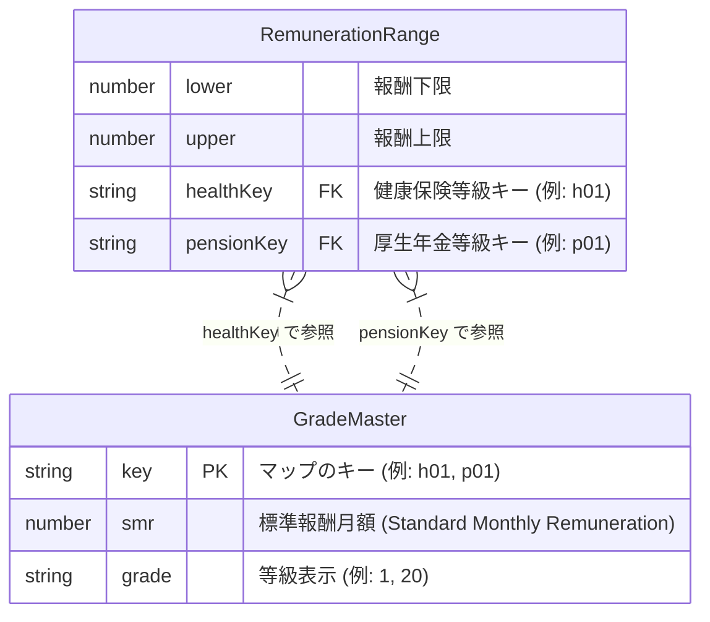
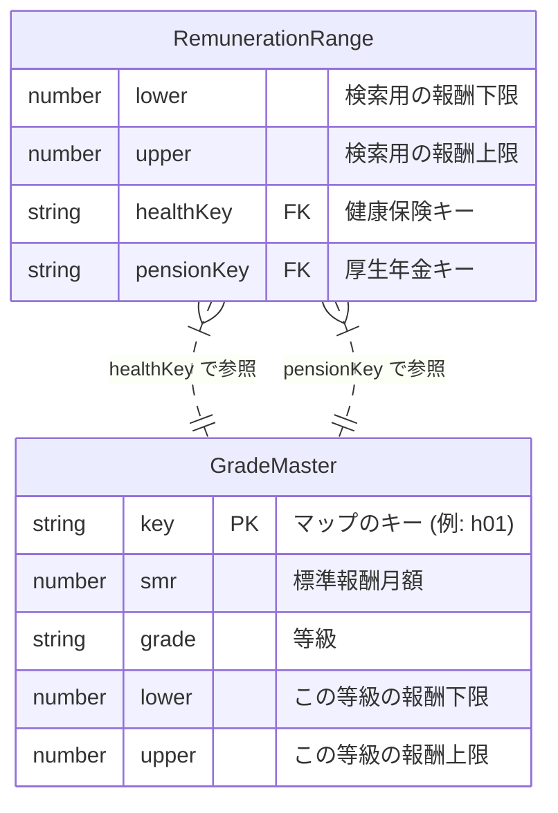
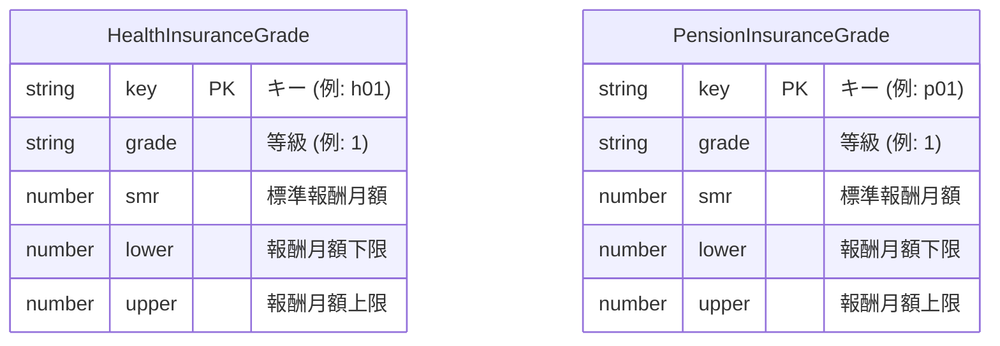

> From: https://gemini.google.com/app/fc68249c595da74d

# you asked

// 1. A single remuneration range
interface RemunerationRange {
  lower: number;
  upper: number;
  healthKey: string;
  pensionKey: string;
}

// 2. Grade definition
interface InsuranceGrade {
  smr: number;
  grade: string;
}

// 3. Grade master
// i.e.: { "h01": { smr: 58000, grade: "1" }, ... }
type GradeMap = Record<string, InsuranceGrade>;

// 4. Whole structure
type RemunerationRanges = RemunerationRange[];

ER 図を書ける？

---

# gemini response

はい、提示されたTypeScriptの型定義に基づいて、データ構造を表す\*\*ER図（Entity Relationship Diagram）\*\*を作成しました。

この構造は、一般的に**日本の社会保険（健康保険・厚生年金保険）の標準報酬月額等級**を管理するためのデータモデルに見受けられます。

### ER図 (Mermaid)

`GradeMap` のキー（`"h01"`など）を主キー（PK）とする「等級マスター」と、報酬範囲を定義する「報酬範囲テーブル」の2つのエンティティとして表現しています。



-----

### 図の解説

このデータモデルは、**リレーショナルな関係**を持っています。

#### 1\. `GradeMaster` (等級マスター)

TypeScriptの `GradeMap` (`Record<string, InsuranceGrade>`) に相当します。

  * **PK (Primary Key):** `Record` のキー部分（例: `"h01"`, `"p05"`）。
  * **属性:** `smr`（標準報酬月額）と `grade`（等級番号）。
  * ここには、健康保険用と厚生年金用の両方の等級定義が含まれると想定されます。

#### 2\. `RemunerationRange` (報酬範囲)

TypeScriptの `RemunerationRanges` 配列の各要素に相当します。

  * 給与の範囲（`lower` 〜 `upper`）を定義します。
  * その範囲が、どの「健康保険等級 (`healthKey`)」および「厚生年金等級 (`pensionKey`)」に該当するかを指し示します。

#### 3\. リレーション (関係性)

  * **多対1 (N:1):** `RemunerationRange` は、外部キー (`healthKey`, `pensionKey`) を通じて `GradeMaster` を参照しています。
      * `healthKey` -\> `GradeMaster.key`
      * `pensionKey` -\> `GradeMaster.key`

### 補足: 実際のデータイメージ

この構造をJSONデータとして具体化すると、以下のようになります。

```json
// GradeMap (GradeMaster)
{
  "h01": { "smr": 58000, "grade": "1" },
  "h02": { "smr": 68000, "grade": "2" },
  "p01": { "smr": 88000, "grade": "1" }
}

// RemunerationRanges
[
  {
    "lower": 0,
    "upper": 63000,
    "healthKey": "h01", // GradeMapの "h01" を参照
    "pensionKey": "p01" // GradeMapの "p01" を参照（※年金は下限が異なる場合があるため別キー）
  }
]
```

-----

このデータ構造に基づいて、\*\*SQLのテーブル定義（DDL）\*\*を作成したり、**データの検索ロジック**（例：給与額から等級を引く関数）を提案することも可能です。ご希望があればお知らせください。

---

# you asked

Grade Master も lower と upper を持ってるので ER 図に追加して

---

# gemini response

承知しました。**GradeMaster（等級マスター）側にもその等級における報酬範囲（lower / upper）を持たせる**形にER図を更新します。

実際の社会保険の等級表（マスター）は「等級、月額、**対象となる報酬の範囲（◯円以上〜◯円未満）**」がセットで定義されているため、この形の方が実態（公的な等級表の定義）に近くなります。

### 更新版 ER図

`GradeMaster` に属性を追加しました。



-----

### データ構造の変更点とポイント

この変更により、データモデルの意味合いが少し深くなりました。

1.  **GradeMaster（定義）**

      * TypeScript型: `Record<string, InsuranceGrade & { lower: number, upper: number }>`
      * 役割: **「法律で決まっている等級表そのもの」** を表します。
      * 例: 「健康保険の1等級（h01）は、報酬月額が63,000円未満（lower:0, upper:63000）の人」という定義を持ちます。

2.  **RemunerationRange（照合・検索用）**

      * 役割: **「給与計算ロジックのための最適化テーブル」** という位置づけになります。
      * 健康保険と厚生年金は、等級の区切り（金額のレンジ）が微妙に異なります。そのため、両方の区切りを統合して細分化した「共通のレンジ」を `RemunerationRange` として持っておくことで、給与額から一発で両方のキーを引けるようになります。

### TypeScriptの型定義（更新イメージ）

ER図に合わせてインターフェースを修正すると、以下のようになります。

```typescript
// 1. Grade definition (更新: 範囲定義を追加)
interface InsuranceGrade {
  smr: number;
  grade: string;
  lower: number; // 追加: その等級の定義上の下限
  upper: number; // 追加: その等級の定義上の上限
}

// 2. Grade master
type GradeMap = Record<string, InsuranceGrade>;

// 3. Remuneration range (検索用)
// こちらは変更なし。給与計算時に「給与額」を投げて検索するためのスライスされた範囲
interface RemunerationRange {
  lower: number;
  upper: number;
  healthKey: string;
  pensionKey: string;
}

type RemunerationRanges = RemunerationRange[];
```

このようにマスター側に範囲を持たせておくと、UIで「等級一覧表」を表示する際などに非常に扱いやすくなります。

---

# you asked

Master を健保と厚年で分けて、RR マスターを削除して

---

# gemini response

ご要望に合わせて、\*\*「GradeMasterを健保（Health）と厚年（Pension）に分割」**し、**「RemunerationRange（検索用の中間テーブル）を削除」\*\*したER図を作成します。

この構造は、正規化が進み、各保険の定義が独立するため、データの管理がスッキリします（その代わり、検索時は給与額を使ってそれぞれのテーブルを直接引くことになります）。

### ER図 (Mermaid)

2つの独立したマスターテーブルが存在する形になります。



-----

### TypeScript 型定義の変更点

データ構造の変更に伴い、型定義も以下のようにシンプルになります。`RemunerationRange` が消え、2つの独立したマップになります。

```typescript
// 共通の等級定義インターフェース
interface InsuranceGrade {
  smr: number;    // 標準報酬月額
  grade: string;  // 等級
  lower: number;  // 下限
  upper: number;  // 上限
}

// 1. 健保マスター
// 例: { "h01": { smr: 58000, grade: "1", lower: 0, upper: 63000 }, ... }
type HealthGradeMap = Record<string, InsuranceGrade>;

// 2. 厚年マスター
// 例: { "p01": { smr: 88000, grade: "1", lower: 0, upper: 93000 }, ... }
type PensionGradeMap = Record<string, InsuranceGrade>;

// ※ RemunerationRanges (RR Master) は削除されました
```

### この構造のメリット・デメリット

**メリット:**

  * **管理が楽:** 「健保の料率改定」や「厚年の等級追加」が起きた際、それぞれのテーブルだけを更新すれば良いため、運用ミスが減ります。
  * **構造が直感的:** 実際の法定義（別々の表）と同じ構造になります。

**デメリット（注意点）:**

  * **検索ロジックの変化:** 以前は `RemunerationRange` を1回引けば両方のキーが分かりましたが、この構造では、ある給与額に対して **「健保テーブルを検索」** と **「厚年テーブルを検索」** の2回の検索処理（あるいはフィルタリング）を行う必要があります。

---

# you asked

健保の h_00、h_01、h_02 などは p_00 と対応付けられる。この対応付における符号や ID を定義したいんだけど、名前は何が良い？

---

# gemini response

その「h\_xx」と「p\_xx」を結びつける（あるいは包含する）概念のIDですね。
これは\*\*「標準報酬月額（Standard Monthly Remuneration = SMR）」のランク\*\*そのものを指すIDになるため、その文脈に合わせた名前が適切です。

いくつかの切り口で提案します。

### 1\. 業務ドメインに即した命名（推奨）

社会保険の業務用語である「標準報酬月額（SMR）」や「等級（Grade）」の上位概念として扱うパターンです。

  * **`smrCode` / `smrID`**
      * 最も実態に近いです。両者を結びつけているのは「標準報酬月額（SMR）」という共通の金額基準だからです。
  * **`rankCode` / `rankID`**
      * 「等級（Grade）」という言葉がすでに個別の保険（h\_xx, p\_xx）で使われている場合、それらを統括するランクとして区別できます。
  * **`bracketID`**
      * 給与計算や税務でよく使われる「層（ブラケット）」という意味です。「給与レンジの区分けID」というニュアンスが出ます。

### 2\. 構造的な対応関係を示す命名

「マッピングするためのキー」であることを強調するパターンです。

  * **`correspondenceCode`**
      * 直訳ですが、対応関係を示す意図は明確です。
  * **`linkKey` / `linkID`**
      * シンプルですが、何と何をリンクしているかが名前からは見えないため、コメント等で補足が必要です。
  * **`commonGradeID`**
      * 「共通等級」という意味です。

### 3\. 具体的な実装例

個人的な推奨は、ドメインの意味が明確な **`smrCode`** または **`bracketId`** です。

もし、この対応表を一つの「マスター」として定義する場合、以下のような構造が考えられます。

```typescript
// 対応関係（マッピング）を定義するインターフェース
interface GradeMapping {
  // 提案名: smrCode (標準報酬月額コード)
  // 理由: h_xx と p_xx を結びつける根拠は SMR だから
  smrCode: string; 

  // 対応する各保険のキー（null許容なのは、片方にしか存在しない等級があるため）
  healthKey: string | null;  // e.g. "h01"
  pensionKey: string | null; // e.g. "p01"
  
  // 補足情報として表示名など
  label: string; // e.g. "1等級 (5万8千円)"
}

// データ例
const mappings: GradeMapping[] = [
  { smrCode: "r01", healthKey: "h01", pensionKey: "p01", label: "..." },
  { smrCode: "r02", healthKey: "h02", pensionKey: null,  label: "..." }, // 厚年は等級が少ない場合など
];
```

### どの命名を採用すべきかの基準

  * **「金額」に着目する場合:** `smrCode`, `remunerationLevel`
  * **「表の行」に着目する場合:** `rowId`, `tableRowKey`
  * **「給与の範囲」に着目する場合:** `bracketId`, `rangeCode`

**`smrCode`** (Standard Monthly Remuneration Code) が、開発チーム内で「何のID？」と聞かれた時に「標準報酬月額の区分のことだよ」と説明しやすいため、一番のおすすめです。

---
