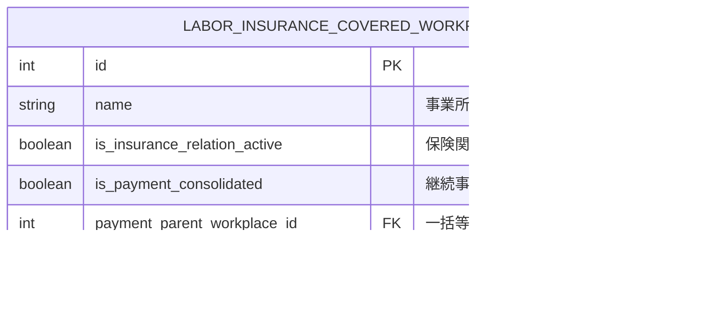

# you asked

労働保険において、継続事業の一括を受けた事業は、労働保険の適用事業ではないことになる？

社保だと、一括適用で一括された事業所は、法的には適用事業所ではなくなるらしい

---

# gemini response

結論から言うと、**労働保険の「継続事業の一括」を行っても、被一括事業（まとめられた側の支店など）は法的に「適用事業」としての性格を失いません。**

ここが社会保険（社保）の「一括適用」と大きく異なる、非常にややこしいポイントです。

システム設計において致命的な違いになるため、整理して解説します。

-----

### 1\. 労働保険の「継続事業の一括」とは？

**「お金（保険料）の計算と納付だけを本社でまとめてやる」** 手続きです。

  * **目的**: 事務処理の簡素化（納付書を1枚にするため）。
  * **法的ステータス**:
      * 各事業所（支店）には、依然として\*\*「保険関係」が成立しています。\*\*
      * つまり、**「適用事業」として存在し続けます。**
  * **実務での動き**:
      * **労災事故が起きたら**: その支店を管轄する労働基準監督署に届け出ます（本社ではありません）。
      * **雇用保険の手続き**: 原則として、その支店の管轄ハローワークで行います（※後述の例外あり）。

### 2\. 社会保険の「一括適用」との違い

ご質問にある通り、社保と労働保険では「一括」の意味が全く異なります。

| 項目 | **社会保険 (一括適用)** | **労働保険 (継続事業の一括)** |
| :--- | :--- | :--- |
| **被一括事業所の扱い** | **適用事業所ではなくなる** | **適用事業のまま** |
| **法的解釈** | 本社の一部とみなされる (擬制) | 保険料の申告・納付のみ代行される |
| **事業所整理記号** | 本社の記号・番号を使う (支店独自の番号は消滅) | **支店独自の整理番号は残る** (被一括事業番号が付与される) |
| **各種届出** | 本社の管轄へ提出 | 原則、**支店の管轄**へ提出 (※労災申請など) |

### 3\. 【要注意】雇用保険の「事業所非該当」という別の罠

労働保険には「継続事業の一括（お金の話）」とは別に、**「雇用保険適用事業所非該当承認（人の話）」** という手続きがあります。

  * **継続事業の一括**: 保険料をまとめる。
  * **事業所非該当承認**: 人事権がない小さな営業所などを、ハローワークの手続き上も本社の一部として扱う。

もし「継続事業の一括」**かつ**「事業所非該当承認」を受けた場合、その支店は雇用保険上も独立性を失い、番号を持たなくなります。しかし、**労災保険上は依然として独立した適用事業場**です（場所がある限り労災のリスクはあるため）。

-----

### 4\. システム設計（ER図・API）への影響

この法的構造の違いは、データモデルに直結します。

#### 間違いやすい設計 ❌

> 「一括されたから、`is_active = false` にして、親IDだけ持たせよう」

これをやると、**「支店で起きた労災事故の申請」や「支店独自の雇用保険番号管理」ができなくなります。**

#### 正しい設計のアプローチ ⭕

労働保険のテーブル設計では、**「保険関係（存在）」と「納付義務（お金）」を分けて管理**する必要があります。

**ER図への反映イメージ:**

  * **API の挙動**:
      * `GET /labor-insurance-workplaces/{id}` したとき、一括されていてもデータは返却されるべきです。
      * ただし、保険料集計ロジック（年次更新のバッチ処理など）では、`is_payment_consolidated = true` の事業所を除外し、`payment_parent_workplace_id` に紐づく賃金を親に合算して計算する必要があります。

**結論:**
労働保険においては、一括されても\*\*「適用事業としては生きている（死んでいない）」\*\*ため、システム上も独立したエンティティとして残しつつ、「請求先が親に向いている」というフラグ管理にするのが正解です。

---

# you asked

事業所整理記号を振るのは誰？事業所番号を振るのは誰？

---

# gemini response

ご提示いただいた ER 図にある「事業所整理記号」や「事業所番号」は、どの保険制度の話かによって発行元（管轄するお役所）が明確に分かれています。

日本の複雑な縦割り行政がそのまま反映されている部分ですので、整理して解説します。

---

### 1. 社会保険（厚生年金・健康保険）の場合

ER 図の `PENSION_INSURANCE_SETTINGS` や `HEALTH_INSURANCE_SETTINGS` にある記号と番号です。新規適用届を提出した際に、セットで付与されます。

* **事業所整理記号**
    * **誰が振る？:** **年金事務所（日本年金機構）** です。
        * ※例外として、自前の「健康保険組合（関東ITソフトウェア健保など）」に加入している場合は、健康保険側については**その健康保険組合**が独自の記号を振ります。
    * **内容:** 管轄の年金事務所やエリアの分類を表すもので、「01-イロ」や「オカ」のように、数字とカタカナが混ざった独特のフォーマットになります。
* **事業所番号**
    * **誰が振る？:** これも **年金事務所（日本年金機構）** です。
    * **内容:** 各事業所を一意に識別するための番号です。通常は **5桁の数字**（例: `12345`）が割り当てられます。

### 2. 労働保険（労災保険・雇用保険）の場合

ER 図の `ROSAI_INSURANCE_SETTINGS` や `KOYO_INSURANCE_SETTINGS` にある番号です。社会保険とは完全に別の役所が管理しています。

* **労働保険番号**（労災・雇用をまとめた大きなくくりのお金用番号）
    * **誰が振る？:** **労働基準監督署（労基署）** です。
    * **内容:** 14桁の数字（府県-所掌-管轄-基幹番号-枝番）で構成されます。
* **雇用保険適用事業所番号**（雇用保険の実務用番号）
    * **誰が振る？:** **ハローワーク（公共職業安定所）** です。
    * **内容:** 11桁の数字（例: `1301-123456-1`）で構成されます。

---

### システム設計・実装上の重要ポイント

これらは**「発行元がバラバラ」**であるため、以下の点に注意する必要があります。

1.  **バリデーション（入力チェック）がすべて異なる:**
    年金事務所の「カタカナ混じり」、労基署の「14桁数字」、ハローワークの「ハイフン付き11桁」など、それぞれフォーマットチェックの正規表現を分ける必要があります。
2.  **ライフサイクルが独立している:**
    例えば事業所が移転して管轄が変わった場合、「ハローワークの管轄は変わるけど、年金事務所の管轄は変わらない」といったケースが発生します。そのため、ER 図で各種保険のテーブルを分離している現在の設計は、非常に理にかなっています。

これらの入力フォームを作成する際、各番号の正規表現やバリデーションルールも定義しておきましょうか？