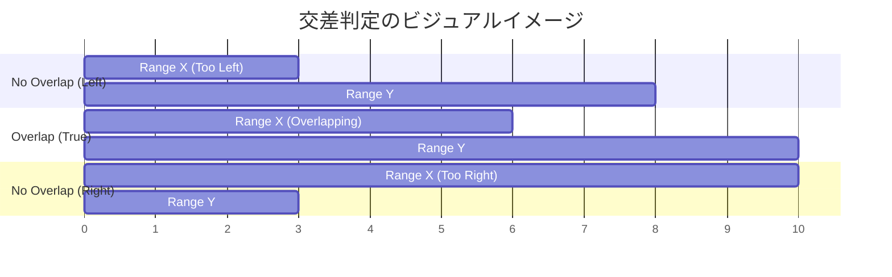

# you asked

2 つのリストが共通の値を持つかを検査するコードを JS で実装してみて。単純に済むかしら？

---

# gemini response

はい、JavaScript（ES6以降）であれば、**`Set`** と **`some`** を組み合わせることで、非常にシンプルかつ高速（効率的）に実装できます。

### 最もおすすめの方法 (`Set` を使う)

これが**計算量的にも速く、コードも短い**ベストな書き方です。片方を `Set` に変換することで検索を一瞬（$O(1)$）で行えるようにします。

```javascript
const listA = ['h01', 'h02', 'h03'];
const listB = ['p01', 'p02', 'h02']; // 'h02' が共通

// 共通の値があるかチェック (true/false)
const hasCommon = listA.some(item => new Set(listB).has(item));

console.log(hasCommon); // true
```

### さらに短い書き方（データ量が少ない場合）

データ量が少ない（数十〜数百件程度）なら、`Set` を作らずに配列のまま `includes` で探すのが一番直感的です。

```javascript
// 配列のまま検索（リストが大きいと少し遅くなる可能性があります）
const hasCommon = listA.some(item => listB.includes(item));
```

-----

### 解説

  * **`some()`**: 配列の中に、条件を満たすものが「1つでも」あれば `true` を返し、そこでループを止めます（全件チェックしないので効率的です）。
  * **`Set`**: 重複を許さないリストですが、`has()` メソッドが非常に高速という特徴があります。

**結論：**
基本的には **`Set` を使うパターン** を覚えておけば、データ量が増えてもパフォーマンスが落ちないので安心です。

---

# you asked

listA.some と書くと、listA と listB に対称性が無いように見える。入れ替えても意味の変わらない処理なので、対称的な実装にしたい

---

# gemini response

おっしゃる通りです。`listA.some` は「A を主語にして B を探す」形になるため、コード上の対称性が損なわれていますね。

**「A と B は対等である」** という意図をコードで表現するための、対称的な実装パターンを3つ紹介します。

### 1\. 結合してサイズを比較する（最も対称的）

「2つを合わせた集合のサイズ」が「個々の合計」よりも小さければ、重複（共通の値）があるということです。

```javascript
const listA = ['h01', 'h02'];
const listB = ['p01', 'h02'];

// 「合体後のユニーク数」 < 「単体の合計数」 なら共通項あり
const hasCommon = new Set([...listA, ...listB]).size < (listA.length + listB.length);

console.log(hasCommon); // true
```

  * **メリット:** 文法的に完全に A と B が対等（Commutative）に見えます。
  * **デメリット:** 配列を結合して新しい Set を作るため、データ量が膨大な場合はメモリと速度で少し不利です（数千件程度なら誤差です）。

-----

### 2\. Set の intersection（交差）を使う（最新の標準）

最新の JavaScript (ES2024 / Node.js 22+) では、Set に集合演算メソッドが追加されました。これを使うのが意味的にも最も美しいです。

```javascript
const hasCommon = new Set(listA).intersection(new Set(listB)).size > 0;
```

  * **メリット:** 「交差（積集合）があるか？」という数学的な定義そのものです。
  * **注意:** 環境によってはまだ対応していない場合があるため、古いブラウザ等をサポートする場合は Polyfill が必要です。

-----

### 3\. 関数化して隠蔽する（実用的）

内部実装がどうであれ、**呼び出し元（利用コード）での対称性**を担保するのが一般的なエンジニアリングの解決策です。

```javascript
// util.js などに定義
const haveIntersection = (a, b) => {
  // 内部では効率の良い Set.has を使う（どちらを主にするかは内部ロジックにお任せ）
  const [small, large] = a.length < b.length ? [a, b] : [b, a];
  const largeSet = new Set(large);
  return small.some(item => largeSet.has(item));
};

// メインコード
if (haveIntersection(listA, listB)) {
  // AとBは対等に見える
}
```

**おすすめ:**
ロジックの単純さと見た目の対称性を両立させるなら、**1番の「サイズ比較」** が一番パッと見て分かりやすいかと思います。

---

# you asked

x.min と x.max、y.min と y.max があって、それぞれ min<= max を満たす。
この x 範囲と y 範囲が交差部分を持つかを検証するコードを書いて
一般的なロジックで書けると思うけど、一応それぞれ非負整数のみの想定

---

# gemini response

範囲の交差判定（Overlap Check）は、\*\*「交差していない（離れている）条件の逆」\*\*を考えると最もシンプルで、かつ対称的なコードになります。

### 一般的なロジック

2つの範囲が**重ならない**のは以下のどちらかの場合です。

1.  `x` が `y` より完全に左にある（`x.max < y.min`）
2.  `x` が `y` より完全に右にある（`x.min > y.max`）

したがって、**重なる（交差する）条件**はこの逆（否定）になります。

```javascript
// x.max >= y.min  かつ  x.min <= y.max
```

これをより対称的に記述すると以下のようになります。

### 実装コード (TypeScript)

```typescript
interface Range {
  min: number;
  max: number;
}

const hasOverlap = (x: Range, y: Range): boolean => {
  // 「互いの上限が、相手の下限以上であること」を確認します
  return x.max >= y.min && y.max >= x.min;
};
```

### なぜこれが良いのか

1.  **完全に対称的です**
    式を見てわかる通り、`x` と `y` を入れ替えても全く同じ論理になります（`&&` の左右が入れ替わるだけ）。
2.  **境界値を含みます**
    `x.max` と `y.min` が同じ値（例：`[0, 5]` と `[5, 10]`）の場合も `true` になります。もし「接しているだけでは交差とみなさない」場合は、`>=` を `>` に変えるだけで対応できます。
3.  **計算が速い**
    最大値・最小値を計算する関数（`Math.min/max`）を使わず、単純な比較演算だけで済むため非常に高速です。

---

# you asked

この条件式を図示できる？

---

# gemini response

はい、数直線（タイムライン）で表現すると、このロジックの仕組みが直感的に分かります。

`x.max >= y.min && y.max >= x.min` という式は、**「相手の手前に自分が終わってしまっていないこと」** を互いに確認し合っている状態です。

### アスキーアートによる図解

#### 1\. 交差している状態 (True)

2つの条件をどちらも満たすため、重なりが発生しています。

```text
Condition 1: x.max >= y.min (Xの終わりが、Yの始まりに届いている)
Condition 2: y.max >= x.min (Yの終わりが、Xの始まりに届いている)

      x.min             x.max
        |-----------------|
                 |-----------------|
               y.min             y.max
                 <------->
                 交差エリア
```

#### 2\. 交差していない状態 (False)

どちらか片方の条件が崩れると、重なりはなくなります。

**ケースA：Xが完全に左にある**
`x.max < y.min` なので、条件1 (`x.max >= y.min`) で **False** になります。

```text
    x.min     x.max
      |---------|
                      |---------|
                    y.min     y.max

      (XがYに届いていない)
```

**ケースB：Xが完全に右にある**
`x.min > y.max`（つまり `y.max < x.min`）なので、条件2 (`y.max >= x.min`) で **False** になります。

```text
                      x.min     x.max
                        |---------|
      |---------|
    y.min     y.max

      (YがXに届いていない)
```

-----

### Mermaid での図示

視覚的なイメージとして、3つのパターンを表にしました。真ん中の「Overlap」だけが条件式をクリアします。



### まとめ

この `x.max >= y.min && y.max >= x.min` という書き方は、\*\*包含（片方が片方を包み込む）**や**接点（境界値が同じ）\*\*のケースも含めて、あらゆる「接触」を漏れなく判定できる、非常に堅牢で美しいロジックです。

---
