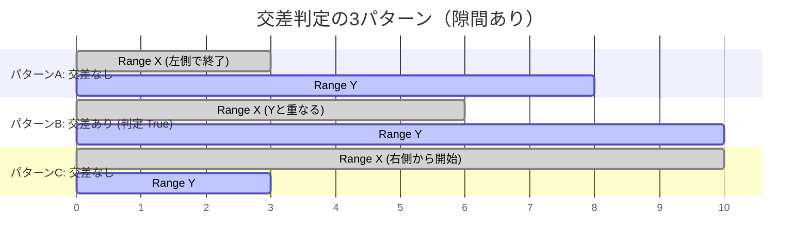

# you asked

Mermaid いい感じなんだけど、縦に詰まって見づらいからパターンごとに隙間を挿入して

---

# gemini response

Mermaidの `gantt` チャートはデフォルトだと行間が少し狭いですよね。

視認性を高めるために、**空の `section` を「スペーサー（隙間）」として挟む**テクニックを使って、各パターンの間を広げました。また、XとYを色分けして（`done` と `active` クラスを使用）さらに見やすくしています。



### 図の工夫点

1.  **`section .` の挿入**:
      * パターンの間に、タイトルが `.`（ドット）だけのセクションを挟んでいます。これが区切り線のような役割を果たし、縦の圧迫感を減らしています。
2.  **色分け**:
      * `Range X` に `done`（グレー系）、`Range Y` に `active`（強調色）というステータスを付与し、どちらがどのバーなのかを一目で区別できるようにしました。

これで直感的に「真ん中のパターンだけが重なっている」ことが認識しやすくなったかと思います。

---

# you asked

// Health Insurance Grades
{
  "h_00": { "smr": 58000, "grade": "1", "lower": 0, "upper": 53000 },
  "h_01": { "smr": 58000, "grade": "1", "lower": 53000, "upper": 63000 },
  "h_02": { "smr": 68000, "grade": "2", "lower": 63000, "upper": 73000 },
  ...
}

// Pension Insurance Grades
{
  "p_00": { "smr": 88000, "grade": "1", "lower": 0, "upper": 83000  },
  "p_01": { "smr": 88000, "grade": "1", "lower": 83000, "upper": 93000  },
  "p_02": { "smr": 98000, "grade": "2", "lower": 93000, "upper": 101000 },
  ...
}

こんなデータ構造が 2 つある。h_xx から p_xx へのマッピングを次のように定義したい。擬似コードで書いてみて。

p_mm.lower <= h_nn.smr < p_mm.upper を満たす p_mm

---

# gemini response

提示されたロジック（`h_nn` の **SMR** が、`p_mm` の **レンジ** に収まっているか）に基づいてマッピングを行う擬似コードと、実際のTypeScript実装案です。

### 1\. 擬似コード

ロジックの本質は「健保の等級が持つ『標準報酬月額』を使って、厚年のテーブルを検索する」ことです。

```text
関数 generateMapping(healthMap, pensionMap):
    結果リスト = []

    // 1. 全ての健保等級をループ
    for each (hKey, hData) in healthMap:
        
        // 判定に使う値: 健保の標準報酬月額 (SMR)
        targetValue = hData.smr 

        // 2. 厚年等級の中から条件に合うものを探す
        // 条件: p.lower <= targetValue < p.upper
        foundPensionKey = null
        
        for each (pKey, pData) in pensionMap:
            if (pData.lower <= targetValue AND targetValue < pData.upper):
                foundPensionKey = pKey
                break // 見つかったらこのループを抜ける

        // 3. マッピングを保存
        結果リスト.add({
            healthKey: hKey,
            pensionKey: foundPensionKey, // 見つからなければ null
            smr: targetValue
        })

    return 結果リスト
```

-----

### 2\. TypeScript 実装

JavaScript/TypeScript の `Object.entries` と `find` を使うと、宣言的でスッキリ書けます。

```typescript
type GradeData = { smr: number; grade: string; lower: number; upper: number };
type GradeMap = Record<string, GradeData>;

interface GradeMapping {
  healthKey: string;
  pensionKey: string | null;
  smr: number;
}

const mapHealthToPension = (
  healthMap: GradeMap, 
  pensionMap: GradeMap
): GradeMapping[] => {
  
  // 健保マスターを配列化してループ
  return Object.entries(healthMap).map(([hKey, hData]) => {
    
    // 検索対象のSMR
    const targetSmr = hData.smr;

    // 厚年マスターから条件に合うものを探す (find)
    // 条件: p_mm.lower <= h_nn.smr < p_mm.upper
    const matchingEntry = Object.entries(pensionMap).find(([_, pData]) => {
      return pData.lower <= targetSmr && targetSmr < pData.upper;
    });

    // 見つかった場合はそのキー (p_mm)、なければ null
    const pensionKey = matchingEntry ? matchingEntry[0] : null;

    return {
      healthKey: hKey,
      pensionKey: pensionKey,
      smr: targetSmr
    };
  });
};
```

### 実行結果のイメージ

提示されたデータで実行すると、以下のようなマッピングが生成されます。

  * **h\_00** (SMR 58,000)
      * 判定: `p_00` の範囲 `[0, 83,000)` に入る？ → **Yes**
      * 結果: `pensionKey: "p_00"`
  * **h\_01** (SMR 58,000)
      * 判定: `p_00` の範囲 `[0, 83,000)` に入る？ → **Yes**
      * 結果: `pensionKey: "p_00"`
  * **h\_02** (SMR 68,000)
      * 判定: `p_00` の範囲 `[0, 83,000)` に入る？ → **Yes**
      * 結果: `pensionKey: "p_00"`

このように、**「SMR（金額）をキーにして、両方の制度を紐付ける」** 実装になります。

---

# you asked

高階関数とか使って短く書けない？

---

# gemini response

ES2020（新しいJavaScript/TypeScript）の構文を活用すれば、実質 **1行（ワンライナー）** のロジックで書けます。

`Object.entries`、`map`、`find` を組み合わせ、さらに「分割代入」と「オプショナルチェーン（`?.`）」を使うのがコツです。

### 最短実装例

```typescript
const mapGrades = (hMap: GradeMap, pMap: GradeMap) =>
  Object.entries(hMap).map(([hKey, { smr }]) => ({
    healthKey: hKey,
    // 厚年マップを走査し、条件(lower <= smr < upper)に合うキーを取得。なければ null
    pensionKey: Object.entries(pMap).find(([_, p]) => p.lower <= smr && smr < p.upper)?.[0] ?? null,
    smr
  }));
```

### 何をしているか（短縮のテクニック）

1.  **`[hKey, { smr }]`**:
      * 引数の時点でオブジェクトを分解（Destructuring）し、必要な `smr` だけを直接取り出しています。`hData` と書く手間を省いています。
2.  **`find(...)`**:
      * 内側のループも `Object.entries(pMap)` で回し、条件に一致するペア `[key, value]` を探します。
3.  **`?.[0]` (Optional Chaining)**:
      * `find` は見つからないと `undefined` を返します。
      * `undefined` の場合にエラーにならず、安全にプロパティアクセスをスキップして `undefined` を返す記法です。見つかった場合は配列の0番目（キー）を返します。
4.  **`?? null` (Nullish Coalescing)**:
      * 左側が `undefined` の場合のみ `null` を代入します。

この書き方なら、複雑なループや一時変数を一切書かずに済みます。

---

# you asked

SIMP の推定された質量は？電荷は？その他の基礎物理量は？調査して出典とともに回答して

---

# gemini response

**SIMP**（Strongly Interacting Massive Particle：強く相互作用する重い粒子）は、暗黒物質（ダークマター）の候補の一つです。

現在有力視されている「現代的なSIMPモデル（2014年以降の理論的進展）」に基づき、推定される質量や電荷などの物理量を回答します。

### 1. SIMPの基礎物理量（推定値）

| 物理量 | 推定値 / 特性 | 備考 |
| :--- | :--- | :--- |
| **質量 ($m$)** | **約 10 MeV ～ 1 GeV** | WIMP（GeV-TeV級）よりも軽く、電子よりは重い「Sub-GeV」領域が有力です。 |
| **電荷 ($q$)** | **0 （電気的に中性）** | 電磁気力とは相互作用しません（光らないため）。ただし**ダークセクター内の「暗黒電荷」**を持つと考えられています。 |
| **自己相互作用断面積 ($\sigma/m$)** | **$0.1 \sim 1 \, \text{cm}^2/\text{g}$** | グラム当たり $1\text{cm}^2$ 程度。これは原子核レベルの衝突確率に相当し、WIMPより遥かに高い値です。 |

---

### 2. 詳細解説

#### 質量（Mass）：なぜ軽いのか？
従来のWIMP（弱く相互作用する重い粒子）が数10 GeV以上の重さであるのに対し、SIMPは**MeV（メガ電子ボルト）からGeV（ギガ電子ボルト）のスケール**であると予測されています。
この質量範囲は、SIMPが初期宇宙で**「3つの粒子が出会って2つの粒子になる ($3 \to 2$)」**という特殊な熱的プロセス（SIMP Miracle）を経て現在の量が残ったと仮定すると、自然に導き出される値です。

* **出典:** 高エネルギー加速器研究機構（KEK）やHochberg et al.の研究では、**数100 MeV**（パイ中間子に近い重さ）が典型的な値として挙げられています。

#### 電荷（Charge）：電気と「暗黒」の電荷
* **電気電荷:** 我々の世界（標準模型）の電磁気力に対しては「中性」です。もし電気を帯びていれば光と反応して観測できてしまうためです。
* **暗黒電荷:** SIMPはその名の通り「強く相互作用」しますが、これは「強い力（原子核をつなぎとめる力）」そのものではなく、未知の**「ダークセクター（暗黒部門）における強い力」**を指します。したがって、SIMP同士は**「暗黒電荷（ダークカラー）」**などを介して頻繁に衝突・散乱します。

#### 自己相互作用（Self-Interaction）：SIMPの決定的な特徴
SIMPが提案された最大の理由は、WIMP理論では説明がつかない「銀河中心の密度分布問題（コア・カスプ問題）」を解決するためです。
SIMP同士がビリヤードのように衝突して弾き合うことで、銀河中心のダークマターが密集しすぎるのを防いでいると考えられています。その散乱のしやすさ（断面積 $\sigma$ を質量 $m$ で割った値）は、**$0.1 \sim 1 \, \text{cm}^2/\text{g}$** の範囲にあると観測データ（銀河団の衝突など）と矛盾しません。

---

### 主要な出典・参考文献

この分野の基礎となっている論文は以下の通りです。

1.  **提唱（元祖）:**
    * Spergel, D. N., & Steinhardt, P. J. (2000). *"Observational evidence for self-interacting cold dark matter"*.
    * 初期の提案。WIMPの欠点を補うために「自分同士で散乱するダークマター」として定義されました。

2.  **現代的SIMP理論（SIMP Miracle）:**
    * Hochberg, Y., Kuflik, E., Volansky, T., & Wacker, J. G. (2014). *"Mechanism for Thermal Relic Dark Matter of Strongly Interacting Massive Particles"*.
    * ここで「質量がMeV〜GeVスケールであること」や「$3 \to 2$ プロセス」の理論的枠組みが確立されました。

3.  **関連研究:**
    * Murayama, H. (村山斉) 氏らによる「パイ中間子（Dark Pion）」をSIMPの正体とする研究などが有名です。

---
