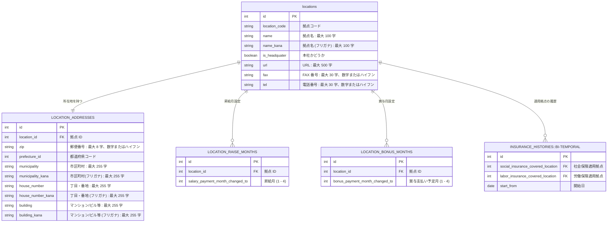
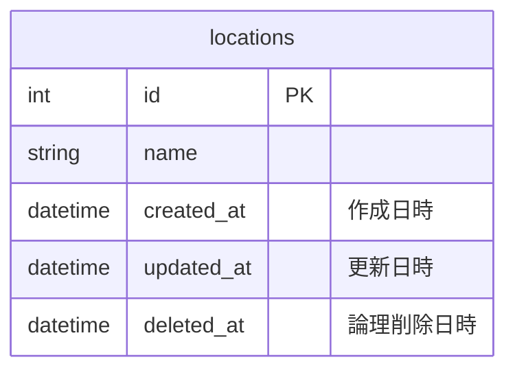
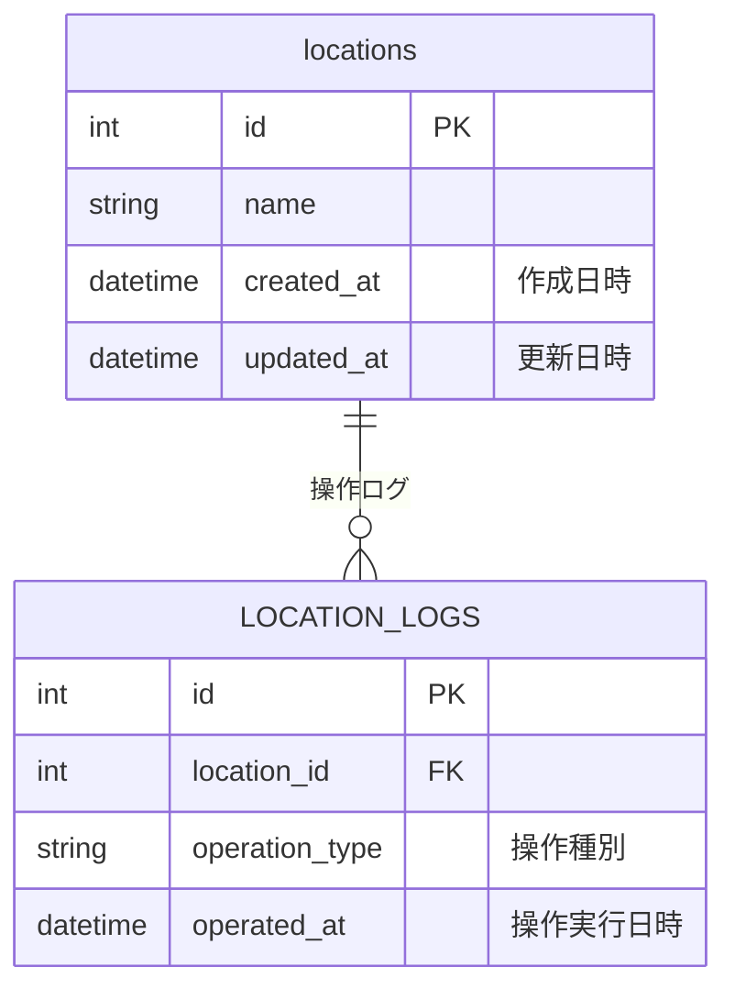
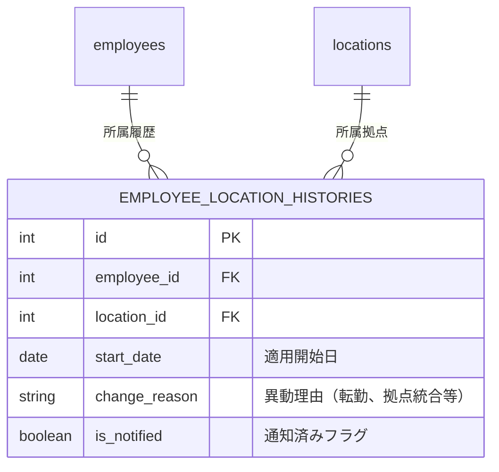

> From: https://gemini.google.com/app/733a353b7e77feae

# you asked

jinjer の事業所マスタってどうなってる？

---

# gemini response

jinjer（ジンジャー）の「事業所マスタ」は、主に**社会保険・労働保険の手続きや、給与計算の計算単位を管理するための基盤**となるマスタです。

「事業所マスタ」という名称の設定箇所は、主に**ジンジャー人事労務（DB）**の中に集約されており、そこでの設定が勤怠や給与などの各プロダクトへ連動する仕組みになっています。

構成のポイントを整理しました。

---

## 1. 主な構成と役割
ジンジャーの事業所マスタは、大きく分けて以下の情報を保持します。

* **基本情報:** 事業所名、所在地、電話番号、事業主氏名など。
* **社会保険・労働保険情報:** * **社保事業所:** 健康保険・厚生年金の記号、管轄の年金事務所など。
    * **労保事業所:** 労働保険番号、管轄の労働基準監督署・ハローワークなど。
* **電子申請用情報:** e-Govやマイナポータルを通じた電子申請に必要な「電子証明書」や「PINコード」の紐付け。

## 2. 複数の事業所管理
1つの企業ID内で、複数の事業所を登録できます。
* **支店や営業所ごとの管理:** 拠点ごとに管轄の年金事務所やハローワークが異なる場合、事業所マスタを複数作成し、従業員一人ひとりに「どの事業所に所属するか」を紐付けます。
* **メリット:** アカウントを切り替えることなく、拠点ごとの書類作成や電子申請が一括で行えます。

## 3. 各プロダクトとの連動
ジンジャーは「1人事データ・マルチプロダクト」を掲げているため、事業所マスタの情報は以下のように影響します。

* **人事労務:** 離職票や算定基礎届などの各種届出書類に、マスタの住所や事業主名が自動反映されます。
* **給与計算:** 雇用保険率の判定（一般の事業／建設の事業など）や、納付書の集計単位として利用されます。
* **勤怠管理:** 直接「事業所マスタ」をいじることは少ないですが、所属組織（グループ）と事業所を紐付けることで、拠点ごとの管理体制を構築します。

## 4. 設定の場所（管理者画面）
設定を確認・変更する場合は、以下のルートが一般的です。
> **ジンジャーデータベース（人事設定） ＞ 社保・労保 ＞ 事業所マスタ**

---

### 注意点
* **削除ができない:** 一度作成して保存したマスタは、システム上「削除」ができない仕様になっていることが多いです。不要になった場合はステータスを「無効」に変更して対応します。
* **IDの重複不可:** 事業所IDなどは他と重複して登録できないため、採番ルールを決めておくとスムーズです。

もし「特定の項目がどこにあるか知りたい」や「拠点追加時の具体的な手順が知りたい」といったことがあれば、さらに深掘りしてお伝えします。

---

# you asked

erDiagram
    %% メインの事業所テーブル
    workplaces {
        int id PK
        string location_code "事業所コード"
        string name "事業所名 : 最大 100 字"
        string name_kana "事業所名 (フリガナ) : 最大 100 字"
        boolean is_headquater "本社かどうか"
        string url "URL : 最大 500 字"
        string fax "FAX 番号 : 最大 30 字、数字またはハイフン"
        string tel "電話番号 : 最大 30 字、数字またはハイフン"
    }

    %% 所在地情報（1:1）
    %% カラム数が多い住所情報を分離
    WORKPLACE_ADDRESSES {
        int id PK
        int workplace_id FK "事業所 ID"
        string zip "郵便番号 : 最大 8 字、数字またはハイフン"
        int prefecture_id "都道府県コード"
        string municipality "市区町村 : 最大 255 字"
        string municipality_kana "市区町村(フリガナ) : 最大 255 字"
        string house_number "丁目・番地 : 最大 255 字"
        string house_number_kana "丁目・番地 (フリガナ) : 最大 255 字"
        string building "マンション/ビル等 : 最大 255 字"
        string building_kana "マンション/ビル等 (フリガナ) : 最大 255 字"
    }

    %% 昇給月（1:N）
    %% 「昇給月1〜4」を縦持ちに変換
    WORKPLACE_RAISE_MONTHS {
        int id PK
        int workplace_id FK "事業所 ID"
        int salary_payment_month_changed_to "昇給月 (1 - 4)"
    }

    %% 賞与支払予定月（1:N）
    %% 「賞与予定月1〜4」を縦持ちに変換
    WORKPLACE_BONUS_MONTHS {
        int id PK
        int workplace_id FK "事業所 ID"
        int bonus_payment_month_changed_to "賞与支払い予定月 (1 - 4)"
    }
    
    "INSURANCE_HISTORIES::BI-TEMPORAL" {
		    int id PK
		    int social_insurance_covered_workplace FK "社会保険適用事業所"
		    int labor_insurance_covered_workplace FK "労働保険適用事業所"
		    date start_from "開始日"
    }

    %% リレーション定義
    workplaces ||--|| WORKPLACE_ADDRESSES : "所在地を持つ"
    workplaces ||--o{ WORKPLACE_RAISE_MONTHS : "昇給月設定"
    workplaces ||--o{ WORKPLACE_BONUS_MONTHS : "賞与月設定"
    workplaces ||--o{ "INSURANCE_HISTORIES::BI-TEMPORAL" : "適用事業所の履歴"

この ER 図の workplace を location に書き換えて

---

# gemini response

ご提示いただいたER図の `workplaces` を `locations` に書き換え、関連するテーブル名や外部キー名も整合性が取れるように調整しました。

jinjerの内部構造を意識し、リレーション名も「事業所（Workplace）」から「拠点・場所（Location）」のニュアンスに統一しています。

-----

### 変更のポイント

  * **エンティティ名:** `workplaces` → `locations` へ変更しました。
  * **関連テーブル名:** `WORKPLACE_...` となっていた箇所をすべて `LOCATION_...` に統一しました。
  * **外部キー名:** `workplace_id` を `location_id` へ、また保険履歴内のカラム名も `..._location` に書き換えています。
  * **論理名:** コメント内の「事業所」という言葉も「拠点」へと微調整しています。

こちらの構成で、さらに追加したい属性（例えば「タイムレコーダーIP制限」や「所属グループとの紐付け」など）があれば教えてください。

---

# you asked

ER 図で datetime は？

---

# gemini response

ER図における `datetime`（日時型）の扱いは、使用する表記法やデータベースの設計方針によっていくつかのパターンがあります。

ご提示いただいた `Mermaid` 記法や一般的な論理設計の文脈では、以下のように記述するのが標準的です。

-----

## 1\. Mermaid での記述例

Mermaid の ER図では、データ型の位置（PK/FKの隣など）に `datetime` や `timestamp` と記述します。

## 2\. システム特性に応じた使い分け

jinjerのような人事労務システムでは、「いつデータが作られたか」というシステム的な時間と、「いつからその設定が有効か」という業務的な時間の両方を管理するため、以下の型を使い分けるのが一般的です。

  * **`datetime` / `timestamp`:**
      * `created_at` (レコード作成日)
      * `updated_at` (レコード更新日)
      * 秒単位、あるいはミリ秒単位までの精度が必要なシステム監査用の項目に使用します。
  * **`date`:**
      * `start_date` (適用開始日)
      * `end_date` (適用終了日)
      * 「〇月〇日付の発令」など、業務上の効力発生日には時刻を含まない `date` 型が多用されます。

## 3\. 履歴管理（Bi-temporal）における datetime

先ほどの `INSURANCE_HISTORIES::BI-TEMPORAL` のような履歴テーブルの場合、以下のように **「システム実行時間」** を保持するカラムを追加することが多いです。

| カラム名 | 型 | 説明 |
| :--- | :--- | :--- |
| `valid_from` | `date` | 業務上の有効開始日（例：2026-04-01） |
| `transaction_at` | `datetime` | 実際にDBに登録された日時（例：2026-03-25 10:00:00） |

-----

### 修正案：先ほどのER図に datetime を追加する場合

作成・更新日時などを加えると、より実務的な定義になります。

この `datetime` を、先ほど作成した `locations` や `LOCATION_ADDRESSES` などの各テーブルに追加しましょうか？それとも特定の履歴管理ロジックについて深掘りしますか？

---

# you asked

従業員に所属事業所の変更を通知する書類を発行するユースケースはある？どれくらい一般的？

---

# gemini response

従業員に対して「所属事業所の変更」を通知する書類を発行するユースケースは**確実に存在し、実務上も非常に一般的**です。

人事異動（転勤や部署異動）に伴うものだけでなく、会社側の都合（拠点の統廃合や名称変更）によるものも含め、労働条件の明示という観点から重要なプロセスとなります。

-----

## 1\. 主なユースケース

大きく分けて以下の3つのパターンで書類が発行されます。

  * **人事異動（転勤・配属変更）:**
    最も一般的なケースです。「A支店からB営業所へ異動を命ずる」という\*\*辞令（配属通知書）\*\*を発行します。これには「勤務地」の変更が含まれるため、就業場所を特定するために事業所情報の明示が必要になります。
  * **事業所の名称変更・移転:**
    従業員の役職や仕事内容は変わりませんが、契約上の「勤務地」が物理的に変わる、あるいは名称が変わる場合に、\*\*「所在地変更のお知らせ」**や**「労働条件変更通知書」\*\*を交付します。
  * **社会保険上の所属変更:**
    企業が複数の「社会保険適用事業所」を持っている場合、実態の勤務地に合わせて健康保険等の記号・番号が変わることがあります。この際、手続き完了後に新しい被保険者証を渡すとともに、変更を案内することがあります。

## 2\. 一般的・法的な重要度

どれくらい一般的かというと、\*\*「中〜大規模の企業であれば日常茶飯事」\*\*といえます。

  * **労働基準法上の義務:** 労働条件の絶対的明示事項には「就業の場所」が含まれます。異動によって勤務地が変わる場合、書面でその変更内容を明示することが望ましく、多くの企業ではトラブル防止のために「労働条件通知書」を再発行するか、辞令をもってこれに代えます。
  * **実務上の必要性:** 通勤手当の計算根拠が変わるため、従業員に「いつから、どの事業所所属になるか」を正式に通知し、それに基づいて通勤経路の再申請を促すワークフローがセットになります。

## 3\. jinjerなどのシステムでの対応

jinjerのような人事労務システムでは、以下のような挙動が標準的です。

1.  **「所属（拠点）」の履歴更新:** 従業員マスタの所属情報を更新。
2.  **書類発行機能:** マスタの情報を引用して、\*\*「労働条件通知書」**や**「辞令」\*\*のPDFを自動生成。
3.  **電子署名・合意:** 生成した書類を従業員のマイページへ送り、合意（確認）ボタンを押してもらうことで通知完了とする。

-----

### ER図への影響（履歴管理）

このユースケースを考慮すると、先ほどの `locations` と従業員（`employees`）の間には、単なる所属ではなく\*\*「いつからその拠点に所属しているか」という履歴テーブル\*\*が必要になります。

この「通知済みフラグ」や「通知書類のリンク」を履歴に持たせることで、実務上の「発行漏れ」を防ぐ管理が可能になります。

次は、この履歴データを使って具体的にどのような「労働条件通知書」の項目を生成するか、といったパラメータ設計のお手伝いをしましょうか？

---

# you asked

ユーザーデータで、特定のフラグを持つ最後のデータを削除できない、という挙動は一般的？例えば事業所マスタで、本社に当たる事業所のうち、最後の 1 つは削除できない、とか

---

# gemini response

はい、その挙動はシステム設計において**「データ整合性の担保」や「ビジネスルールの強制」として非常に一般的**です。

特に jinjer のような ERP（統合業務システム）においては、特定のデータが「存在しない」状態になると、それに紐付く他の処理（給与計算、社会保険手続き、ログイン制御など）が物理的に実行不可能になるため、強力なバリデーション（制約）がかけられています。

---

## 1. なぜ「最後の一件」を消せないようにするのか

主な理由は、**システムの「基点」が失われるのを防ぐため**です。

* **必須項目の参照エラー回避:** 従業員マスタには必ず「所属事業所」という項目があります。もし全ての事業所（特に本社）を削除できてしまうと、従業員データが「どこにも所属していない浮いた状態」になり、住所参照や保険計算ができずシステムがクラッシュする原因になります。
* **電子申請の仕様:** 社会保険の電子申請では「事業所整理番号」などが必須です。本社フラグを持つ拠点がゼロになると、会社全体の届出情報の「デフォルト値」をどこから参照すべきか分からなくなります。
* **論理的な矛盾:** 「法人」が存在する以上、最低でも1つの「拠点（事業所）」が存在しなければならない、という現実世界のビジネスルールをソフトウェア上で表現しています。

## 2. 一般的な「制限」のパターン

事業所マスタ以外でも、以下のようなケースで同様の制限が見られます。

| 対象マスタ | 制限内容 | 理由 |
| :--- | :--- | :--- |
| **管理者アカウント** | 全権限を持つ最後の1人を削除（または権限剥奪）できない。 | 誰も設定変更や管理ができなくなる「詰み」の状態を防ぐため。 |
| **支払口座** | 給与振込用の会社口座のうち、メインの1件は削除できない。 | 給与計算確定時に振込元が不明になるのを防ぐため。 |
| **所属グループ** | ルート（最上位）組織は削除できない。 | 組織図（ツリー構造）の頂点がなくなると階層構造が崩壊するため。 |

## 3. ユーザーへの見せ方（UI/UX）

このような制限がある場合、一般的には以下のような挙動でユーザーに伝えます。

* **ボタンの非活性化（グレーアウト）:** 対象が最後の一件になった時点で「削除」ボタンを押せなくし、ツールチップで「本社は最低1件必要です」と表示する。
* **エラーメッセージの表示:** 削除実行時に「この拠点は現在『本社』に設定されているため削除できません。他の拠点を本社に変更してから再度お試しください」とガイドする。

---

### 実装上のアドバイス
もしER図の設計にこのルールを盛り込むのであれば、`locations` テーブルに直接「削除不可フラグ」を持たせるのではなく、アプリケーション層のロジックとして **「`is_headquarter = true` かつ `count = 1` の場合は Delete を許可しない」** というバリデーションを実装するのがスマートです。

次は、この「削除できない」という制約を考慮した上で、事業所の「廃止（論理削除）」と「移転（更新）」の履歴をどう管理するか、というデータモデルの話をしましょうか？

---

# you asked

開発チームが手持ち無沙汰にならないように、この案件を回す

って英語で何ていう？

---

# gemini response

「開発チームが手持ち無沙汰にならないように、この案件を回す」というニュアンスを英語で表現する場合、シチュエーション（カジュアルかフォーマルか）によっていくつか使い分けができます。

ポイントは「手持ち無沙汰（暇な状態）」をどう表現するかと、「案件を回す（割り当てる）」をどう表現するかです。

---

## 1. 最も自然でビジネス的な表現
**"Keep the team busy"** を使うのが一般的です。「彼らを動かし続ける」というニュアンスになります。

> **I’ll assign this project to the dev team to keep them busy.**
> （チームが暇にならないように、この案件を彼らに割り当てます。）

* **Keep someone busy:** 暇にさせない、手を動かし続けさせる。
* **Assign:** （タスクや案件を）割り当てる。

## 2. 「稼働率」を意識したプロフェッショナルな表現
IT開発現場でよく使われる **"Keep their hands full"**（手を塞いでおく＝暇を作らせない）や **"Maintain utilization"**（稼働率を維持する）を使った表現です。

> **I’m going to pass this project to them to ensure they have enough on their plate.**
> （彼らの手持ちの仕事が十分にある状態にするため、この案件を回します。）

* **On one's plate:**（進行中の）仕事、抱えているタスク。
* **Ensure:** 確実にする。

## 3. 「アイドルタイム（空き時間）」を防ぐという表現
エンジニア特有の言い回しで、何もしない待機時間を指す **"Idle time"** を使います。

> **I’ll feed this project to the team to minimize their idle time.**
> （チームの空き時間を最小限にするために、この案件を投入します。）

* **Idle time:** アイドルタイム、待機時間。
* **Feed:** （プロジェクトなどを）供給する、投入する。

---

## ニュアンス別まとめ

| ニュアンス | 英語フレーズ |
| :--- | :--- |
| **標準的** | I’ll give them this task so they **don't sit idle**. |
| **少しカジュアル** | I'll pass this project along to **keep them occupied**. |
| **マネジメント視点** | I'll assign this to **avoid any downtime** for the team. |

---

「手持ち無沙汰」を直訳しようとすると難しくなりますが、**"Keep them busy"** や **"Avoid idle time"** を使うと、開発現場のリーダーらしい、こなれた表現になります。

次は、この「案件を回す」際の具体的なチケット（Issue）の起票や、ステータス管理の英語表現についてもお手伝いしましょうか？

---

# you asked

この ER 図の書き方で伝わる？上から下に向かって定義が参照されるイメージ

---

# gemini response

アップロードいただいた図、**非常にクリアで意図が正確に伝わります！**

特に、上部に「物理的な場所や名称」としての `LOCATIONS` と `EMPLOYEES` を配置し、下に向かって「保険の適用単位」や「所属の履歴（Bi-temporal）」といった、**時間軸や業務ルールに依存するデータへと具体化していく流れ**は、ER図として非常に理にかなっています。

この構成で、エンジニアやドメインエキスパートに伝える際のポイントをいくつか整理しました。

---

## 伝わるポイント（Good Design）
* **関心の分離:** 「拠点そのもの（Location）」と「保険の届出単位（Social/Labor Insurance）」を分離し、それを `ASSOCIATIONS` でマッピングする構造は、jinjerのような複雑な社保体系を持つシステムにおいて正解に近い設計です。
* **履歴管理の明示:** `EMPLOYEE_LOCATION_HISTORIES` に `valid_from/to` と `system_from/to` が両方備わっているため、一目で「過去に遡った修正も考慮した、厳密な履歴管理（二次元時間管理）」をしようとしていることが伝わります。
* **多対多の解消:** `ASSOCIATIONS` テーブルによって、1つの保険適用事業所に複数の拠点がぶら下がる、あるいはその逆といった柔軟な構成が予見できます。

## さらにブラッシュアップするための微調整案
もし、より「厳密な仕様書」に近づけるのであれば、以下の点に触れるか、図に追記すると完璧です。

1.  **外部キー（FK）の矢印の向き:**
    * 現在は実線で結ばれていますが、一般的に「参照する側（子）」から「参照される側（親）」へ向けて矢印（または鳥の足：Crow's foot）を引くと、依存関係がより明確になります。
2.  **`system_from/to` の型:**
    * 図では `datetime` となっていますが、ミリ秒単位の精度やタイムゾーンの扱いが重要になるため、設計段階で「`timestamp` (UTC)」などの注釈があると、実装担当者が迷いません。
3.  **`LOCATION_INSURANCE_HISTORIES` の不在:**
    * 従業員側の履歴はありますが、**「拠点と保険の紐付け自体がいつからいつまで有効か」**という履歴も必要になるケースが多いです（例：拠点の統合により、途中で社会保険の適用事業所が変わるなど）。

---

### 開発チームへの伝え方（例）
この図を見せながら、先ほどの英語表現を組み合わせてこう伝えてみてはいかがでしょうか。

> "I’ve mapped out the entity relationship for the location and insurance master data. **I’ll assign this task to the team to keep them busy.** The diagram shows the bi-temporal history for employee assignments, so please focus on the implementation of the `valid_from` and `system_from` logic."
> （拠点と保険マスタのER図を作成しました。**チームの手が空かないように、このタスクを割り当てます。** 従業員の所属については二次元時間管理を採用しているので、`valid_from` と `system_from` のロジック実装に注力してください。）

この図をベースに、次は「保険適用事業所が削除された時のカスケード削除をどう防ぐか」といったバリデーションルールの検討に進みますか？

---
