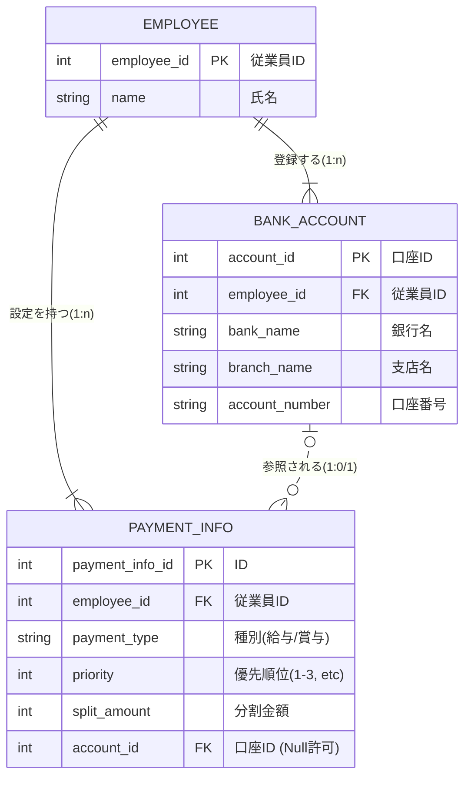
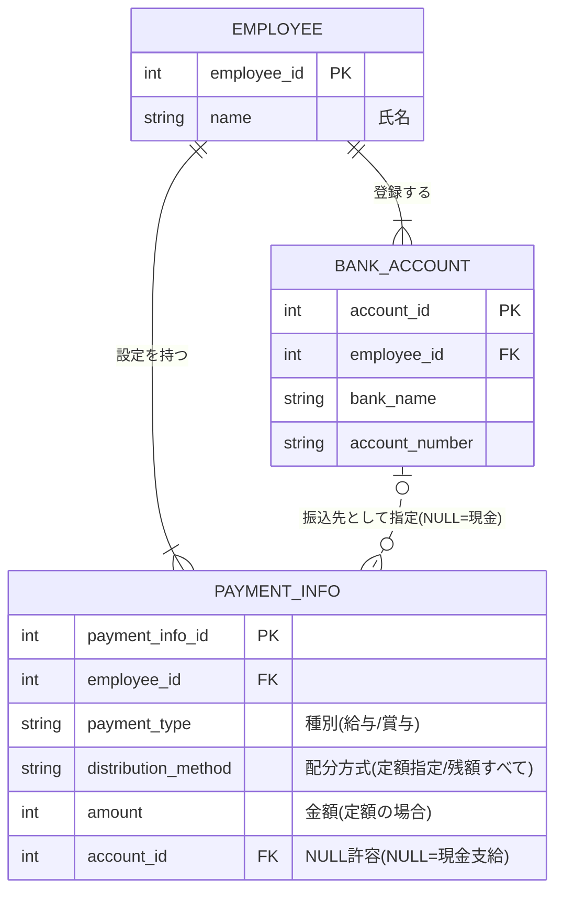
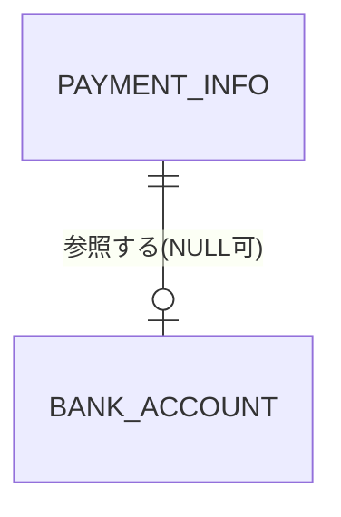
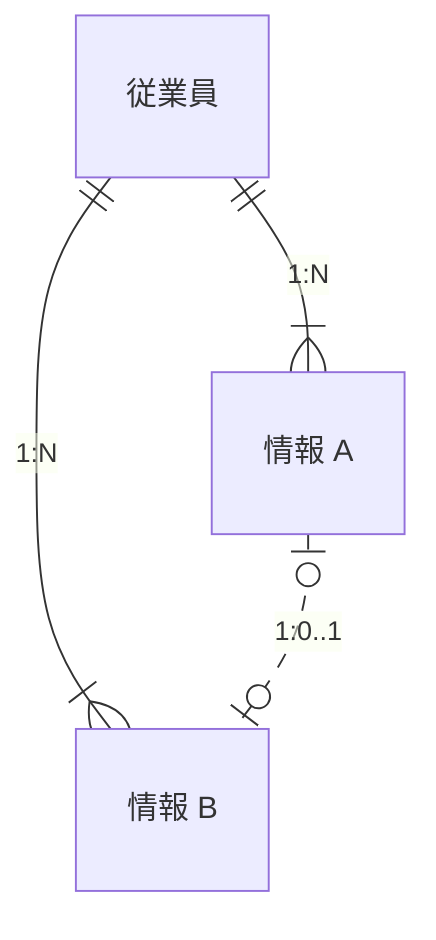

# you asked

あるシステムは従業員情報を保持しており、各従業員の銀行口座を登録する。このシステムに支給情報を登録する。支給情報とは給与と賞与の受け取り方を指定するもので、以下から構成される。(1) 給与または賞与を、最大 3 つにまで分割して受け取れる、(2) 分割しない場合はベース口座で全額を、分割する場合は指定の金額を別口座で、残りをベース口座で受け取る。

このとき、支給情報を登録できるようシステムを拡張する難しさを、テーブルの正規化と絡めて手短に説明したい。論点を整理して

---

# gemini response

この要件におけるシステム拡張の難しさは、**「ビジネスルールの制約（最大3つ・残額計算）」と「データベースの正規化（柔軟性・整合性）」の間にトレードオフが発生する点**にあります。

主な論点を3つに整理しました。

### 1. 第一正規形（1NF）と「繰り返し項目」のジレンマ
「最大3つまで」という要件をどうテーブルに落とし込むかで、以下の葛藤が生じます。

* **非正規化（横持ち）のアプローチ:**
    * `支給情報テーブル`に「分割口座1」「分割金額1」「分割口座2」…といったカラムを作る方法。
    * **問題点:** 「繰り返し項目」を持つため第一正規形に違反します。「最大4つ」に変更された場合、テーブル定義の修正（DDL）が必要になり、拡張性が低いです。また、分割しない人には大量のNULLが発生します。
* **正規化（縦持ち）のアプローチ:**
    * `支給詳細テーブル`を作成し、1つの分割設定を1レコードとして保存する方法。
    * **問題点:** 柔軟ですが、「最大3つまで」という個数制限をDBの制約（Check制約等）だけで保証するのが難しく、アプリケーションロジックへの依存度が高まります。

### 2. 「残額（ベース口座）」の扱いとデータ整合性
「残りはベース口座」という動的なルールは、静的なデータ保存と相性が悪いです。

* **計算列の扱い:**
    * ベース口座への振込額は `総支給額 - Σ(分割指定額)` で決まります。これをDBに保存すると「推移的関数従属」に近い状態になり、第三正規形（3NF）の観点から冗長（データ不整合のリスク）になります。
    * 保存しない場合、毎回計算が必要となり、参照時のクエリが複雑化します。
* **ベース口座の定義場所:**
    * 「ベース口座」を従業員マスタに持たせるか、支給情報テーブルの「優先度最下位のレコード」として扱うか。後者の場合、正規化は進みますが「必ず一つベース口座が必要」という要件の強制力が弱まります。

### 3. 主キーの複雑化（給与と賞与の区別）
支給情報は「従業員」だけでなく「支給種別（給与/賞与）」ごとの管理が必要です。

* 正規化を進めると、子テーブル（詳細テーブル）の主キーは`{従業員ID, 支給種別, 優先順位}`のような複合キーになります。
* これにより、更新処理（特に優先順位の入れ替えや、給与設定を賞与にコピーしたい場合など）のSQLやロジックが複雑化し、バグの温床になりやすくなります。

---

**結論としての難しさ**
この拡張は、テーブルをきれいに正規化（縦持ち）すると「個数制限」や「残額ロジック」の実装コストが跳ね上がり、逆に非正規化（横持ち）すると将来の仕様変更（分割数増など）に弱くなる、という**「設計の落とし所」を決める難しさ**があります。

---

# you asked

従業員1:n支給情報
従業員1:n口座情報
支給情報1:1/0口座情報

この ER 図を Mermaid で書いて

---

# gemini response

ご提示いただいた関係性（カーディナリティ）と、先ほどの「分割受け取り」の仕様を考慮したER図を作成しました。

「支給情報 1 : 0/1 口座情報」の部分は、支給情報テーブルが口座情報の外部キーを持つものの、それが **NULL許可（または特定条件下で参照しない）** である状態（ベース口座扱いなど）を表現しています。



### 図のポイント

  * **`PAYMENT_INFO` の `account_id`**: ここがリレーションの肝です。
      * **1（参照あり）**: 指定金額を振り込む「分割口座」を指定する場合。
      * **0（NULL/参照なし）**: ここがNULLの場合は「残額をベース口座へ振り込む」というロジックにする、あるいは別途フラグで管理する等の設計判断になります（前述の正規化の難しさに直結する部分です）。

---

# you asked

ちょっと違う。支給情報が口座情報を参照しないケースは、現金支給のケース。修正して

---

# gemini response

承知いたしました。「口座情報への参照なし（NULL）＝現金支給」という定義でER図を修正します。

この定義変更に伴い、論理的には\*\*「ベース口座（残額受け取り）」も、必ず特定の口座IDを参照する必要がある\*\*（現金でなければNULLにはできない）ということになります。



### 修正のポイント

1.  **`account_id` の意味合いを変更**:
      * **値あり**: 銀行振込（分割指定の口座、またはベース口座のいずれか）。
      * **NULL**: **現金支給**。
2.  **`distribution_method`（配分方式）の追加**:
      * 前回の議論にあった「残りはベース口座で」というロジックをデータ上で区別するため、「金額指定（分割分）」なのか「残額すべて（ベース分）」なのかを判別する属性を明示しました。
      * これにより、「ベース口座も現金（＝残金は手渡し）」という設定も表現可能になります。

---

# you asked

1:1 または 1:0 の関係を標準的にどう表記する？

---

# gemini response

データベース設計（ER図）において「1対1、または1対0（あってもなくても良い1つ）」の関係は、一般的に\*\*「0または1（Zero or One）」\*\*の関係と呼ばれます。

主要な表記法（IE記法、UML）と、Mermaidでの書き方を整理します。

### 1\. IE記法（カラスの足 / Crow's Foot）

データベース設計で最も標準的な記法です。

  * **記号:** 直線の上に「◯（ゼロ）」と「｜（イチ）」を並べて書きます。
  * **見た目:** `―○|`
  * **意味:** 「相手が存在しない（0）か、存在するなら1つだけ（1）」

**図解イメージ:**

```text
[支給情報] ||―――――――o| [口座情報]
(必ず1つ存在)        (0または1つ)
```

※ 「支給情報」側から見て、線の一端（口座側）に「○」と「|」がつきます。

### 2\. UML（クラス図）

オブジェクト指向設計で使われる記法です。

  * **多重度（Multiplicity）:** 数字で範囲を書きます。
  * **表記:** `0..1`
  * **意味:** 下限が0、上限が1。

<!-- end list -->

```text
[支給情報] 1 ――――――― 0..1 [口座情報]
```

### 3\. Mermaid での書き方

先ほどのMermaidのコードでこの関係を表現する場合、線の末端の記号を変えます。

  * **構文:** `||--o|`
      * `||` : こちら側は「1」（Mandatory One）
      * `o|` : あちら側は「0または1」（Optional One）

**今回のケース（支給情報 → 口座情報）:**



### 実装（物理設計）との対応

この「0または1」の関係は、データベースの実装上は以下のように表現されます。

  * **外部キー（FK）のカラム設定:** `NULL` を許可する（Nullable）。
  * **ユニーク制約:** そのFKカラムにユニーク制約をつける（1対多にならないようにするため）。

今回の例で言うと、`PAYMENT_INFO` テーブルの `account_id` カラムは、**「NULLを許可する（現金の場合）」かつ「重複を許さない（1つの支給設定が複数の口座を指さない）」** という設定になります。

---

# you asked

erDiagram
    従業員 {}
    "情報 A" {}
    "情報 B" {}

    従業員 ||--|{ "情報 B" : "1:N"
    従業員 ||--|{ "情報 A" : "1:N"
    "情報 A" |o..o{ "情報 B" : "1:0..1"

この記法で正確？詳細は省略してある

---

# gemini response

画像のER図とMermaidのコードを比較すると、**1箇所だけ修正が必要**です。

ご提示いただいたコードの `|o..o{` という部分は、右側が `{` （カラスの足＝複数/Many）になっています。しかし、ラベルには `1:0..1` （最大で1）と書かれており、画像の意図とも食い違っています。

「0または1」を表すには、末尾を `{` ではなく `|` にします。

### 修正後のコード



### 解説：記号の違い

Mermaidの記法では、末尾の記号で「多重度」が決まります。

  * **`o{`** : **0 または 複数 (Zero or Many)**
      * 図形：◯とカラスの足（フォークのような形）
  * **`o|`** : **0 または 1 (Zero or One)**
      * 図形：◯と縦線

前回の「現金支給ならNULL、振込なら1つの口座」という要件（0または1）に合わせる場合も、この **`o|`** が正解になります。

---
